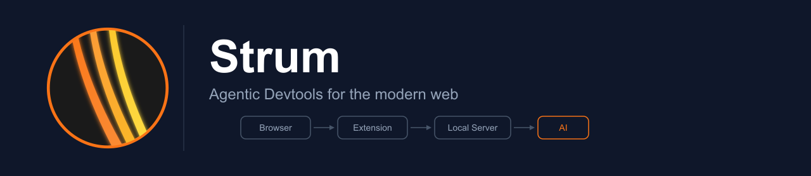

> ## Branch Policy (Read First)
> If you want something working, load code and run the server from `STABLE`.
> `UNSTABLE` makes zero promises on regressions or issues and is treated as work in progress.
> Stable builds are compressed, tagged, and moved to `STABLE`.

<div align="center">



[](LICENSE)
[](https://github.com/brennhill/gasoline-agentic-browser-devtools-mcp/releases)
[](https://go.dev/)
[](https://developer.chrome.com/docs/extensions/mv3/)
[](https://github.com/brennhill/gasoline-agentic-browser-devtools-mcp)
[](https://github.com/brennhill/gasoline-agentic-browser-devtools-mcp)
[](https://github.com/brennhill/gasoline-agentic-browser-devtools-mcp)
[](https://app.codacy.com/gh/brennhill/gasoline-agentic-browser-devtools-mcp/dashboard?utm_source=gh&utm_medium=referral&utm_content=&utm_campaign=Badge_grade)
[](https://snyk.io/test/github/brennhill/gasoline-agentic-browser-devtools-mcp)
[](https://github.com/brennhill/gasoline-agentic-browser-devtools-mcp/pulls)
[](https://x.com/gasolinedev)
[](https://getstrum.dev)

**Strum: Agentic Devtools — rapid e2e web development.** Streams console logs, network errors, and exceptions to Claude Code, Copilot, Cursor, or any MCP-compatible assistant. Enterprise ready.

[Documentation](https://getstrum.dev) •
[Quick Start](https://getstrum.dev/getting-started/) •
[Features](https://getstrum.dev/features/) •
[MCP Setup](https://getstrum.dev/mcp-integration/)

</div>

---

<div align="center">

## 📦 Latest Release

Current version: **v0.8.1** — Link health analyzer, browser automation, recording, and performance analysis for AI agents.

**macOS / Linux:**
```bash
curl -sSL https://raw.githubusercontent.com/brennhill/gasoline-agentic-browser-devtools-mcp/STABLE/scripts/install.sh | bash
```

**Windows (PowerShell):**
```powershell
irm https://raw.githubusercontent.com/brennhill/gasoline-agentic-browser-devtools-mcp/STABLE/scripts/install.ps1 | iex
```

</div>

---

## Quick Start

**Install Strum: Agentic Devtools (Binary + Extension + Auto-Config) in one command:**

**macOS / Linux:**
```bash
curl -sSL https://raw.githubusercontent.com/brennhill/gasoline-agentic-browser-devtools-mcp/STABLE/scripts/install.sh | bash
```

**Windows (PowerShell):**
```powershell
irm https://raw.githubusercontent.com/brennhill/gasoline-agentic-browser-devtools-mcp/STABLE/scripts/install.ps1 | iex
```

This script automatically:
1.  **Downloads** the latest stable binary for your platform.
2.  **Installs** the browser extension files to `~/.gasoline/extension`.
3.  **Auto-configures** all detected MCP clients (Claude Code, Cursor, Windsurf, Zed, etc.).

---

### Step 1: Finalize Browser Extension

1. Open `chrome://extensions`
2. Enable **Developer mode** (top right)
3. Click **Load unpacked**
4. Select the folder: `~/.gasoline/extension` (or wherever the script printed)

### Step 2: Restart Your AI Tool

Restart Claude Code, Cursor, Windsurf, or Zed. The Strum server will now start automatically when needed.

**[Full setup guide →](https://getstrum.dev/getting-started/)** | **[Per-tool install guide →](docs/mcp-install-guide.md)**

---

## Why Strum: Agentic Devtools

**No debug port required.** Other tools need Chrome launched with `--remote-debugging-port`, which disables security sandboxing and breaks your normal browser workflow. Strum uses a standard extension — your browser stays secure and unmodified.

**Single binary, zero runtime.** One Go binary that runs anywhere — no runtime dependencies, no Puppeteer, no framework.

**Captures what others can't.** WebSocket messages, full request/response bodies, user action recording, Web Vitals, automatic regression detection, visual annotations, and Playwright test generation from real browser sessions — features no other MCP browser tool offers.

**Works with every MCP tool.** Claude Code, Cursor, Windsurf, Zed, Claude Desktop, VS Code + Continue. Switch AI tools without changing your debugging setup.

**Enterprise-safe by design.** Binds to `127.0.0.1` only. Auth headers are stripped automatically. No accounts, no cloud. Anonymous usage stats only (see Privacy). Audit the source — it's AGPL-3.0.

## What It Does

- **Console logs** — `console.log()`, `.warn()`, `.error()` with full arguments
- **Network errors** — Failed API calls (4xx, 5xx) with response bodies
- **Exceptions** — Uncaught errors with full stack traces
- **WebSocket events** — Connection lifecycle and message payloads
- **Network bodies** — Request/response payloads for API debugging
- **User actions** — Click, type, navigate, scroll recording with smart selectors
- **Web Vitals** — LCP, CLS, INP, FCP with regression detection
- **DOM inspection** — Query the page with CSS selectors via MCP
- **Accessibility audits** — WCAG checks with SARIF export
- **Security audits** — Credentials, PII, headers, cookies, third-party analysis
- **Browser automation** — Click, type, select, upload, navigate with semantic selectors
- **Visual annotations** — Draw mode for user feedback with computed style extraction
- **Test generation** — Playwright tests from context, self-healing selectors, failure classification
- **Reproduction scripts** — Playwright scripts from recorded user actions
- **Noise filtering** — Auto-detect and dismiss irrelevant errors
- **Developer API** — `window.__gasoline.annotate()` for custom context

**[Full feature list →](https://getstrum.dev/features/)**

## Privacy

All captured data (logs, network, actions) stays 100% local — nothing leaves your machine. No cloud, no accounts.

We collect anonymous usage statistics (feature usage flags, extension version) using a random identifier not linked to your identity. No URLs, browsing data, or personal information is collected.

**[Privacy details →](https://getstrum.dev/security/)**

## Performance

See [latest benchmarks](docs/benchmarks/latest-benchmark.md) for current performance data.

Last benchmarked: 2026-02-09 on darwin/arm64 (v0.8.1)

## Known Issues

See [docs/core/known-issues.md](docs/core/known-issues.md) for current known issues.

## Development

```bash
make test                              # Go server tests
node --test tests/extension/*.test.js  # Extension tests
make dev                               # Build for current platform
```

**[Release process & quality gates →](docs/core/release.md)** · **[Changelog →](CHANGELOG.md)**

## License

**AGPL-3.0** — Free and open source for all use cases.

Artwork, logos, and the Sparky mascot are **Copyright (c) Brenn Hill** and are not covered by the AGPL. See [LICENSE-ARTWORK](LICENSE-ARTWORK) for details.

---

<div align="center">


**[getstrum.dev](https://getstrum.dev)**

*Agentic devtools for the modern web*

If you find Strum: Agentic Devtools useful, please consider giving it a star!

[](https://github.com/brennhill/gasoline-agentic-browser-devtools-mcp)

</div>
