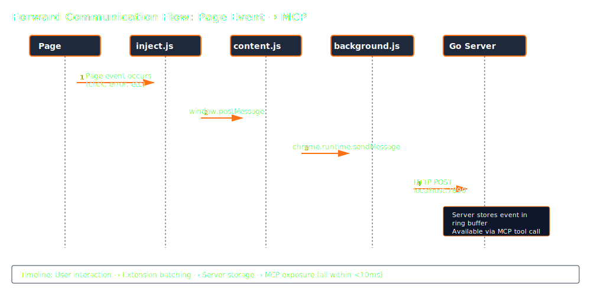
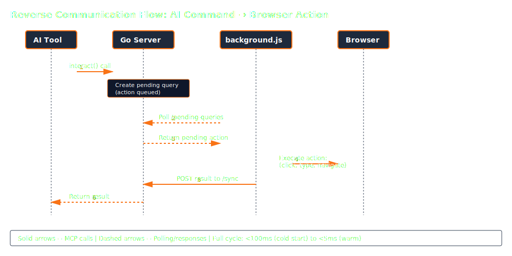

## The Big Picture

Gasoline has three components: a Chrome extension that captures browser telemetry, a Go server that stores and serves it, and the MCP protocol that connects everything to your AI tool.


<!-- Diagram: High-level architecture showing Extension → Go Server → AI Tool data flow -->

## The Three-Layer Extension

The Chrome extension uses a three-layer architecture, each running in a different security context:

### Layer 1: inject.js (Page Context)

Runs in the **MAIN world** — the same JavaScript context as the web page. This gives it access to:

- `console.log/warn/error` — intercepted via monkey-patching
- `window.fetch` and `XMLHttpRequest` — for network body capture
- `WebSocket` — constructor wrapped to capture connections and frames
- `window.addEventListener` — for user action recording (click, input, submit)
- Web Vitals APIs — PerformanceObserver for LCP, CLS, INP, FCP

This is the only layer that can see what the page's JavaScript is actually doing.

### Layer 2: content.js (Isolated World)

Runs in Chrome's **isolated world** — separate from the page's JavaScript, but with full DOM access. It:

- Receives messages from inject.js via `window.postMessage`
- Forwards them to the background service worker via `chrome.runtime.sendMessage`
- Handles subtitle display (creates and manages the narration overlay element)
- Handles action toast display (the blue/green notification banners)
- Manages script injection (loads inject.js into the page)

<!-- Screenshot: Action toast showing "Click: Submit" in blue at top of viewport -->
<!-- Screenshot: Subtitle overlay showing narration text at bottom of viewport -->

### Layer 3: background.js (Service Worker)

The extension's **service worker** — no DOM access, but full extension API access. It:

- Batches incoming telemetry from content scripts
- POSTs data to the Go server via HTTP
- Polls the server for pending queries (commands the AI wants to execute)
- Executes DOM primitives (click, type, scroll) via `chrome.scripting`
- Manages extension state (which tabs are connected, what's enabled)

### Communication Flow



The reverse flow (AI → browser) works through the pending query system:



## Ring Buffers

All telemetry is stored in generic ring buffers — fixed-size circular arrays that evict the oldest entries when full. This gives predictable memory usage regardless of how long the session runs.

### Buffer Capacities

| Buffer | Max Entries | Max Memory |
|---|---|---|
| Console logs | 1,000 | — |
| Extension logs | 500 | — |
| WebSocket events | 500 | 4 MB |
| Network bodies | 100 | 8 MB |
| Network waterfall | 1,000 (configurable) | 500 KB |
| WebSocket connections | 20 active + 10 closed | 2 MB |
| Pending queries | 15 | 1 KB |

### Cursor-Based Pagination

Every buffer supports cursor-based reads. When an AI requests data, it receives a cursor with the response. On the next request, it passes the cursor back to get only _new_ entries — no duplicates, no missed data, even if the buffer wrapped around.

```go
type BufferCursor struct {
    Position  int64     // Monotonic counter (never wraps)
    Timestamp time.Time // When this position was valid
}
```

This is critical for long-running sessions where the AI periodically checks for new errors or events.

## The Bridge Pattern (Multi-Client)

A unique challenge: multiple AI tools need to share the same browser telemetry. Claude Code and Cursor might both be connected simultaneously.

Gasoline solves this with the **stdio bridge pattern**:

```text
Claude Code → npx gasoline-mcp (stdio) ──┐
Cursor      → npx gasoline-mcp (stdio) ──┼──► Gasoline Server (HTTP :7890)
Zed         → npx gasoline-mcp (stdio) ──┘           ↕
                                              Browser Extension
```

Each MCP client spawns its own stdio process. The first process starts the HTTP server. Subsequent processes detect the running server and switch to **bridge mode** — proxying MCP JSON-RPC calls over HTTP to the shared server.

This means:
- All clients see the same telemetry
- No port conflicts — everyone connects to the same server
- The server persists across client disconnects (daemon mode is the default)
- Zero configuration — the bridge detection is automatic

<!-- Diagram: Multi-client bridge pattern showing 3 AI tools connecting through stdio wrappers to a single HTTP server -->

## Server Lifecycle

Every MCP client connection follows a 6-step lifecycle:

1. **Check** — TCP probe to see if server is running on the configured port
2. **Launch** — If no server, spawn the HTTP server as a background process (cold start: ~400ms)
3. **Connect** — If server exists, connect as a bridge client
4. **Retry** — If connection fails, retry up to 3 times with exponential backoff (1-3s)
5. **Recover** — If still failing, kill the unresponsive server and spawn a fresh one
6. **Debug** — If recovery fails, write debug log to `/tmp/gasoline-debug-*.log` and exit

### Performance Targets

| Metric | Target | Measured |
|---|---|---|
| Cold start | < 600ms | 300-410ms |
| Console intercept overhead | < 0.1ms | < 0.1ms |
| HTTP endpoint latency | < 0.5ms | < 0.5ms |
| Concurrent clients | 100+ | Tested at 100 |
| Event rate limit | 1,000 events/sec | Circuit breaker (HTTP 429) |
| Tool call rate limit | 500 calls/min | MCP-level limiter |

## Security Boundaries

Gasoline enforces strict security at every layer:

- **Localhost only.** The Go server binds to `127.0.0.1`. It never accepts remote connections. There is no configuration option to change this.
- **No debug port.** No `--remote-debugging-port`. Chrome's security sandbox stays intact.
- **Header stripping.** Authorization headers, cookies, and tokens are automatically removed from captured network data.
- **Network bodies opt-in.** Request/response body capture is off by default. You explicitly enable it.
- **AI Web Pilot opt-in.** Browser control is off by default. You enable it in the extension popup.
- **No external transmission.** No analytics, no telemetry, no phone-home. Data never leaves your machine.

## Zero Dependencies

The Go server has **zero production dependencies** — no external packages, no frameworks, no ORMs. Everything is built on Go's standard library:

- HTTP server: `net/http`
- JSON handling: `encoding/json`
- Concurrency: `sync.RWMutex`
- File I/O: `os` and `bufio`
- MCP protocol: Hand-rolled JSON-RPC 2.0

This means:
- **Zero supply chain risk.** No `go.sum` vulnerabilities to patch.
- **Fast compilation.** No dependency resolution. Build in seconds.
- **Single binary.** `go build` produces one executable. No runtime to install.
- **Long-term stability.** Go's compatibility guarantee. Code written today compiles tomorrow.

## The Five Tools

Everything Gasoline does is exposed through exactly five MCP tools:

| Tool | Purpose | Modes |
|---|---|---|
| **observe** | Read browser state | 30 modes (errors, network, WebSocket, vitals, recordings, screenshots, storage, etc.) |
| **analyze** | Active analysis | 27 modes (DOM queries, accessibility, security, link health, annotations, forms, visual diff, etc.) |
| **generate** | Create artifacts | 13 formats (tests, reproductions, HAR, SARIF, CSP, SRI, test healing, etc.) |
| **configure** | Manage the session | 29 actions (noise rules, storage, recording, streaming, health, sequences, etc.) |
| **interact** | Control the browser | 58 actions (navigate, click, type, upload, draw mode, recording, batch, explore, etc.) |

Five tools. Not fifty. The AI doesn't need to choose from a sprawling API — it picks the right tool and the right mode. This constraint keeps the interface learnable and the implementation maintainable.

## Deep-Dive Architecture Diagrams

For a detailed understanding of how all the pieces fit together, check out our comprehensive architecture diagrams:

### System Architecture (C4 Model)

- **[C2: Container Architecture](https://github.com/brennhill/gasoline-agentic-browser-devtools-mcp/blob/stable/docs/architecture/diagrams/c2-containers.md)** — The 5 main system components and how they communicate (AI Agent, Wrapper, Go Server, Extension, Browser)
- **[C3: Component Architecture](https://github.com/brennhill/gasoline-agentic-browser-devtools-mcp/blob/stable/docs/architecture/diagrams/c3-components.md)** — Go package structure showing all 40+ packages organized in 5 layers (Foundation, Domain, Tools, HTTP Server, Utilities)

### Request-Response Flows

- **[Request-Response Cycle](https://github.com/brennhill/gasoline-agentic-browser-devtools-mcp/blob/stable/docs/architecture/diagrams/request-response-cycle.md)** — Complete MCP command flow showing how AI requests become browser actions and how results are returned (immediate, query+polling, one-way, and error scenarios)
- **[Extension Message Protocol](https://github.com/brennhill/gasoline-agentic-browser-devtools-mcp/blob/stable/docs/architecture/diagrams/extension-message-protocol.md)** — All 6 HTTP message types between extension and server with complete JSON schemas, state machines, and reliability patterns

### Data Flow

- **[Data Capture Pipeline](https://github.com/brennhill/gasoline-agentic-browser-devtools-mcp/blob/stable/docs/architecture/diagrams/data-capture-pipeline.md)** — How telemetry flows from page observers → extension batchers → server ring buffers, with detailed specifications for all 7 event types (console, network, actions, WebSocket, performance, errors) and memory management strategy
