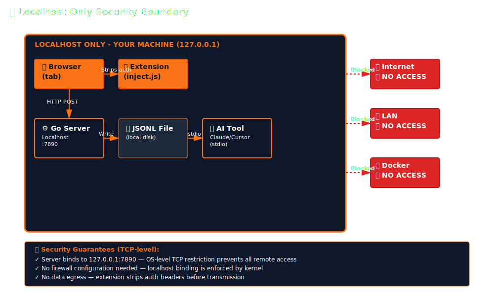

STRUM is designed for teams that can't afford data leaks. Every design decision prioritizes keeping your browser data on your hardware — no exceptions, no opt-outs, no "trust us" promises. Zero dependencies. Localhost only. Open source (AGPL-3.0).

## Automatic Credential Stripping

Network requests are sanitized **before they're ever written to disk**. The extension strips any header matching:

```
authorization, cookie, set-cookie, x-api-key, x-auth-token,
x-secret, x-password, *token*, *secret*, *key*, *password*
```

This is a regex-based pattern match (case-insensitive). If a header name contains `token`, `secret`, `key`, or `password` anywhere in it, it's removed. No configuration needed — it's always on.

### What gets redacted

| Data Type | Action | When |
|-----------|--------|------|
| `Authorization` header | Stripped | Always |
| `Cookie` / `Set-Cookie` | Stripped | Always |
| Custom auth headers (`X-API-Key`, etc.) | Stripped | Always |
| Any header matching `*token*`, `*secret*`, `*key*`, `*password*` | Stripped | Always |
| Password input values | Replaced with `[redacted]` | Always |
| Credit card fields (`cc-number`, `cc-exp`, `cc-csc`) | Replaced with `[redacted]` | Always |
| Sensitive autocomplete fields | Replaced with `[redacted]` | Always |

### Double-layer redaction

Sensitive data is caught at **two** points:

1. **Extension** — strips headers and input values before sending to the server
2. **Server** — re-checks and redacts password values on ingest as a safety net

Even if a bug in the extension missed something, the server catches it.

## Localhost-Only Binding

The server binds exclusively to `127.0.0.1`:

```go
addr := fmt.Sprintf("127.0.0.1:%d", *port)
http.ListenAndServe(addr, nil)
```

This is a **TCP-level restriction** — the operating system itself rejects connections from any non-local address. No firewall configuration needed. No "disable remote access" checkbox to forget. It's architecturally impossible for a remote machine to reach the server.

- Not accessible from your LAN
- Not accessible from the internet
- Not accessible from Docker containers (unless explicitly bridged)
- Not accessible from VMs on the same host

## Zero Network Calls

The Go binary **never initiates outbound network connections**. It doesn't:

- Phone home for updates
- Send telemetry or analytics
- Check license servers
- Resolve DNS
- Make any HTTP requests

You can verify this with `tcpdump`, `lsof -i`, or any network monitor. The binary opens one listening socket on localhost and that's it.

## Zero Dependencies — Zero Supply Chain Risk

The server is a **single statically-compiled Go binary** with no external dependencies:

- No `node_modules/` with thousands of transitive packages
- No Python virtualenvs
- No dynamic linking (on Linux: fully static)
- No runtime downloads

**The binary you audit is the binary you run.** There's no dependency tree to worry about, no lock file drift, no protestware risk. One file, checksum it, done.

The extension is **vanilla JavaScript** — no webpack, no transpilers, no npm packages. The source in the Chrome Web Store is the same source in the repo. Readable in DevTools.

## Rate Limiting & Circuit Breaker

### Server-side rate limiting

The server enforces a **1,000 events/second** cap. Beyond that, it returns HTTP 429:

| Threshold | Action |
|-----------|--------|
| < 1,000 events/sec | Normal processing |
| > 1,000 events/sec | HTTP 429, events dropped |
| Memory hard limit (50MB) | HTTP 503, events dropped |

This prevents a runaway page from flooding your disk with gigabytes of logs.

### Extension-side circuit breaker

If the server goes down, the extension doesn't spin trying to reconnect:

| State | Behavior |
|-------|----------|
| **Closed** (normal) | Send events normally |
| **Open** (5 consecutive failures) | Stop sending, wait 30s |
| **Half-open** (after timeout) | Send one probe request |
| **Backoff** | Exponential: 1s → 2s → 4s → ... → 30s max |

No CPU burn. No memory leak from queued retries. The extension backs off gracefully.

## Memory-Safe Buffers

Every buffer in the system has a hard cap:

### Extension limits

| Buffer | Max Size | Overflow Behavior |
|--------|----------|-------------------|
| WebSocket messages | 4KB per message | Truncated |
| Request bodies | 8KB | Truncated |
| Response bodies | 16KB | Truncated |
| User action buffer | 20 items | FIFO eviction |
| Context annotations | 50 keys, 4KB/value | Rejected with warning |
| Overall extension memory | 20MB soft / 50MB hard | Buffers reduced or features disabled |

### Server limits

| Buffer | Max Size | Overflow Behavior |
|--------|----------|-------------------|
| WebSocket event ring | 500 events | Oldest dropped |
| Network bodies ring | 100 entries | Oldest dropped |
| Enhanced actions | 1,000 entries | Oldest dropped |
| Active WS connections | 20 tracked | Oldest dropped |
| WebSocket buffer total | 4MB | HTTP 503 |
| Network bodies total | 8MB | HTTP 503 |
| Server memory total | 50MB hard limit | HTTP 503 |

At no point can a misbehaving page consume unbounded memory in either the extension or the server.

## Extension Permissions

The Chrome extension requests:

| Permission | Why |
|------------|-----|
| `activeTab` | Inject capture scripts into the current tab |
| `storage` | Persist extension settings locally |
| `alarms` | Schedule periodic health checks |
| `tabs` | Query tab URL for log context |
| `scripting` | Inject content scripts for DOM automation |
| `tabCapture` | Tab video/audio recording |
| `offscreen` | Offscreen document for media encoding |
| `debugger` | Network body capture via Chrome DevTools Protocol |
| `cookies` | Cookie inspection for security audits |
| `contextMenus` | Right-click menu integration |

Host permissions use `<all_urls>` to enable capture and automation on any site the developer is debugging. All communication stays local — the extension only talks to `127.0.0.1`.

**Not requested:**

- No `webRequest` / `webRequestBlocking`
- No `history`, `bookmarks`, `downloads`
- No `identity` or OAuth scopes

## Log File Security

- **Default location:** `~/.gasoline/logs/gasoline.jsonl`
- **File permissions:** `0600` (owner read/write only — no group or world access)
- **Append-only:** Server only appends, never seeks or rewrites in-place
- **Automatic rotation:** Oldest entries dropped when `--max-entries` exceeded (default 1000)
- **No external access:** File is read by the AI tool via stdio (MCP), not via HTTP

The AI tool reads the file directly from disk — no network layer, no API endpoint, no token exchange.

## Input Validation

Every endpoint validates input before processing:

| Endpoint | Validation |
|----------|-----------|
| `POST /logs` | JSON structure, required `entries` array, entry format |
| `POST /v4/*` | JSON body parsing, size limits, type checking |
| MCP (stdio) | JSON-RPC 2.0 structure, method whitelist, parameter validation |
| All endpoints | Rate limiting, memory cap checks before processing |

Malformed input returns appropriate HTTP errors (400, 429, 503) — never crashes, never executes arbitrary content.

## Open Source Audit

The entire codebase is open under **AGPL-3.0**:

- **Go server:** Zero dependencies, fully auditable
- **Extension:** Vanilla JS, no build step, readable in Chrome DevTools
- **No obfuscation:** What you see in the repo is what runs on your machine
- **Reproducible builds:** `make build` produces identical binaries from source

```bash
# Verify the binary yourself
git clone https://github.com/brennhill/gasoline-agentic-browser-devtools-mcp.git
cd gasoline-agentic-browser-devtools-mcp && make build
shasum -a 256 bin/gasoline-*
```

## Data Flow Diagram



## Enterprise Deployment

For teams evaluating.gasoline:

- **Data governance:** No data egress — all debugging data stays on the developer's machine, never transmitted externally
- **Audit trail:** Open source, reproducible builds, no telemetry to verify absence of
- **IT approval:** Single binary, no runtime deps, no outbound network, minimal permissions
- **Onboarding:** `npx gasoline-mcp` — no accounts, no API keys, no license management
- **Offboarding:** Delete the binary and log file. No cloud state to clean up
