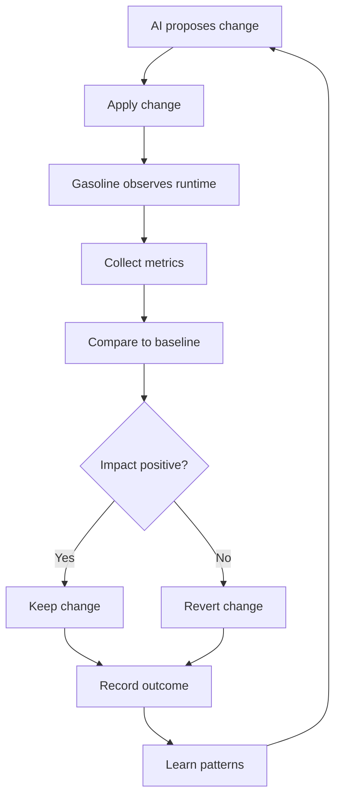

# Runtime Feedback for AI Decisions

**How Gasoline provides runtime observability to help AI make better development decisions.**

---

## The Core Insight

LLMs already have codebase access (via `read_file`, `search_files`, etc.). What they lack is **runtime visibility** — seeing what code actually does, not just what it says.

**Gasoline's value:** Runtime feedback that validates AI decisions against actual behavior, performance, and user interactions.

---

## What Kind of Runtime Feedback Matters

| Feedback Type | Why It Matters | Example Use Case |
|----------------|------------------|------------------|
| **Performance metrics** | Code that looks fast may be slow | Validate algorithm choices |
| **Error rates** | Code that looks correct may fail | Catch edge cases |
| **User behavior** | Code that makes sense may not match usage | Validate UX decisions |
| **Network patterns** | API design may look good but be inefficient | Optimize requests |
| **Resource usage** | Code may work but be wasteful | Catch memory leaks |

---

## Scenario 1: Algorithm Validation

**AI proposes:** "Use quicksort for sorting this array"

**Without runtime feedback:**
```
LLM: "Quicksort is O(n log n), good for most cases"
Developer: Implements quicksort
Result: Hope it's actually faster
```

**With runtime feedback:**
```
LLM: "I'll use quicksort for sorting"
Gasoline: {
  current_implementation: "Array.sort()",
  benchmark: {
    size: 1000,
    time: "2.3ms"
  }
}
LLM: "Let me compare quicksort vs current approach"
Gasoline: {
  quicksort_benchmark: {
    size: 1000,
    time: "3.1ms"
  },
  comparison: {
    winner: "current_implementation",
    reason: "V8's built-in sort is optimized"
  }
}
LLM: "Stick with Array.sort(), it's faster"
```

**Key insight:** Runtime feedback validates against **actual performance**, not theoretical complexity.

---

## Scenario 2: API Design Validation

**AI proposes:** "Add GraphQL endpoint for user queries"

**Without runtime feedback:**
```
LLM: "GraphQL is flexible, good for complex queries"
Developer: Implements GraphQL
Result: Hope it's actually better
```

**With runtime feedback:**
```
LLM: "I'll add GraphQL for user queries"
Gasoline: {
  current_rest_api: {
    endpoint: "/api/users",
    avg_response_time: "45ms",
    cache_hit_rate: "78%"
  }
}
LLM: "Let me simulate GraphQL approach"
Gasoline: {
  graphql_simulation: {
    avg_response_time: "62ms",
    cache_hit_rate: "45%",
    comparison: {
      rest_wins: "Performance and caching",
      graphql_wins: "Flexibility"
    }
  }
}
LLM: "REST is actually better for this use case. Stick with REST."
```

**Key insight:** Runtime feedback shows **actual tradeoffs**, not theoretical benefits.

---

## Scenario 3: State Management Decision

**AI proposes:** "Replace Redux with Zustand for simpler state"

**Without runtime feedback:**
```
LLM: "Zustand is simpler, smaller bundle"
Developer: Implements Zustand
Result: Hope it's actually better
```

**With runtime feedback:**
```
LLM: "I'll replace Redux with Zustand"
Gasoline: {
  current_redux: {
    bundle_size: "12KB",
    avg_update_time: "1.2ms",
    re_render_count: "3.2 per action"
  }
}
LLM: "Let me simulate Zustand"
Gasoline: {
  zustand_simulation: {
    bundle_size: "3KB",
    avg_update_time: "0.8ms",
    re_render_count: "2.1 per action"
  },
  comparison: {
    zustand_wins: ["Bundle size", "Update time", "Re-renders"],
    migration_cost: "Estimated 8 hours"
  }
}
LLM: "Zustand is better. Recommend migration if effort allows."
```

**Key insight:** Runtime feedback quantifies **actual benefits**, not marketing claims.

---

## Scenario 4: Caching Strategy

**AI proposes:** "Add Redis caching for API responses"

**Without runtime feedback:**
```
LLM: "Redis will speed up API responses"
Developer: Implements Redis
Result: Hope it's actually faster
```

**With runtime feedback:**
```
LLM: "I'll add Redis caching"
Gasoline: {
  current_no_cache: {
    avg_response_time: "120ms",
    database_load: "High"
  }
}
LLM: "Let me simulate with Redis"
Gasoline: {
  redis_simulation: {
    avg_response_time: "45ms",
    cache_hit_rate: "82%",
    database_load: "Low"
  },
  comparison: {
    redis_wins: ["Response time", "Database load"],
    concerns: ["Added complexity", "Memory usage"]
  }
}
LLM: "Redis provides 75% speedup. Recommend if traffic justifies complexity."
```

**Key insight:** Runtime feedback measures **actual impact**, not theoretical gains.

---

## Implementation: Runtime Feedback API

### Query: "How does current implementation perform?"

```javascript
query({
  type: "performance_benchmark",
  target: "user_list_fetch"
})

Result: {
  target: "user_list_fetch",
  metrics: {
    avg_time: "45ms",
    p50: "38ms",
    p95: "78ms",
    p99: "120ms",
    sample_size: 234
  },
  breakdown: {
    network_time: "32ms",
    processing_time: "13ms"
  },
  comparison: {
    baseline: "65ms",
    improvement: "30% faster"
  }
}
```

### Query: "What errors occur with this implementation?"

```javascript
query({
  type: "error_analysis",
  target: "user_authentication"
})

Result: {
  target: "user_authentication",
  errors: {
    total: 47,
    by_type: {
      "invalid_credentials": 32,
      "rate_limited": 12,
      "server_error": 3
    },
    by_endpoint: {
      "/auth/login": 44,
      "/auth/refresh": 3
    }
  },
  patterns: {
    "invalid_credentials": {
      common_user_agents: ["Chrome/120", "Firefox/121"],
      time_distribution: "Mostly 9am-5pm",
      hypothesis: "Users mistyping passwords during work hours"
    }
  }
}
```

### Query: "How do users interact with this feature?"

```javascript
query({
  type: "user_behavior",
  target: "search_feature"
})

Result: {
  target: "search_feature",
  interactions: {
    total_searches: 1234,
    avg_query_length: "3.2 characters",
    avg_results_per_page: "8.7",
    click_through_rate: "23%"
  },
  patterns: {
    "short_queries": {
      count: 456,
      avg_results: "12.3",
      hypothesis: "Users searching broadly"
    },
    "long_queries": {
      count: 123,
      avg_results: "2.1",
      hypothesis: "Users looking for specific items"
    }
  },
  recommendations: [
    "Add autocomplete for short queries",
    "Improve result ranking for long queries"
  ]
}
```

### Query: "Compare before/after this change"

```javascript
query({
  type: "comparison",
  before: "commit_abc123",
  after: "commit_def456",
  metrics: ["performance", "errors", "user_behavior"]
})

Result: {
  comparison: {
    performance: {
      before: { avg_time: "65ms" },
      after: { avg_time: "42ms" },
      change: "-35%"
    },
    errors: {
      before: { rate: "2.3%" },
      after: { rate: "1.1%" },
      change: "-52%"
    },
    user_behavior: {
      before: { completion_rate: "78%" },
      after: { completion_rate: "89%" },
      change: "+14%"
    }
  },
  overall: "Positive impact across all metrics"
}
```

---

## The Runtime Feedback Loop



---

## Practical Implementation Steps

| Priority | Feature | Effort | Impact |
|----------|----------|--------|--------|
| 1 | Performance benchmarking API | Medium | High |
| 2 | Error analysis API | Low | High |
| 3 | User behavior tracking | Medium | Medium |
| 4 | Before/after comparison | Low | High |
| 5 | Pattern detection | High | Very High |

---

## Related Documents

- [ai-engineering.md](ai-engineering.md) — AI-first vision overview
- [practical-ai-visibility.md](practical-ai-visibility.md) — Practical immediate improvements
- [architecture.md](../../.claude/refs/architecture.md) — System architecture

---

**Last Updated:** 2026-02-03
**Status:** Proposed — Runtime feedback exploration for AI development decisions
