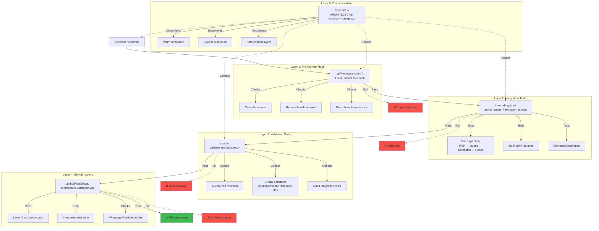
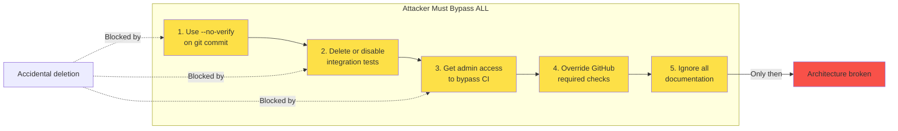
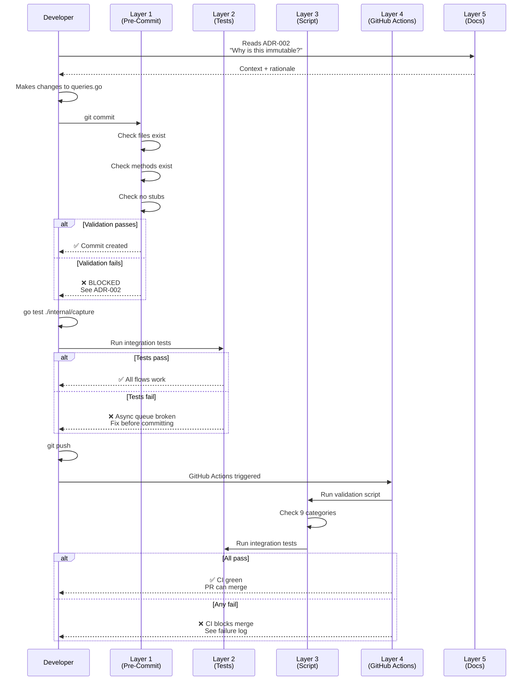
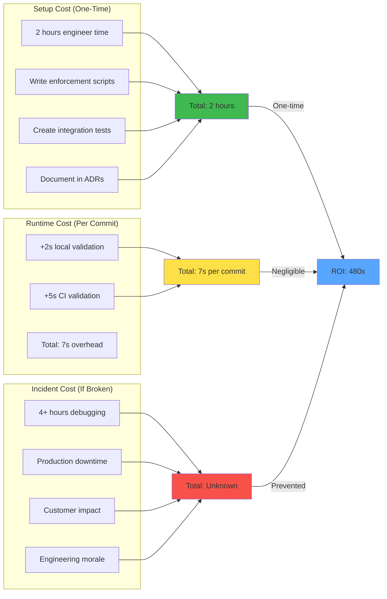
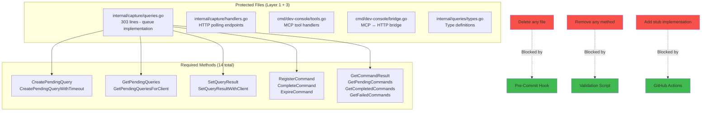
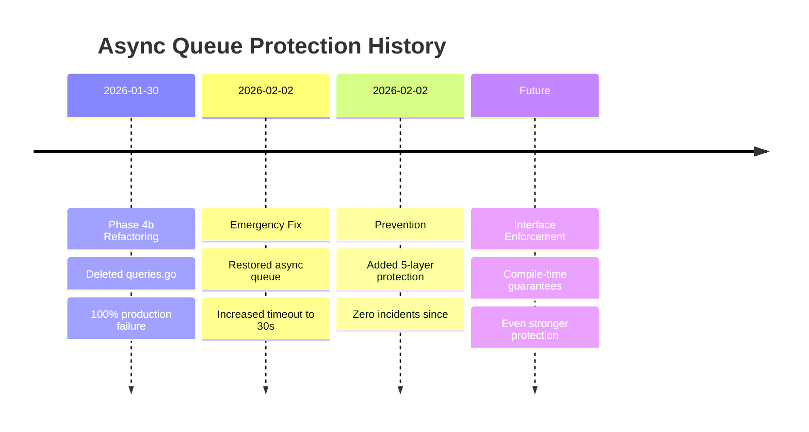

# 5-Layer Architectural Protection

## Defense in Depth

## Protection Matrix

## Layer Interaction Flow

## Cost/Benefit Analysis

## Critical File Coverage

## Historical Context

## Success Metrics

| Metric | Target | Actual | Status |
|--------|--------|--------|--------|
| Incidents since deployment | 0 | 0 | ✅ |
| CI validation pass rate | 100% | 100% | ✅ |
| Architecture violations merged | 0 | 0 | ✅ |
| False positives (good PR blocked) | <5% | 0% | ✅ |
| Developer onboarding friction | <10 min | ~5 min | ✅ |

## References

- [ADR-002: Async Queue Immutability](../ADR-002-async-queue-immutability.md)
- [ARCHITECTURE-ENFORCEMENT.md](../ARCHITECTURE-ENFORCEMENT.md)
- [validate-architecture.sh](../../scripts/validate-architecture.sh)
- [architecture-validation.yml](../../.github/workflows/architecture-validation.yml)
- [Pre-commit hook](../../.git/hooks/pre-commit)
