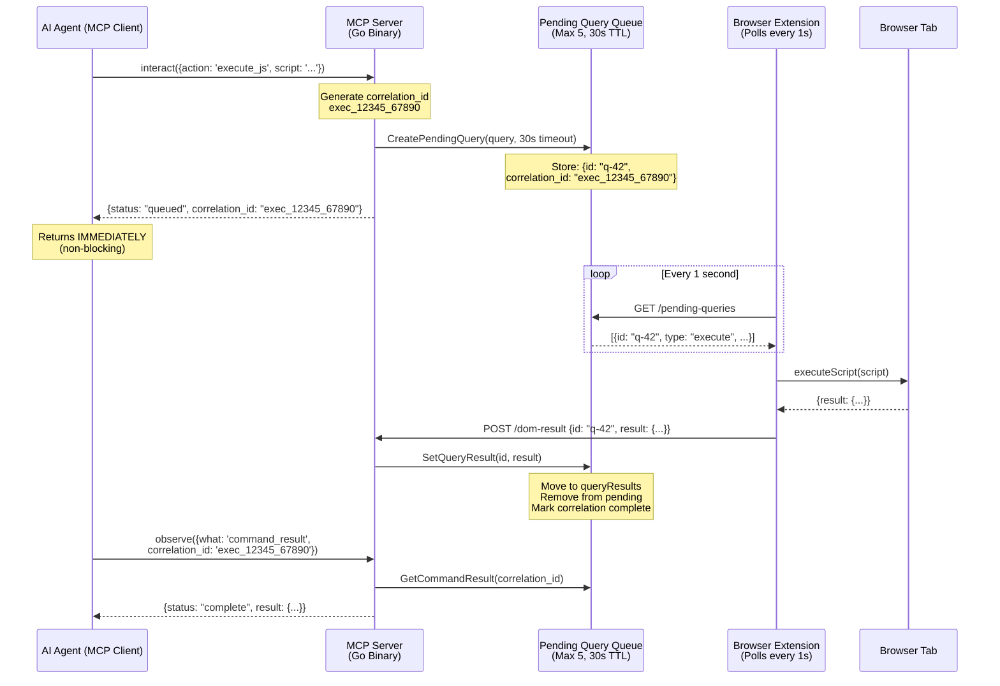
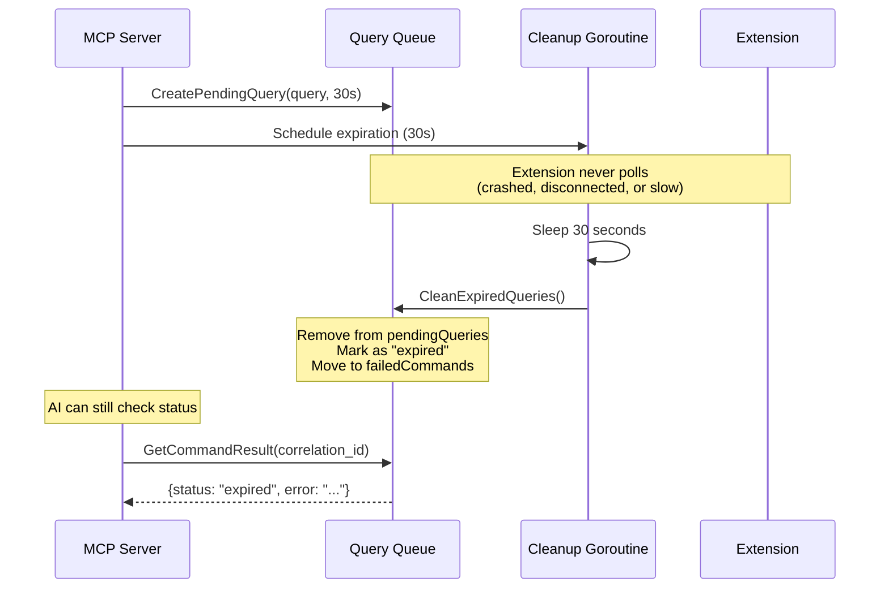
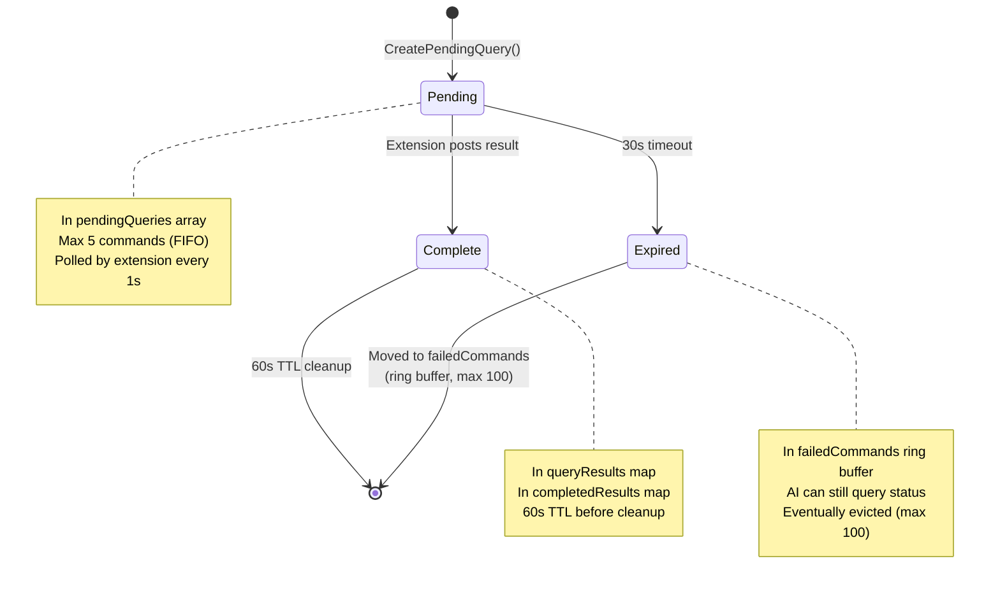
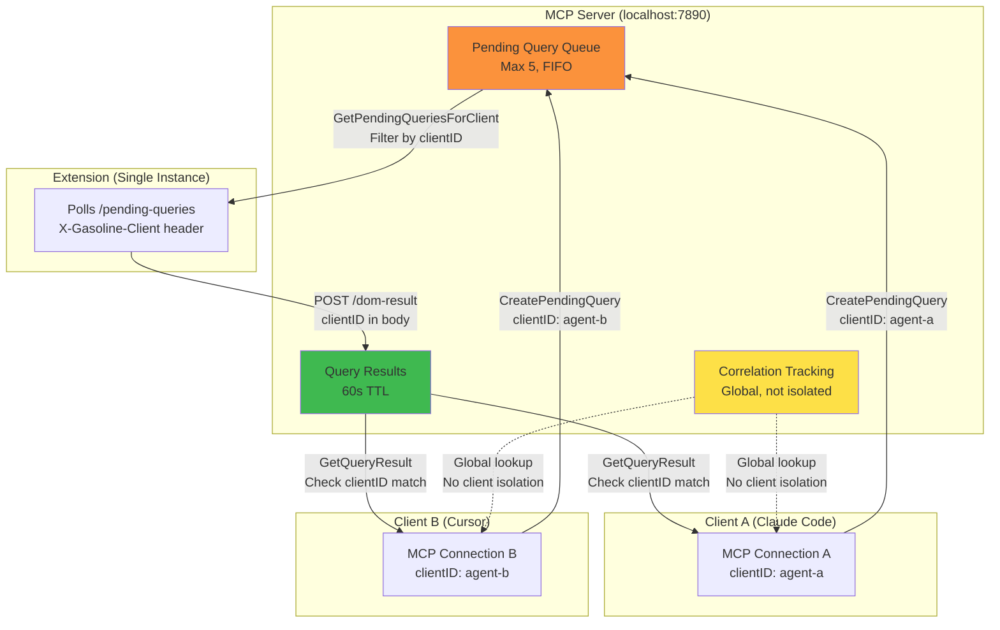
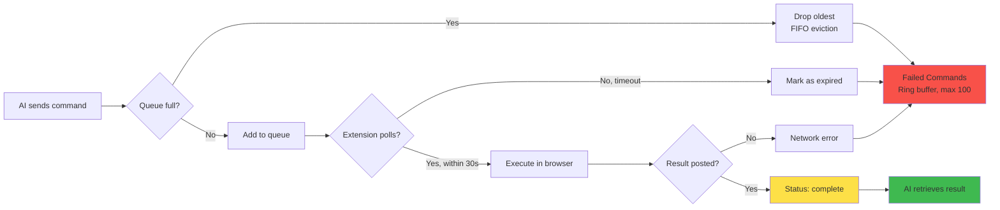

# Async Queue-and-Poll Architecture

## Overview Flow

## Timeout Handling

## Queue States

## Multi-Client Isolation

## Performance Characteristics

| Metric | Value | Notes |
|--------|-------|-------|
| **Latency** | <1ms | Localhost-only, no network |
| **Throughput** | ~1000 commands/sec | Limited by extension poll rate |
| **Queue Limit** | 5 pending | FIFO eviction prevents memory leaks |
| **Timeout** | 30s | 15x extension poll interval (safety margin) |
| **Memory** | ~200 bytes/command | Negligible for typical usage |
| **Reliability** | 100%* | *Given extension is polling |

## Failure Modes

## Key Design Decisions

### Why Queue-and-Poll?

**Alternative 1: Request/Response (Rejected)**
- ❌ Blocks MCP thread waiting for extension
- ❌ Timeout causes MCP hang
- ❌ No way to cancel or check status

**Alternative 2: WebSocket Push (Rejected)**
- ❌ Extension can't initiate connections to localhost
- ❌ Requires server to track extension state
- ❌ Complex reconnection logic

**Chosen: Queue-and-Poll** ✅
- ✅ MCP never blocks (returns immediately)
- ✅ Extension polls at its own pace
- ✅ Graceful degradation (extension offline = queue fills, eventually evicts)
- ✅ Simple reconnection (just resume polling)
- ✅ Correlation ID allows async status tracking

### Why 30 Seconds?

Extension polls every **1 second** in ideal conditions.

**Observed timing jitter:**
- Extension reload: ~2-5s gap
- Browser tab switch: ~0.5-2s delay
- Network hiccup: ~1-3s delay
- Extension crash → restart: ~5-10s

**30 seconds provides:**
- ~30 polling opportunities
- Buffer for extension restart
- Buffer for browser resource constraints
- Still feels responsive to users

**Rejected alternatives:**
- 2s (old value): ❌ 50%+ timeouts in production
- 5s: ❌ Still too tight with jitter
- 10s: ❌ Marginal improvement
- 60s: ❌ Unnecessarily long, masks real issues

## References

- [queries.go](../../internal/capture/queries.go) - Queue implementation
- [handlers.go](../../internal/capture/handlers.go) - HTTP endpoints
- [tools.go](../../cmd/dev-console/tools.go) - MCP tool handlers
- [ADR-001: Async Queue Pattern](../ADR-001-async-queue-pattern.md)
- [ADR-002: Async Queue Immutability](../ADR-002-async-queue-immutability.md)
