# C2: Container Architecture

## Overview

Gasoline consists of 5 main containers orchestrating the MCP protocol, extension telemetry, and browser control.

## C2 Architecture Diagram

```mermaid
graph TB
    subgraph "AI Environment"
        AIAgent["🤖 AI Agent<br/>(Claude, Cursor, Windsurf)<br/>- Makes MCP calls<br/>- Polls for results<br/>- Processes telemetry"]
    end

    subgraph "Node.js Wrapper"
        Wrapper["📦 gasoline-mcp<br/>(Node.js Script)<br/>- Spawns Go binary<br/>- Bridges stdio → HTTP<br/>- Handles process lifecycle"]
    end

    subgraph "Go Server (localhost:7890)"
        direction LR
        MCP["🔧 MCP Handler<br/>- Parses JSON-RPC 2.0<br/>- Routes to tools<br/>- Manages correlation IDs"]

        Tools["⚙️ 4 MCP Tools<br/>- observe()<br/>- generate()<br/>- interact()<br/>- configure()"]

        Capture["📊 Capture Manager<br/>- Ring buffers<br/>- TTL enforcement<br/>- Memory limits<br/>- Query queue"]

        Session["👥 Session/Client<br/>- Multi-client registry<br/>- Token verification<br/>- Rate limiting<br/>- Circuit breaker"]

        MCP --> Tools
        Tools --> Capture
        Tools --> Session
        Capture --> Session
    end

    subgraph "Browser Extension (MV3)"
        BG["🔄 Background Service Worker<br/>- Maintains server connection<br/>- Polls /pending-queries<br/>- Manages state<br/>- Handles recordings"]

        Content["📮 Content Script<br/>- Listens for window.postMessage<br/>- Listens for runtime messages<br/>- Forwards to background"]

        Inject["💉 Page Injection (inject.js)<br/>- Observes console, fetch, XHR<br/>- WebSocket capture<br/>- Error tracking<br/>- Performance monitoring"]

        BG -.->|chrome.runtime| Content
        Content -.->|window.postMessage| Inject
    end

    subgraph "Browser Tab"
        Page["🌐 Web Application<br/>- User code<br/>- Console logs<br/>- Network requests<br/>- DOM/a11y state"]
    end

    subgraph "Filesystem"
        Storage["💾 Gasoline Storage<br/>~/.gasoline/<br/>- Recordings (.webm)<br/>- Metadata (.json)<br/>- Session state"]
    end

    %% Data flows
    AIAgent -->|"1. MCP call (stdin)"| Wrapper
    Wrapper -->|"2. HTTP POST /mcp"| MCP
    MCP -->|"3. JSON-RPC response"| Wrapper
    Wrapper -->|"4. Response (stdout)"| AIAgent

    BG -->|"5a. GET /pending-queries"| Capture
    Capture -->|"5b. Query list + data"| BG
    BG -->|"6. POST /query-result"| Capture
    Capture -->|"7. CompleteCommand()"| Session

    Inject -->|"8. POST /sync (batched)"| Capture
    Inject -->|"Events: logs, network,<br/>WS, performance"| Capture

    BG -->|"9a. Poll /completed"| Session
    Session -->|"9b. Result ready?"| BG

    BG -->|"10. Recording output"| Storage
    Session -->|"Auth, verification"| BG

    Content -->|"11. User interactions"| Inject
    Page -->|"12. Console, network,<br/>errors, state"| Inject

    %% Styling
    classDef ai fill:#fde047,stroke:#d29922,stroke-width:2px,color:#000
    classDef wrapper fill:#58a6ff,stroke:#1f6feb,stroke-width:2px,color:#fff
    classDef server fill:#fb923c,stroke:#f97316,stroke-width:3px,color:#fff
    classDef extension fill:#3fb950,stroke:#2ea043,stroke-width:2px,color:#fff
    classDef browser fill:#a371f7,stroke:#8957e5,stroke-width:2px,color:#fff
    classDef storage fill:#79c0ff,stroke:#388bfd,stroke-width:2px,color:#000

    class AIAgent ai
    class Wrapper wrapper
    class MCP,Tools,Capture,Session server
    class BG,Content,Inject extension
    class Page browser
    class Storage storage
```



---

## Container Responsibilities

### 1. AI Agent
- **Technology:** Claude, Cursor, Windsurf
- **Responsibilities:**
  - Initiates MCP calls (observe, generate, interact, configure)
  - Interprets tool responses
  - Makes decisions based on telemetry
  - Polls for async results
- **Communication:** Via stdin/stdout through wrapper

### 2. Node.js Wrapper (gasoline-mcp)
- **Technology:** Node.js script, execFileSync
- **Location:** `bin/gasoline-mcp`
- **Responsibilities:**
  - Spawns Go binary once
  - Bridges stdio (MCP) to HTTP (server)
  - Handles process lifecycle
  - Manages port allocation
- **Key Code:** `cmd/dev-console/main.go:handleMCPConnection()`

### 3. Go Server (HTTP + MCP Handler)
- **Technology:** Go, zero dependencies
- **Port:** localhost:7890 (default, configurable)
- **Components:**
  - **MCP Handler** - JSON-RPC 2.0 request routing
  - **4 Tools** - observe, generate, interact, configure
  - **Capture Manager** - Telemetry ring buffers, memory enforcement
  - **Session Manager** - Multi-client isolation, token verification
- **Key Files:**
  - `cmd/dev-console/handler.go` - MCP routing
  - `cmd/dev-console/tools_*.go` - Tool implementations
  - `internal/capture/` - Telemetry buffering
  - `internal/session/` - Client management

### 4. Browser Extension (Chrome MV3)
- **Components:**
  - **Background Service Worker** - Manages server connection, state, recordings
  - **Content Script** - Bridges extension ↔ page
  - **Page Injection** - Runs in page context, captures events
- **Key Files:**
  - `src/background/` - Service worker logic
  - `src/content/` - Content script
  - `src/inject/` - Page-level injection

### 5. Browser Tab (User's Web Application)
- **Events Generated:**
  - Console logs and errors
  - Network requests (HTTP, WebSocket)
  - User interactions (click, input, navigation)
  - Performance metrics
  - DOM/Accessibility state
  - Page lifecycle events

---

## Data Flow Patterns

### Pattern 1: Continuous Telemetry (Extension → Server)
```
Extension (inject.js)
  → Observes console, network, WS, performance every second
  → Batches events in memory
  → POSTs to /sync endpoint every 1s
  → Server stores in ring buffers (logs, network, actions, etc.)
```

### Pattern 2: Query System (AI → Server → Extension → Result)
```
AI Agent
  → MCP call: interact({action: 'execute_js'})
  → Wrapper → Server
  → Server creates PendingQuery with correlation_id
  → Server creates implicit query in queue
  → Extension polls /pending-queries every 1s
  → Extension executes script
  → Extension POSTs result to /dom-result
  → Server stores result with correlation_id
  → AI polls /completed-results for correlation_id
  → Server returns result
  → AI receives final response
```

### Pattern 3: Observe (AI → Server → Buffer)
```
AI Agent
  → MCP call: observe({what: 'logs'})
  → Server queries Capture ring buffers
  → Returns recent log entries
  → No extension round-trip needed (already buffered)
```

### Pattern 4: Configure (AI → Server → Persistence)
```
AI Agent
  → MCP call: configure({action: 'store'})
  → Server persists state to disk
  → No round-trip needed
```

---

## Key Architectural Decisions

### Why 5 Containers?
1. **Separation of Concerns** - Each container has single responsibility
2. **Process Isolation** - Extension crashes don't kill server
3. **Independent Scaling** - AI agent can connect to existing server
4. **Deployment Flexibility** - Server can run separately from extension
5. **Protocol Layering** - stdio/HTTP boundary is clean

### Why HTTP for Server-Extension Communication?
- Standard, well-understood protocol
- Works across process boundaries
- Built-in retry/timeout semantics
- Easy to debug (can curl endpoints)
- No dependency on Chrome IPC quirks

### Why Polling Instead of Push?
- **Reliability** - No lost messages if extension restarts
- **Simplicity** - No persistent connection state to manage
- **Resilience** - Natural backoff on failures
- **Multi-client** - Polling is naturally isolated per client

---

## References

### Implementation Files
- **Wrapper:** `bin/gasoline-mcp`
- **Server Entry:** `cmd/dev-console/main.go:handleMCPConnection()`
- **MCP Handler:** `cmd/dev-console/handler.go`
- **Capture:** `internal/capture/types.go:Capture`
- **Session:** `internal/session/client_registry.go`
- **Extension Background:** `src/background/index.ts`
- **Extension Content:** `src/content.ts`
- **Page Injection:** `src/inject/index.ts`

### Related Diagrams
- [C3: Components](c3-components.md) - Go package structure
- [Request-Response Cycle](request-response-cycle.md) - Complete MCP command flow
- [Query System](query-system.md) - Async queue-and-poll details
- [Extension Message Protocol](extension-message-protocol.md) - All message types

### Documentation
- [MCP Correctness](../../core/mcp-correctness.md)
- [Extension Message Protocol](../../core/extension-message-protocol.md)
- [Error Recovery](../../core/error-recovery.md)
