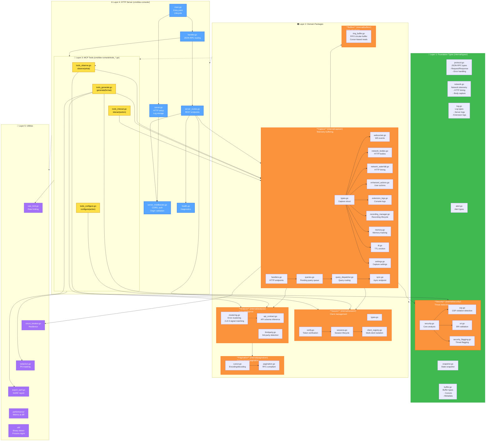

# C3: Component Architecture (Go Packages)

## Overview

The Go server is organized into 5 logical layers: Foundation Types, Domain Packages, Tools, HTTP Server, and Utilities.

## C3 Architecture Diagram



---

## Layer Responsibilities

### Layer 1: Foundation Types (`internal/types/`)
**Purpose:** Zero-dependency type definitions for all layers
- **protocol.go** - JSON-RPC 2.0 message types
- **network.go** - Network telemetry (PerformanceResourceTiming, HTTP timing)
- **log.go** - Log entry types (server logs, extension logs)
- **alert.go** - Alert types (immediate, CI, perf regression)
- **security.go** - Security threat flags
- **snapshot.go** - State snapshot types
- **buffer.go** - Buffer cursors and metadata

**Dependencies:** None
**Used By:** All other layers

### Layer 2: Domain Packages

#### **Capture** (`internal/capture/`)
**Purpose:** Receive and buffer browser telemetry
- **Ring Buffers:** logs, network_bodies, network_waterfall, websocket_events, actions
- **Memory Enforcement:** TTL eviction, max size limits
- **Query Queue:** Pending queries from AI, dispatched to extension
- **Sync Endpoint:** Batched telemetry ingestion from extension
- **Recording:** Video/audio lifecycle management

**Key Files:**
- `types.go` - Capture struct (central hub)
- `websocket.go`, `network_*.go`, `enhanced_actions.go`, `extension_logs.go` - Event-specific buffers
- `queries.go`, `query_dispatcher.go` - Query queueing
- `sync.go` - Batched telemetry reception
- `recording_manager.go` - Recording persistence
- `handlers.go` - HTTP endpoint handlers
- `memory.go`, `ttl.go` - Resource management

**Responsible For:**
- Receiving telemetry from extension
- Buffering with circular FIFO semantics
- TTL-based eviction
- Memory limit enforcement
- Query queueing and routing
- Correlation ID tracking for results

#### **Session** (`internal/session/`)
**Purpose:** Multi-client isolation and verification
- **Client Registry** - Track connected clients
- **Token Verification** - Constant-time token comparison
- **Session Lifecycle** - Create, maintain, clean up
- **Rate Limiting** - Per-client limits
- **Circuit Breaker** - Detect misbehaving clients

**Responsible For:**
- Isolating clients from each other
- Preventing token replay
- Enforcing rate limits per client
- Managing session timeouts

#### **Analysis** (`internal/analysis/`)
**Purpose:** Derive insights from captured data
- **Error Clustering** - Group errors by root cause (2-of-3 signal matching)
- **API Contract Analysis** - Infer API schemas from network traffic
- **Third-Party Detection** - Identify 3rd-party resources

**Used By:**
- `generate` tool (for test generation, error summaries)
- Security analysis (for threat context)

#### **Security** (`internal/security/`)
**Purpose:** Threat detection and compliance
- **CSP Analysis** - Detect CSP violations, suggest policies
- **SRI Analysis** - Validate Subresource Integrity
- **Threat Flagging** - Mark security issues
- **Security Diffing** - Compare security state over time

**Used By:**
- `generate` tool (for SARIF reports, CSP recommendations)
- Alerts (for security notifications)

#### **Pagination** (`internal/pagination/`)
**Purpose:** RFC-compliant cursor-based pagination
- **Cursor Encoding** - timestamp:sequence format
- **Eviction Handling** - Automatic restart when cursor expires
- **Pagination Logic** - Offset, limit, has_more

**Used By:** All observe queries with pagination

#### **Buffers** (`internal/buffers/`)
**Purpose:** Generic ring buffer data structure
- **Ring Buffer** - Fixed-size circular FIFO
- **Cursor-based Reads** - Safe concurrent reads
- **Timestamp Tracking** - Creation time metadata

**Used By:** Capture (all event buffers)

---

### Layer 3: MCP Tools (`cmd/dev-console/tools_*.go`)

**4 Tool Implementations:**

| Tool | File | Purpose | Uses |
|------|------|---------|------|
| **observe** | tools_observe.go | Query buffered telemetry | Capture, Analysis, Security |
| **generate** | tools_generate.go | Generate artifacts (tests, SARIF, HAR, CSP) | Capture, Analysis, Security |
| **interact** | tools_interact.go | DOM queries, browser control | Capture, Session |
| **configure** | tools_configure.go | Noise rules, state persistence | Session, Capture |

**Orchestration:** `tools_core.go` provides common utilities (rate limiting, response formatting, error handling)

---

### Layer 4: HTTP Server (`cmd/dev-console/`)

| Component | Purpose |
|-----------|---------|
| **main.go** | Entry point, argument parsing, lifecycle management |
| **handler.go** | JSON-RPC 2.0 request parsing and routing |
| **server.go** | HTTP server setup, log rotation, file persistence |
| **server_middleware.go** | CORS, authentication, origin validation |
| **server_routes.go** | REST endpoint registration |
| **health.go** | Health checks, diagnostics |

**HTTP Endpoints:**
- `POST /mcp` - JSON-RPC 2.0 requests
- `GET /health` - Server health check
- `GET /pending-queries` - Extension polls for work
- `POST /dom-result` - Extension posts DOM query results
- `POST /sync` - Extension posts telemetry batch
- `POST /recordings/save` - Extension posts recording video

---

### Layer 5: Utilities

| Package | Purpose |
|---------|---------|
| **rate_limit.go** | Per-client rate limiting |
| **circuit_breaker.go** | Detect and isolate misbehaving clients |
| **redaction.go** | PII and sensitive data masking |
| **export_sarif.go** | SARIF security report generation |
| **performance/** | Metrics calculation and diff |
| **util/** | Binary format detection, process management |

---

## Dependency Flow

```
Foundation Types
    ↓
Capture ← → Session ← → Analysis ← → Security
    ↓            ↓          ↓           ↓
Pagination ← Buffers   (Intelligence)
    ↓
Tools (observe, generate, interact, configure)
    ↓
HTTP Server (handler, routes, middleware)
    ↓
Utilities (rate limit, circuit breaker, etc.)
```

**Key Principle:** Lower layers don't depend on upper layers. All dependencies flow downward.

---

## Interaction Patterns

### Pattern 1: Observe Tool
```
AI calls observe({what: 'logs'})
  → handler.go routes to tools_observe.go
  → tools_observe.go queries Capture.logs buffer
  → Pagination adds cursor handling
  → Analysis enriches with context (if needed)
  → Security filters (redaction if needed)
  → Response returned to AI
```

### Pattern 2: Interact Tool (Query)
```
AI calls interact({action: 'execute_js'})
  → handler.go routes to tools_interact.go
  → tools_interact.go creates PendingQuery in Capture.queries
  → Query assigned correlation_id
  → Response returned with correlation_id (non-blocking)
  → Extension polls Capture.queries every 1s
  → Extension executes, posts result to /dom-result
  → Capture.completedResults stores result
  → AI polls for result using correlation_id
  → Session verifies token, returns result
  → Redaction filters sensitive data
```

### Pattern 3: Generate Tool
```
AI calls generate({format: 'test'})
  → handler.go routes to tools_generate.go
  → tools_generate.go queries Capture buffers
  → Analysis clusters errors, infers API schemas
  → testgen.go classifies and heals selectors
  → Pagination handles large datasets
  → Export formats as Playwright test
  → Security removes threats from output
  → Response returned to AI
```

### Pattern 4: Configure Tool
```
AI calls configure({action: 'store', data: {...}})
  → handler.go routes to tools_configure.go
  → tools_configure.go persists to disk
  → No query to extension needed
  → Response immediately returned
```

---

## References

### Implementation Files
- **Foundation:** `internal/types/*.go`
- **Capture:** `internal/capture/*.go` (29 files)
- **Session:** `internal/session/*.go` (6 files)
- **Analysis:** `internal/analysis/*.go` (7 files)
- **Security:** `internal/security/*.go` (8 files)
- **Tools:** `cmd/dev-console/tools_*.go` (8 files)
- **HTTP Server:** `cmd/dev-console/{main,handler,server,middleware,routes,health}.go`
- **Utilities:** `internal/{rate_limit,circuit_breaker,redaction,export}` + `internal/util/`

### Related Diagrams
- [C2: Containers](c2-containers.md) - Container boundaries
- [Request-Response Cycle](request-response-cycle.md) - MCP command flow
- [Data Capture Pipeline](data-capture-pipeline.md) - Telemetry flow
- [Query System](query-system.md) - Query routing details

### Documentation
- [Codebase Index](../../core/code-index.md)
- [Feature Strategy](../../core/feature-to-strategy.md)
- [MCP Correctness](../../core/mcp-correctness.md)
