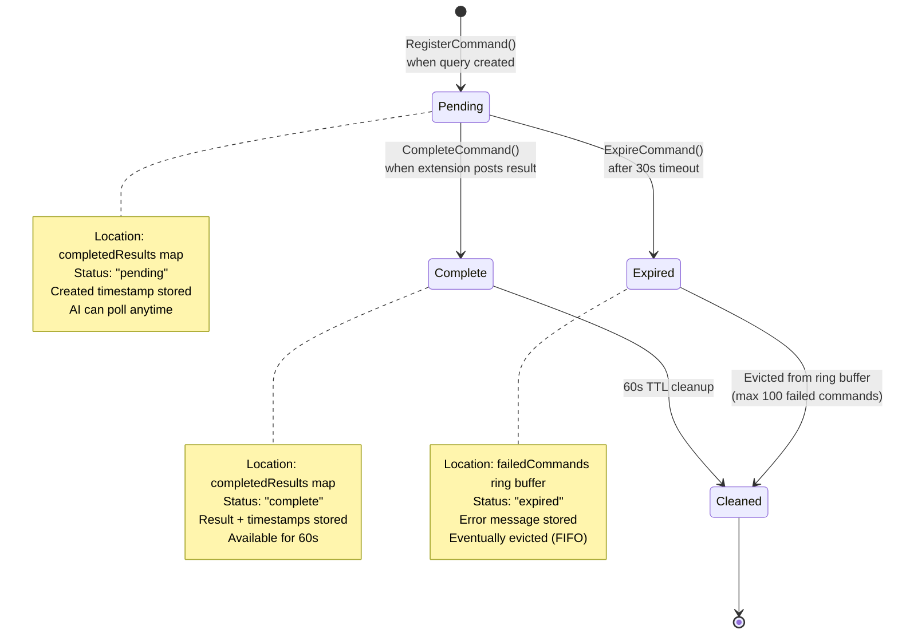
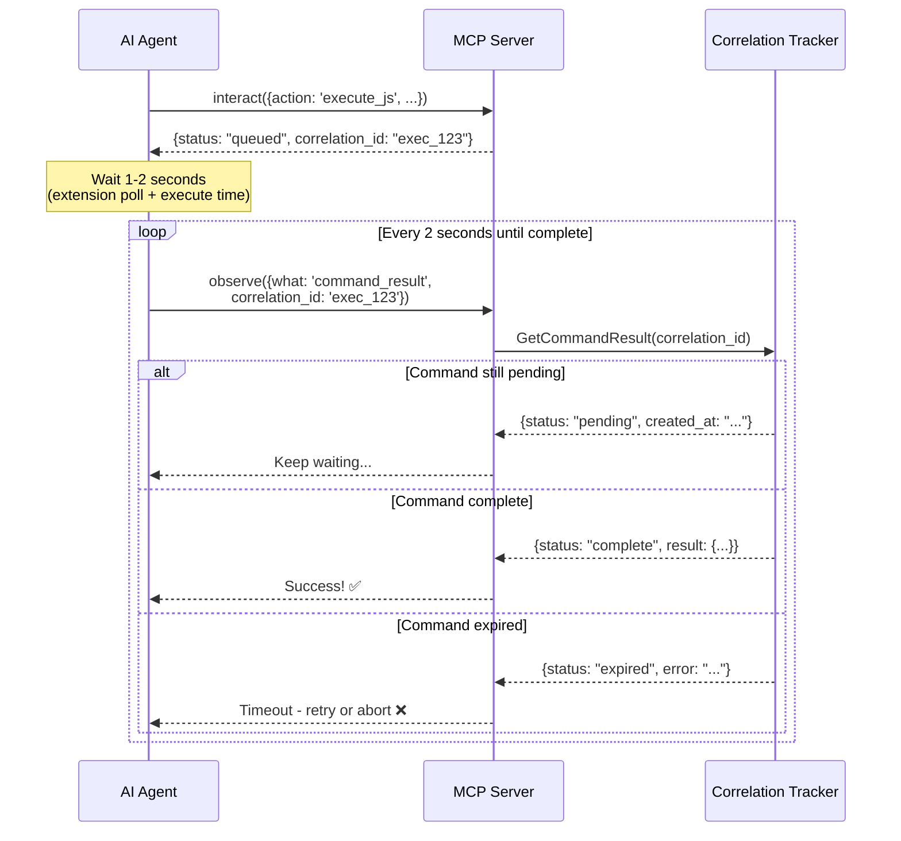
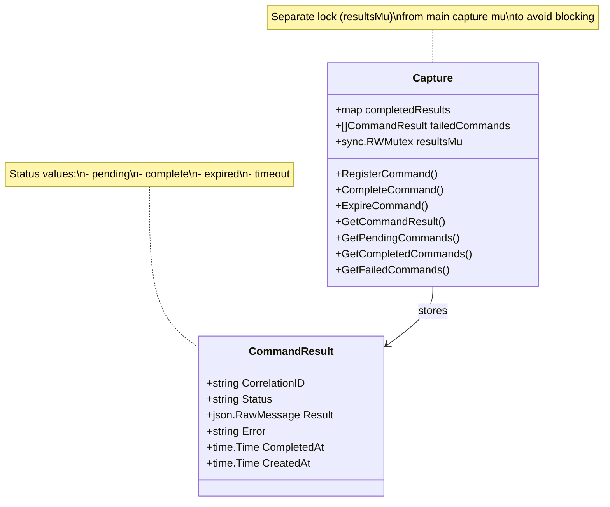
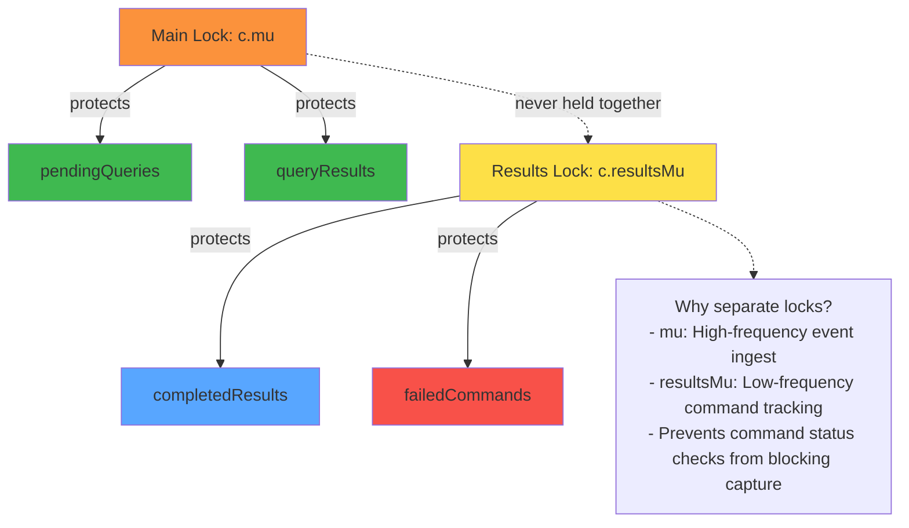

# Correlation ID Lifecycle

## Command Status Tracking



## AI Polling Pattern



## Data Structures



## Status Transition Matrix

| From | To | Trigger | Action |
|------|----|---------|-
| — | `pending` | CreatePendingQueryWithTimeout() | RegisterCommand() called |
| `pending` | `complete` | Extension posts result | CompleteCommand() called |
| `pending` | `expired` | 30s timeout | ExpireCommand() called, move to failedCommands |
| `complete` | [deleted] | 60s TTL | Background cleanup removes from completedResults |
| `expired` | [evicted] | Ring buffer full | Oldest entry removed from failedCommands (FIFO) |

## Lock Hierarchy



## Example Usage

### AI Checking Command Status

```typescript
// AI sends command
const result = await mcp.callTool('interact', {
  action: 'execute_js',
  script: 'document.title'
});

// Returns immediately with correlation_id
console.log(result);
// {status: "queued", correlation_id: "exec_12345_67890"}

// Poll for completion
while (true) {
  const status = await mcp.callTool('observe', {
    what: 'command_result',
    correlation_id: 'exec_12345_67890'
  });

  if (status.status === 'complete') {
    console.log('Result:', status.result);
    break;
  } else if (status.status === 'expired') {
    console.error('Command timed out:', status.error);
    break;
  }

  // Still pending, wait and retry
  await sleep(2000);
}
```

### Listing All Commands

```typescript
// Get overview of all async commands
const commands = await mcp.callTool('observe', {
  what: 'pending_commands'
});

console.log(`Pending: ${commands.pending.length}`);
console.log(`Completed: ${commands.completed.length}`);
console.log(`Failed: ${commands.failed.length}`);

// Inspect failed commands
const failed = await mcp.callTool('observe', {
  what: 'failed_commands'
});

failed.commands.forEach(cmd => {
  console.log(`${cmd.correlation_id}: ${cmd.error}`);
});
```

## Performance Implications

### Memory Usage
- **completedResults map:** ~200 bytes × active commands (typical: 1-10)
- **failedCommands ring:** ~200 bytes × 100 = 20KB max
- **Total:** <50KB for typical workloads

### CPU Usage
- **Map lookup:** O(1), <1μs
- **Cleanup goroutine:** Runs every 10s, <1ms duration
- **Lock contention:** None (separate resultsMu)

### Network
- **Zero** (all localhost, in-process)

## Troubleshooting

### Command stuck in "pending"

**Possible causes:**
1. Extension crashed
2. Extension not polling (check GET /pending-queries logs)
3. Tab navigated away (extension lost reference)
4. Command in queue position 6+ (only top 5 are kept)

**Check:**
```bash
# View pending queries
curl http://localhost:7890/pending-queries

# View failed commands
observe({what: 'failed_commands'})
```

### Commands immediately expiring

**Possible causes:**
1. System clock skew (check timestamps)
2. Extension polling >30s intervals (shouldn't happen)
3. Queue overflow (>5 commands/sec)

**Check AsyncCommandTimeout:**
```bash
grep AsyncCommandTimeout internal/queries/types.go
# Should show: AsyncCommandTimeout = 30 * time.Second
```

## References

- [Implementation: queries.go](../../internal/capture/queries.go)
- [Type Definition: CommandResult](../../internal/queries/types.go)
- [Async Queue Flow Diagram](async-queue-flow.md)
- [Architecture Enforcement](../ARCHITECTURE-ENFORCEMENT.md)
