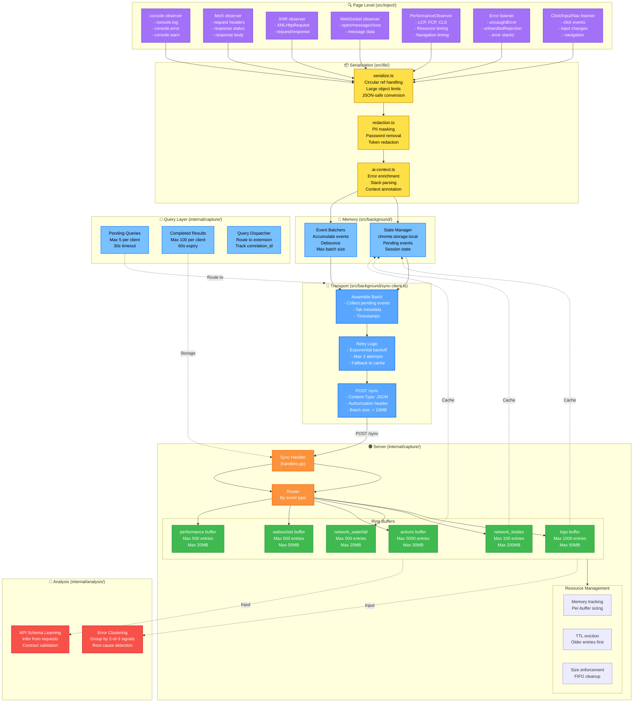
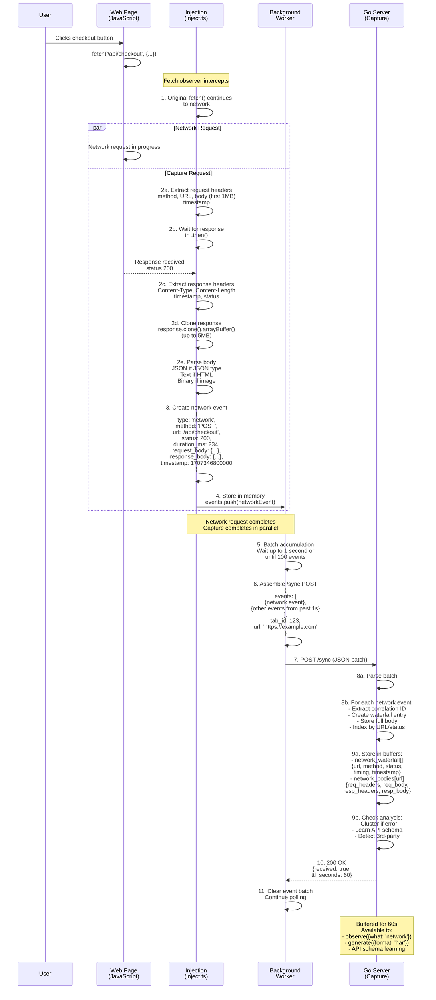
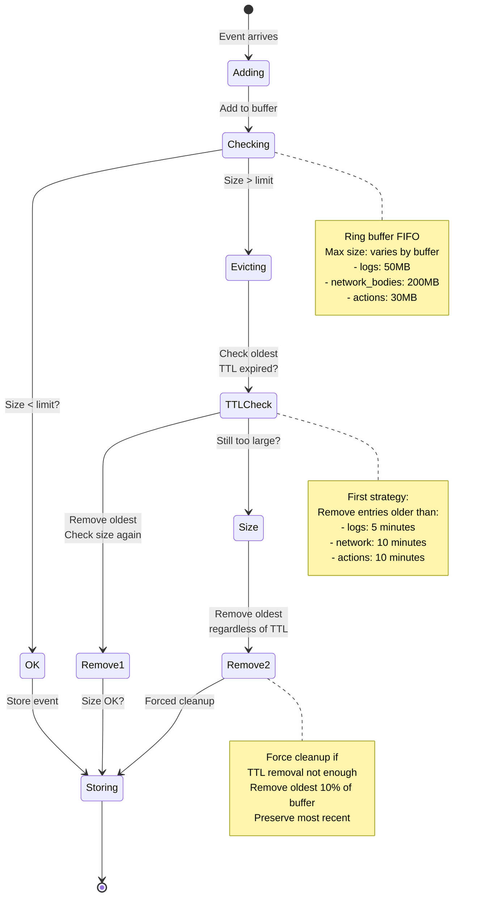

# Data Capture Pipeline: Continuous Telemetry Flow

## Overview

The data capture pipeline is a continuous, event-driven system where the page injection script observes browser events and streams them to the server via batched HTTP requests.

---

## Complete Data Flow Architecture



---

## Step-by-Step Example: Network Request Capture



---

## Buffer Management: Memory Enforcement



---

## Event Type Details

### 1. Console Events
```json
{
  "type": "console",
  "level": "log|warn|error|info|debug",
  "timestamp": 1707346800000,
  "args": ["message", {object}, 123],
  "stack": null,
  "context": {
    "url": "https://example.com",
    "line": 42,
    "source": "app.js"
  }
}
```

**Captured From:** console.log/warn/error/info/debug
**Size Limit:** Each arg up to 1KB, total 10KB per entry
**Buffer Size:** Max 1000 entries, 50MB total
**TTL:** 5 minutes

---

### 2. Network Events (Waterfall)
```json
{
  "type": "network",
  "method": "POST|GET|PUT|DELETE|PATCH",
  "url": "https://api.example.com/checkout",
  "status": 200,
  "duration_ms": 234,
  "timestamp": 1707346801000,
  "request_size_bytes": 512,
  "response_size_bytes": 1024,
  "initiator": "fetch|xhr|img|script|link",
  "protocol": "http/1.1|h2|http3"
}
```

**Captured From:** fetch() and XMLHttpRequest
**Size Limit:** Max 10KB per entry
**Buffer Size:** Max 500 entries, 20MB total
**TTL:** 10 minutes

**Separate Storage (network_bodies):**
```json
{
  "url": "https://api.example.com/checkout",
  "request_headers": {...},
  "request_body": "{\"email\": \"...\"}" (first 1MB),
  "response_headers": {...},
  "response_body": "{\"order_id\": \"...\"}" (first 5MB)
}
```

**Body Storage:** Max 100 entries, 200MB total
**TTL:** 10 minutes

---

### 3. Action Events
```json
{
  "type": "action",
  "action_type": "click|input|change|navigation",
  "target": "button[type=submit]",
  "x": 100,
  "y": 50,
  "text": "Submit",
  "timestamp": 1707346802000,
  "selectors": {
    "css": "button[type=submit]",
    "xpath": "//button[@type='submit']",
    "text": "contains(., 'Submit')",
    "data_testid": "checkout-button"
  }
}
```

**Captured From:**
- click events with selector analysis
- input/change events with target data
- navigation with URL tracking

**Size Limit:** Max 2KB per entry
**Buffer Size:** Max 5000 entries, 30MB total
**TTL:** 10 minutes

---

### 4. WebSocket Events
```json
{
  "type": "websocket",
  "event": "open|message|close|error",
  "url": "wss://socket.example.com",
  "data_size": 512,
  "data_preview": "{\"type\": \"update\", ...}" (first 1KB),
  "timestamp": 1707346803000,
  "direction": "sent|received"
}
```

**Captured From:** WebSocket API
**Size Limit:** Max 1KB preview, 100KB full
**Buffer Size:** Max 500 entries, 50MB total
**TTL:** 10 minutes

---

### 5. Performance Events
```json
{
  "type": "performance",
  "metric": "LCP|FCP|CLS|TTFB",
  "value": 1234,
  "unit": "ms|number",
  "timestamp": 1707346804000,
  "context": {
    "element": "img#hero",
    "url": "https://cdn.example.com/image.webp",
    "loadTime": 1000
  }
}
```

**Captured From:**
- PerformanceObserver('largest-contentful-paint')
- PerformanceObserver('cumulative-layout-shift')
- PerformanceObserver('first-input')
- PerformanceResourceTiming

**Size Limit:** Max 1KB per entry
**Buffer Size:** Max 500 entries, 20MB total
**TTL:** 10 minutes

---

### 6. Error Events
```json
{
  "type": "error",
  "message": "Cannot read property 'foo' of undefined",
  "stack": "Error: ...\n  at checkout...",
  "source": "app.js",
  "line": 42,
  "column": 10,
  "timestamp": 1707346805000,
  "context": {
    "url": "https://example.com/checkout",
    "user_id": "redacted",
    "request_id": "abc123"
  },
  "enrichment": {
    "root_cause": "null_pointer_dereference",
    "affected_feature": "checkout_flow",
    "severity": "high"
  }
}
```

**Captured From:**
- window.onerror
- unhandledrejection
- ErrorEvent listeners

**Size Limit:** Stack max 5KB, context 2KB
**Buffer Size:** Max 200 entries, 20MB total
**TTL:** 15 minutes (longer for errors)

---

## Memory Accounting

Each buffer tracks:
```go
type BufferStats struct {
  EntryCount       int64
  OldestTimestamp  int64
  NewestTimestamp  int64
  EstimatedBytes   int64
  TTLExpiredCount  int64
  EvictedCount     int64
  LastClearedAt    int64
}
```

**Automatic Calculation:**
- Per-entry size estimation
- Running total per buffer
- Global total (cap at 500MB)
- Alert when > 80% full

**Enforcement:**
- Evict oldest entries first (FIFO)
- Respect TTL before size (prefer time over space)
- Hard limit: 500MB total, 200MB per buffer
- Graceful degradation: drop new entries if full

---

## References

### Implementation Files

**Page-Level Capture:**
- `src/inject/observers.ts` - All event observers setup
- `src/lib/console.ts` - Console capture
- `src/lib/network.ts` - Fetch/XHR capture
- `src/lib/websocket.ts` - WebSocket capture
- `src/lib/actions.ts` - Action capture
- `src/lib/performance.ts` - Performance capture
- `src/lib/exceptions.ts` - Error capture

**Serialization & Enrichment:**
- `src/lib/serialize.ts` - Safe JSON serialization
- `src/background/dom-queries.ts` - Selector generation
- `src/lib/ai-context.ts` - Error enrichment
- `internal/redaction/redaction.go` - PII masking

**Batching & Transport:**
- `src/background/batchers.ts` - Event batching
- `src/background/sync-client.ts` - HTTP POST /sync
- `src/background/state-manager.ts` - State storage

**Server-Side Storage:**
- `internal/capture/types.go` - Capture struct
- `internal/capture/websocket.go` - WS buffer
- `internal/capture/network_waterfall.go` - Waterfall buffer
- `internal/capture/network_bodies.go` - Body storage
- `internal/capture/enhanced_actions.go` - Actions buffer
- `internal/capture/extension_logs.go` - Logs buffer
- `internal/capture/handlers.go` - /sync endpoint
- `internal/capture/memory.go` - Memory tracking
- `internal/capture/ttl.go` - TTL eviction
- `internal/capture/buffer_clear.go` - Cleanup logic

### Related Diagrams
- [Extension Message Protocol](extension-message-protocol.md) - HTTP messages
- [Request-Response Cycle](request-response-cycle.md) - MCP flow
- [C2: Containers](c2-containers.md) - Component overview
- [Query System](query-system.md) - Query routing

### Documentation
- [Timestamp Standard](../../core/timestamp-standard.md) - Time format
- [CSP Execution Strategies](../../core/csp-execution-strategies.md) - Observer limitations
- [Error Recovery](../../core/error-recovery.md) - Error handling
