# Extension Message Protocol: All Message Types & Flows

## Overview

The extension communicates with the Go server via HTTP POST requests. All messages use JSON and are designed for offline resilience (polling instead of push).

---

## Message Flow Architecture

```mermaid
graph TB
    subgraph Extension["🔄 Extension (src/background/)"]
        BGSync["Background Service Worker<br/>src/background/sync-client.ts"]
        BGPoll["Polling Loop<br/>Every 1 second"]
        BGState["State Manager<br/>chrome.storage.local"]
    end

    subgraph Server["🟠 Go Server (cmd/dev-console/)"]
        Handler["HTTP Handler<br/>handler.go"]
        Capture["Capture Manager<br/>internal/capture/"]
        Session["Session Manager<br/>internal/session/"]
    end

    subgraph Messages["📨 HTTP Messages<br/>(JSON)"]
        PendingQuery["GET /pending-queries<br/>Poll for work"]
        DOMResult["POST /dom-result<br/>Post query result"]
        QueryStatus["GET /completed-results<br/>Poll result status"]
        SyncBatch["POST /sync<br/>Telemetry batch"]
        RecordingSave["POST /recordings/save<br/>Video blob + metadata"]
        ExtLog["POST /extension-logs<br/>Extension debug logs"]
    end

    BGSync --> PendingQuery
    BGSync --> DOMResult
    BGSync --> QueryStatus
    BGSync --> SyncBatch
    BGSync --> RecordingSave
    BGSync --> ExtLog

    PendingQuery --> Capture
    DOMResult --> Capture
    QueryStatus --> Session
    SyncBatch --> Capture
    RecordingSave --> Capture
    ExtLog --> Capture

    BGPoll -.->|Every 1s| PendingQuery
    BGPoll -.->|Batched, ~1s| SyncBatch
    BGPoll -.->|On demand| QueryStatus

    BGState -.->|Read/Write| BGSync
    Handler -.->|Route to| Capture
    Handler -.->|Route to| Session
```



---

## Message Protocol: Complete Reference

### Message 1: GET /pending-queries
**Direction:** Extension → Server
**Frequency:** Every 1 second (polling)
**Purpose:** Fetch pending work (DOM queries, recording commands, etc.)

**Request:**
```http
GET /pending-queries HTTP/1.1
Host: localhost:7890
Authorization: Bearer <token>
Content-Type: application/json

(no body)
```

**Response (200 OK):**
```json
{
  "queries": [
    {
      "id": "q-42",
      "correlation_id": "exec_12345_67890",
      "action": "execute_js",
      "script": "return document.title",
      "tab_id": 123,
      "timeout_ms": 30000,
      "created_at": 1707346800000
    },
    {
      "id": "q-43",
      "correlation_id": "record_start_12346_67891",
      "action": "record_start",
      "name": "user-flow",
      "created_at": 1707346805000
    }
  ],
  "cursor": "1707346805000:2"
}
```

**Fields:**
- `queries` - Array of pending queries
- `id` - Query ID (unique within server instance)
- `correlation_id` - AI request tracking ID
- `action` - Type: execute_js, query_dom, execute_a11y_audit, record_start, record_stop
- `script` / `selector` / `audit` - Action-specific parameters
- `timeout_ms` - How long before query expires (usually 30000ms)
- `created_at` - Timestamp when query was created
- `cursor` - Pagination cursor for next request

**Error Responses:**
```json
// 401 Unauthorized - Invalid token
{
  "error": "Invalid or expired token",
  "status": "unauthorized"
}

// 429 Too Many Requests - Rate limited
{
  "error": "Rate limit exceeded",
  "retry_after_ms": 5000
}

// 500 Server Error
{
  "error": "Internal server error",
  "status": "error"
}
```

---

### Message 2: POST /dom-result
**Direction:** Extension → Server
**Frequency:** After query execution
**Purpose:** Return DOM query result to server

**Request:**
```http
POST /dom-result HTTP/1.1
Host: localhost:7890
Authorization: Bearer <token>
Content-Type: application/json

{
  "query_id": "q-42",
  "correlation_id": "exec_12345_67890",
  "action": "execute_js",
  "result": {
    "success": true,
    "value": "Home Page",
    "type": "string"
  },
  "error": null,
  "execution_time_ms": 42,
  "tab_id": 123,
  "url": "https://example.com",
  "timestamp": 1707346810000
}
```

**Success Result Fields:**
- `query_id` - Echo back server's query ID
- `correlation_id` - Echo back AI's correlation ID
- `action` - Echo back action type
- `result` - {success: true, value: <actual_result>, type: <typeof>}
- `error` - null
- `execution_time_ms` - How long query took
- `timestamp` - When result was generated

**Error Result Fields:**
```json
{
  "query_id": "q-42",
  "correlation_id": "exec_12345_67890",
  "action": "execute_js",
  "result": null,
  "error": {
    "message": "Script timed out",
    "type": "timeout",
    "stack": "Error: timeout at ...",
    "code": "QUERY_TIMEOUT"
  },
  "execution_time_ms": 30005,
  "timestamp": 1707346830000
}
```

**Response (200 OK):**
```json
{
  "status": "received",
  "query_id": "q-42",
  "ttl_seconds": 60
}
```

Server confirms receipt and tells extension how long it will keep result (60 seconds typically).

---

### Message 3: GET /completed-results
**Direction:** Extension/AI → Server (via polling)
**Frequency:** On demand (when waiting for result)
**Purpose:** Check if query result is ready

**Request:**
```http
GET /completed-results?correlation_id=exec_12345_67890 HTTP/1.1
Host: localhost:7890
Authorization: Bearer <token>
Content-Type: application/json
```

**Response (200 OK) - Result Ready:**
```json
{
  "status": "complete",
  "correlation_id": "exec_12345_67890",
  "result": {
    "success": true,
    "value": "Home Page",
    "type": "string"
  },
  "error": null,
  "expires_at": 1707346870000
}
```

**Response (200 OK) - Pending:**
```json
{
  "status": "pending",
  "correlation_id": "exec_12345_67890",
  "message": "Extension hasn't completed query yet"
}
```

**Response (200 OK) - Expired:**
```json
{
  "status": "expired",
  "correlation_id": "exec_12345_67890",
  "message": "Result older than 60s, cleaned up",
  "expired_at": 1707346870000
}
```

---

### Message 4: POST /sync (Telemetry Batch)
**Direction:** Extension → Server
**Frequency:** Every ~1 second (batched)
**Purpose:** Stream continuous telemetry from page injection script

**Request:**
```http
POST /sync HTTP/1.1
Host: localhost:7890
Authorization: Bearer <token>
Content-Type: application/json

{
  "events": [
    {
      "type": "console",
      "level": "log",
      "timestamp": 1707346800000,
      "args": ["User clicked submit"],
      "stack": null,
      "context": {...}
    },
    {
      "type": "network",
      "method": "POST",
      "url": "https://api.example.com/checkout",
      "status": 200,
      "duration_ms": 234,
      "request_headers": {...},
      "response_headers": {...},
      "timestamp": 1707346801000
    },
    {
      "type": "action",
      "action_type": "click",
      "target": "button[type=submit]",
      "x": 100,
      "y": 50,
      "timestamp": 1707346802000
    },
    {
      "type": "websocket",
      "event": "message",
      "url": "wss://socket.example.com",
      "data_size": 512,
      "timestamp": 1707346803000
    },
    {
      "type": "performance",
      "metric": "LCP",
      "value": 1234,
      "unit": "ms",
      "timestamp": 1707346804000
    }
  ],
  "tab_id": 123,
  "url": "https://example.com",
  "timestamp": 1707346804000
}
```

**Event Types:**
- `console` - Console log/error/warn/info
- `network` - HTTP request (method, status, timing, headers, body)
- `action` - User action (click, input, navigation, hover)
- `websocket` - WebSocket message (open, message, close)
- `performance` - Performance metric (LCP, FCP, CLS, etc.)
- `error` - Uncaught error or rejection

**Response (200 OK):**
```json
{
  "status": "received",
  "event_count": 5,
  "buffer_status": {
    "logs": {
      "count": 342,
      "oldest_ms": 1707346000000,
      "memory_bytes": 45600
    },
    "network": {
      "count": 28,
      "oldest_ms": 1707346100000,
      "memory_bytes": 234560
    },
    "actions": {
      "count": 156,
      "oldest_ms": 1707346050000,
      "memory_bytes": 89120
    }
  }
}
```

---

### Message 5: POST /recordings/save
**Direction:** Extension → Server
**Frequency:** Once per recording
**Purpose:** Save video blob and metadata

**Request:**
```http
POST /recordings/save HTTP/1.1
Host: localhost:7890
Authorization: Bearer <token>
Content-Type: multipart/form-data; boundary=----WebKitFormBoundary

------WebKitFormBoundary
Content-Disposition: form-data; name="metadata"
Content-Type: application/json

{
  "name": "checkout-bug--2026-02-07-1430",
  "duration_seconds": 154,
  "resolution": "1920x1080",
  "frame_rate": 30,
  "mime_type": "video/webm;codecs=vp8",
  "url": "https://example.com/checkout",
  "tab_id": 123
}

------WebKitFormBoundary
Content-Disposition: form-data; name="video"; filename="video.webm"
Content-Type: video/webm

<binary video data - 40MB>

------WebKitFormBoundary--
```

**Response (200 OK):**
```json
{
  "status": "saved",
  "name": "checkout-bug--2026-02-07-1430",
  "path": "~/.gasoline/recordings/checkout-bug--2026-02-07-1430.webm",
  "metadata_path": "~/.gasoline/recordings/checkout-bug--2026-02-07-1430_meta.json",
  "size_bytes": 42000000,
  "duration_seconds": 154
}
```

---

### Message 6: POST /extension-logs
**Direction:** Extension → Server
**Frequency:** On demand (for debugging)
**Purpose:** Send extension internal debug logs

**Request:**
```http
POST /extension-logs HTTP/1.1
Host: localhost:7890
Authorization: Bearer <token>
Content-Type: application/json

{
  "logs": [
    {
      "timestamp": 1707346800000,
      "level": "info",
      "message": "Extension initialized",
      "context": {
        "version": "5.8.0",
        "port": 7890
      }
    },
    {
      "timestamp": 1707346801000,
      "level": "debug",
      "message": "Polling /pending-queries",
      "context": {
        "response_time_ms": 12
      }
    },
    {
      "timestamp": 1707346802000,
      "level": "error",
      "message": "Failed to execute script",
      "context": {
        "query_id": "q-42",
        "error": "CSP violation",
        "recovery": "Fallback to dom-query"
      }
    }
  ]
}
```

**Response (200 OK):**
```json
{
  "status": "received",
  "log_count": 3
}
```

---

## State Machine: Extension Connection Lifecycle


---

## Data Types Reference

### Token Authorization
All requests include token in header:
```
Authorization: Bearer <api_key_or_session_token>
```

Token verification:
- Constant-time comparison
- Per-client rate limiting
- Session expiry tracking

### Correlation ID Format
```
<action>_<request_id>_<random>
Example: exec_12345_67890
```

Used to track AI request through entire pipeline:
1. AI makes request with request_id
2. Server generates correlation_id
3. Extension executes work
4. Result stored with correlation_id
5. AI polls for correlation_id

### Timestamps
All timestamps are **milliseconds since Unix epoch** (consistent with JavaScript):
```
1707346800000  // 2026-02-07T10:00:00Z
```

### Query Action Types
| Action | Input | Output | Timeout |
|--------|-------|--------|---------|
| `execute_js` | script string | return value (any JSON) | 30s |
| `query_dom` | CSS selector | array of elements + text | 30s |
| `execute_a11y_audit` | scope selector | accessibility tree | 60s |
| `record_start` | recording name | {status: 'recording'} | 5s |
| `record_stop` | none | {status: 'saved'} | 30s |

---

## Reliability Patterns

### Pattern 1: Idempotent Query IDs
Each query has unique ID within session. If extension sends same result twice, server deduplicates:
```javascript
if (completedResults[correlation_id] exists) {
  // Already processed
  // Return stored result with updated TTL
  return result;
}
```

### Pattern 2: Timeout Escalation
```
1. Extension polling gets query (t=0)
2. Extension has 30s to execute and POST
3. If no result by t=30s, server marks EXPIRED
4. Extension can still POST up to t=35s (grace period)
5. Late results treated as stale, not stored
```

### Pattern 3: Circuit Breaker
If extension posts too many errors:
```
- Count failures per extension token
- After 10 failures in 60s
- Block new queries to that extension
- Require new connection to reset
```

---

## References

### Implementation Files

**HTTP Handlers:**
- `internal/capture/handlers.go` - All endpoint implementations
  - `/pending-queries` - PendingQueries()
  - `/dom-result` - DOMResult()
  - `/sync` - Sync()
  - `/recordings/save` - RecordingsSave()
  - `/extension-logs` - ExtensionLogs()

**Extension Send/Receive:**
- `src/background/sync-client.ts` - Polling loop
- `src/background/pending-queries.ts` - Query execution
- `src/background/communication.ts` - HTTP layer

**Types:**
- `internal/types/protocol.go` - Message types
- `src/types/messages.ts` - TS message types

**Middleware:**
- `cmd/dev-console/server_middleware.go` - Auth, rate limit
- `internal/session/verify.go` - Token verification

### Related Diagrams
- [C2: Containers](c2-containers.md) - Component overview
- [Request-Response Cycle](request-response-cycle.md) - MCP flow
- [Query System](query-system.md) - Async queue details
- [Data Capture Pipeline](data-capture-pipeline.md) - Telemetry flow

### Documentation
- [Extension Message Protocol](../../core/extension-message-protocol.md) - Core docs
- [Error Recovery](../../core/error-recovery.md) - Error handling
- [Circuit Breaker Pattern](../../core/zombie-prevention.md) - Resilience
