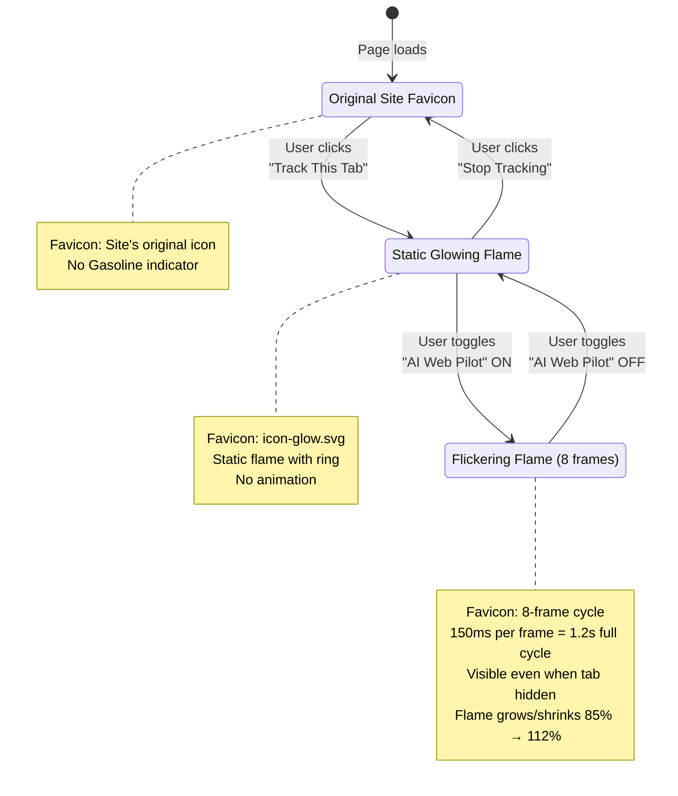
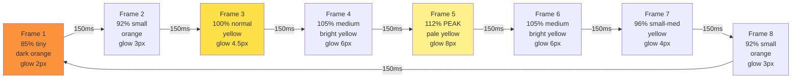
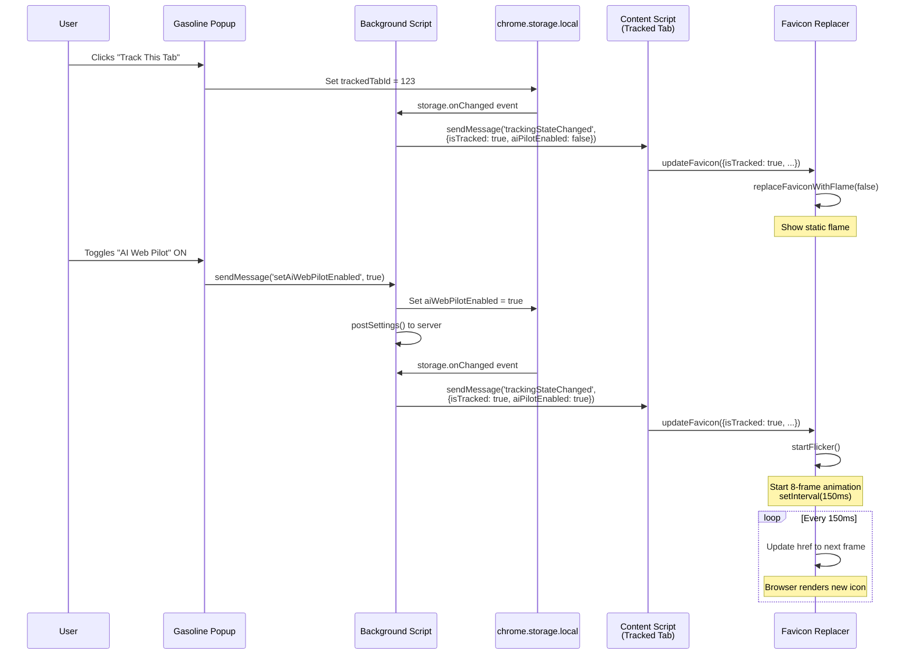
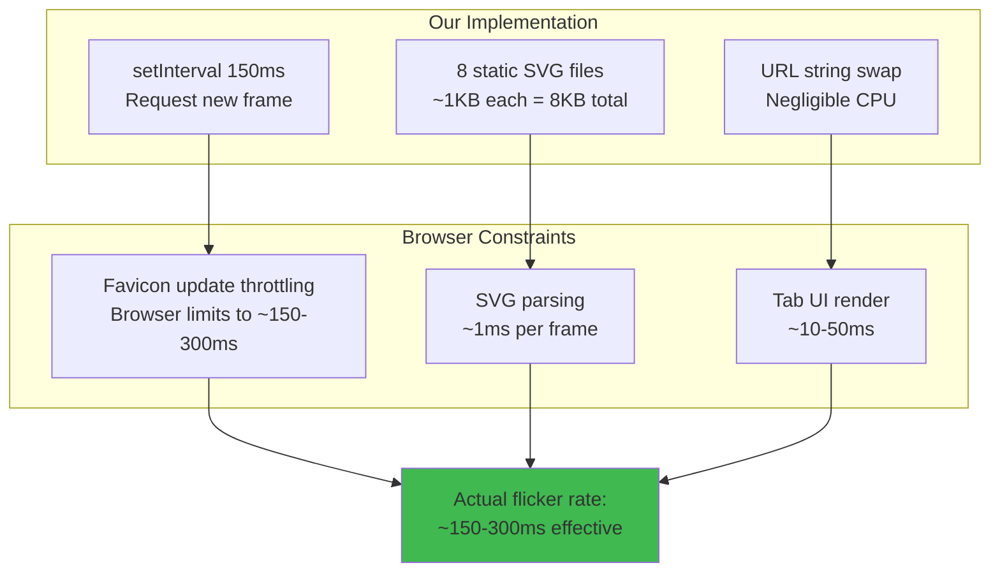
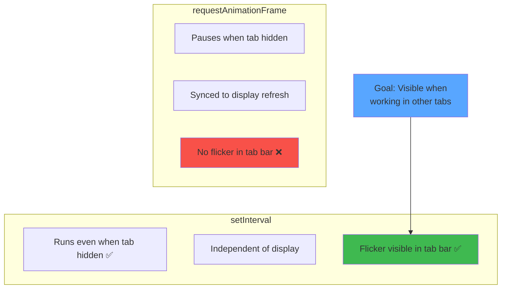
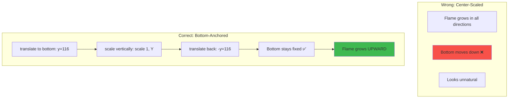
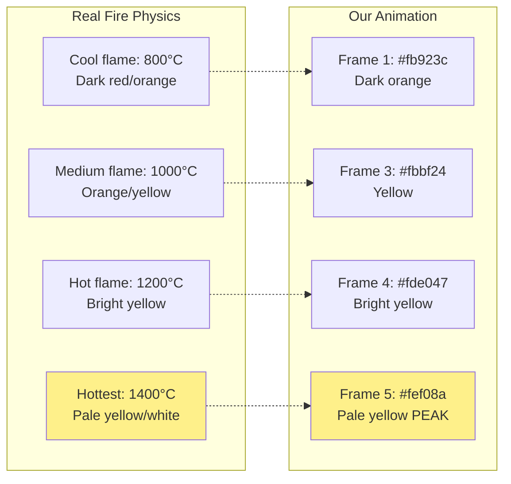
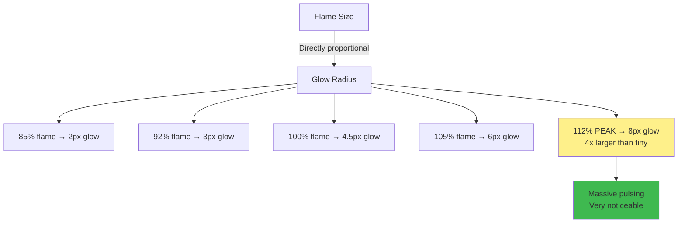
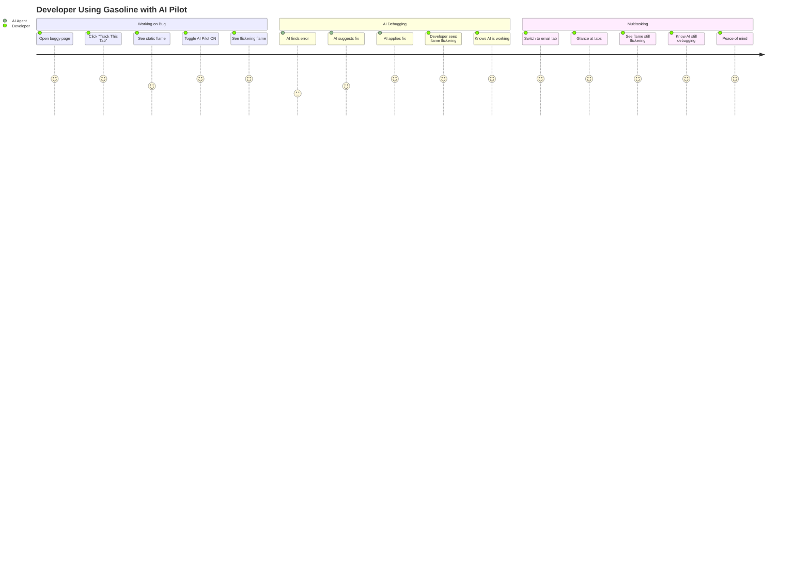

# Flickering Flame Favicon Visual Indicator

## State Machine



## Animation Sequence



## Message Flow



## SVG Frame Structure

```mermaid
graph TB
    subgraph "SVG Components (Per Frame)"
        BG[Background Circle<br/>r=60, fill=#1a1a1a<br/>CONSTANT]
        Ring[Colored Ring<br/>r=62, stroke matches flame<br/>CHANGES per frame]
        Flame[Flame Paths<br/>Scaled vertically<br/>CHANGES per frame]
        GlowF[Flame Glow Filter<br/>feGaussianBlur<br/>CHANGES per frame]
        GlowR[Ring Glow Filter<br/>feGaussianBlur<br/>CHANGES per frame]
    end

    Flame -->|Uses| GlowF
    Ring -->|Uses| GlowR

    GlowF -.->|stdDeviation| Intensity[2px → 8px<br/>Proportional to flame size]
    GlowR -.->|stdDeviation| Intensity

    Flame -.->|transform| Anchor[translate(64, 116)<br/>scale(1, Y)<br/>translate(-64, -116)]

    style BG fill:#1a1a1a,color:#fff
    style Ring fill:#fde047
    style Flame fill:#fb923c
    style GlowF fill:#fef08a
    style GlowR fill:#fef08a
```

## Performance



## Browser Compatibility

| Feature | Chrome | Brave | Edge | Firefox | Safari |
|---------|--------|-------|------|---------|--------|
| SVG Favicon | ✅ | ✅ | ✅ | ✅ | ⚠️ Limited |
| Dynamic Update | ✅ | ✅ | ✅ | ✅ | ❌ |
| Hidden Tab Flicker | ✅ | ✅ | ✅ | ✅ | N/A |
| setInterval in BG | ✅ | ✅ | ✅ | ✅ | ✅ |

**Safari note:** SVG favicons supported but dynamic updates may not show in tab bar.

## Implementation Details

### Why setInterval (not requestAnimationFrame)?



### Flame Growth (Bottom-Anchored)



## Visual Design Rationale

### Color Temperature Physics



### Glow Intensity



## User Experience



## References

- [Implementation: favicon-replacer.ts](../../src/content/favicon-replacer.ts)
- [Icon frames: extension/icons/](../../extension/icons/)
- [Tests: favicon-replacer.test.js](../../tests/extension/favicon-replacer.test.js)
- [Product Spec: Tab Tracking UX](../../docs/features/feature/tab-tracking-ux/product-spec.md)
