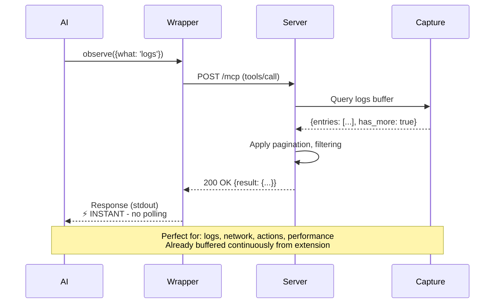
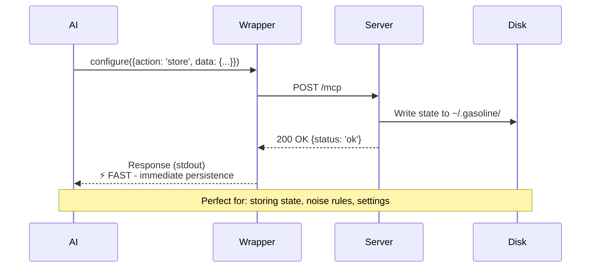
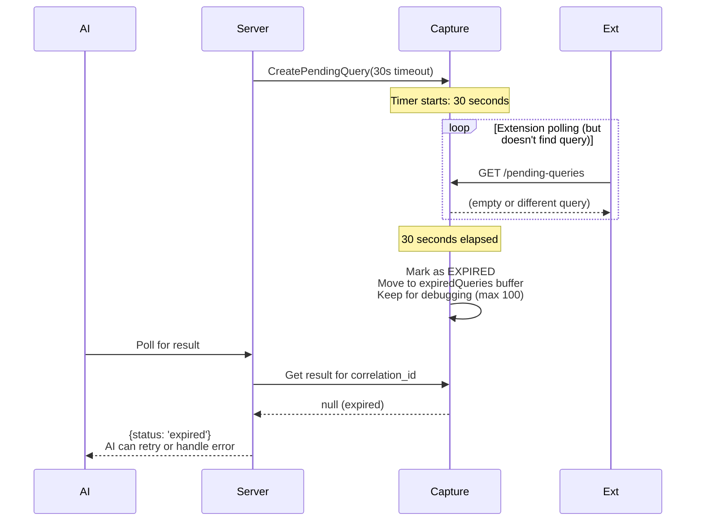
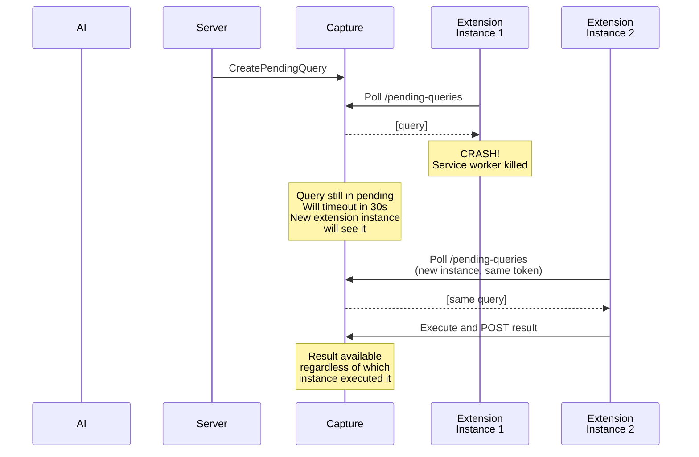
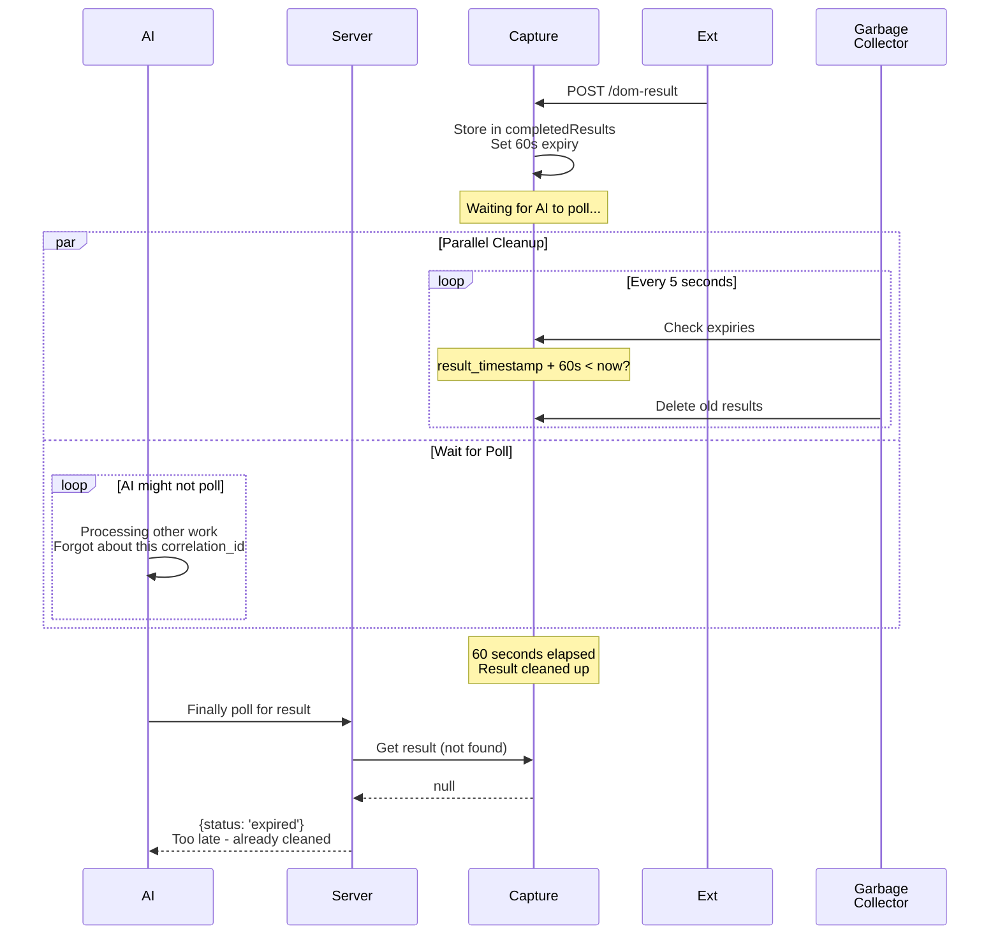

# Request-Response Cycle: Complete MCP Command Flow

## Overview

All MCP commands follow one of these patterns:
1. **Immediate Response** - Data already buffered (observe)
2. **Query Response** - Extension round-trip needed (interact)
3. **Async Polling Response** - AI polls for result (interact with polling)
4. **One-Way** - No response needed (configure)

---

## Complete Cycle: Query with Polling

This is the most complex pattern. All other patterns are simplifications.

```mermaid
sequenceDiagram
    participant AI as AI Agent<br/>(Claude, Cursor)
    participant Wrapper as Wrapper<br/>(bin/gasoline-mcp)
    participant Server as Go Server<br/>(MCP Handler)
    participant Capture as Capture<br/>Manager
    participant Session as Session<br/>Manager
    participant Ext as Extension<br/>(bg worker)
    participant Tab as Browser Tab
    participant Result as Result<br/>Storage

    Note over AI,Result: === PHASE 1: AI Makes Request ===

    AI->>Wrapper: 1. MCP Call (stdin)<br/>interact({<br/>action: 'execute_js',<br/>script: 'return document.title'<br/>})

    Note over Wrapper: Parse JSON-RPC 2.0<br/>Generate request ID: 12345

    Wrapper->>Server: 2. HTTP POST /mcp<br/>{<br/>jsonrpc: '2.0',<br/>id: 12345,<br/>method: 'tools/call',<br/>params: {<br/>name: 'interact',<br/>arguments: {...}<br/>}<br/>}

    Note over AI,Result: === PHASE 2: Server Queues Query ===

    Server->>Server: 3a. Route to tools_interact.go<br/>3b. Validate parameters<br/>3c. Verify session token

    Server->>Capture: 4a. CreatePendingQuery({<br/>action: 'execute_js',<br/>script: '...'<br/>})<br/>4b. Return query_id: 'q-42'<br/>4c. Return correlation_id:<br/>'exec_12345_67890'

    Note over Capture: Generate unique IDs<br/>Store in memory<br/>Set 30s timeout

    Server->>Session: 5. UpdateClientState({<br/>last_activity: now,<br/>pending_correlation_id:<br/>'exec_12345_67890'<br/>})

    Server-->>Wrapper: 6. HTTP Response 200 OK<br/>{<br/>jsonrpc: '2.0',<br/>id: 12345,<br/>result: {<br/>status: 'queued',<br/>correlation_id: 'exec_12345_67890',<br/>query_id: 'q-42'<br/>}<br/>}

    Note over Server: ⚡ FAST: Returns immediately<br/>Extension hasn't responded yet

    Wrapper-->>AI: 7. Response (stdout)<br/>Non-blocking, AI gets<br/>correlation_id to poll with

    Note over AI,Result: === PHASE 3: Extension Polls ===

    loop Every 1 second
        Ext->>Capture: 8. GET /pending-queries
        Note over Capture: Check if new queries<br/>Return any pending items
        Capture-->>Ext: {queries: [{<br/>query_id: 'q-42',<br/>action: 'execute_js',<br/>script: '...'<br/>}]}<br/>Include tab_id, correlation_id
    end

    Note over Ext,Capture: Loop continues until<br/>query appears in pending list

    Ext->>Tab: 9. chrome.scripting.executeScript({<br/>script: 'return document.title'<br/>})

    Tab-->>Ext: 10. Result: 'Home Page'

    Note over Ext: 11. Assemble response<br/>- query_id: 'q-42'<br/>- correlation_id: 'exec_12345_67890'<br/>- result: 'Home Page'<br/>- error: null<br/>- timestamp: now

    Ext->>Capture: 12. POST /dom-result<br/>{<br/>query_id: 'q-42',<br/>correlation_id: 'exec_12345_67890',<br/>result: {<br/>value: 'Home Page'<br/>}<br/>}

    Note over Capture: Store in completedResults<br/>Set expiry: 60s from now<br/>Remove from pending queue

    Capture->>Result: 13. Store result:<br/>completedResults[<br/>'exec_12345_67890'<br/>] = {<br/>status: 'complete',<br/>result: {...},<br/>timestamp: now<br/>}

    Capture-->>Ext: 14. HTTP 200 OK

    Note over Ext: Query complete<br/>Next poll cycle

    Note over AI,Result: === PHASE 4: AI Polls for Result ===

    Note over AI: AI waits or proceeds with<br/>other work, comes back to<br/>check result periodically

    AI->>Wrapper: 15. Poll Request (stdin)<br/>configure({<br/>action: 'query_status',<br/>correlation_id: 'exec_12345_67890'<br/>})

    Note over Wrapper: Or AI might not poll<br/>and instead call observe<br/>to get other data

    Wrapper->>Server: 16. HTTP POST /mcp<br/>{<br/>jsonrpc: '2.0',<br/>id: 12346,<br/>method: 'tools/call',<br/>params: {<br/>name: 'configure',<br/>arguments: {<br/>action: 'query_status',<br/>correlation_id: 'exec_12345_67890'<br/>}<br/>}<br/>}

    Server->>Session: 17a. Verify token<br/>17b. Check rate limit<br/>17c. Verify session active

    Server->>Result: 18. Get result:<br/>completedResults['exec_12345_67890']

    alt Result Found
        Result-->>Server: {<br/>status: 'complete',<br/>result: 'Home Page',<br/>timestamp: 1707346800000<br/>}
        Server-->>Wrapper: 19. HTTP 200<br/>{<br/>status: 'complete',<br/>result: 'Home Page'<br/>}
    else Result Expired (>60s)
        Result-->>Server: null (expired, cleaned up)
        Server-->>Wrapper: 19. HTTP 200<br/>{<br/>status: 'expired',<br/>error: 'Result no longer available'<br/>}
    else Result Not Ready Yet
        Result-->>Server: null
        Server-->>Wrapper: 19. HTTP 200<br/>{<br/>status: 'pending'<br/>}
    end

    Wrapper-->>AI: 20. Response (stdout)<br/>AI now has result or<br/>knows to retry later

    Note over AI,Result: === PHASE 5: Complete ===

    AI->>AI: 21. Process result<br/>Update context<br/>Continue agentic loop

    Note over AI,Result: Result automatically cleaned up<br/>after 60s expiry
```

---

## Variant 1: Immediate Response (observe)

Simpler pattern - data already buffered, no extension round-trip needed.

---

## Variant 2: One-Way (configure)

No response needed, just persistence.

---

## Timeout & Error Scenarios

### Scenario 1: Query Timeout (Extension Doesn't Respond)

---

### Scenario 2: Extension Restarts

---

### Scenario 3: Result Expires Before AI Polls

---

## Data Flow Summary Table

| Phase | Component | Action | Duration |
|-------|-----------|--------|----------|
| 1 | AI → Wrapper | Make MCP call | < 1ms |
| 2 | Wrapper → Server | HTTP request | < 1ms |
| 3 | Server | Parse, validate, queue | < 5ms |
| 4 | Server → Capture | Create pending query | < 1ms |
| 5 | Server → Wrapper | Return queued response | < 1ms |
| 6 | Wrapper → AI | Respond with correlation_id | < 1ms |
| **Total (Phase 1-6)** | **AI gets non-blocking response** | **< 10ms** | ⚡ **FAST** |
| 7-14 | Extension polls + executes | Wait for extension | **0-30s** | (background) |
| 15-20 | AI polls for result | Get result | **< 10ms** | (on demand) |

---

## Key Properties

### Non-Blocking Design
- AI never waits for extension to execute
- Response to AI comes in < 10ms
- Extension has 30 seconds to respond
- Result available for 60 seconds after completion

### Multi-Client Safe
- Each client has separate correlation_id
- Each extension instance has token
- Session isolation prevents cross-client contamination
- Rate limiting per client

### Resilient to Extension Crashes
- Query stays in pending queue
- New extension instance picks up same query
- Result delivery independent of which instance executed

### Memory Bounded
- Pending queries: max 5 per client, 30s timeout
- Completed results: max 100 per client, 60s expiry
- Expired queries: sampled for debugging (ring buffer)

### Debuggable
- Every correlation_id can be tracked
- Timestamps at every phase
- Expired queries kept for inspection
- No data loss (queries either complete or timeout)

---

## References

### Implementation Files

**Query Queue:**
- `internal/capture/types.go:Capture.queries`
- `internal/capture/queries.go` - Queue management
- `internal/capture/query_dispatcher.go` - Routing logic

**Result Storage:**
- `internal/capture/types.go:Capture.completedResults`
- `cmd/dev-console/tools_interact.go` - Query creation
- `cmd/dev-console/tools_core.go:CompleteCommand()` - Result storage

**Extension Polling:**
- `src/background/pending-queries.ts` - Poll logic
- `src/background/sync-client.ts` - Result posting
- `internal/capture/handlers.go:/pending-queries` - Endpoint

**Session Management:**
- `internal/session/client_registry.go` - Token verification
- `cmd/dev-console/handler.go` - Request routing
- `cmd/dev-console/server_middleware.go` - Auth middleware

**Timeout & Cleanup:**
- `internal/capture/ttl.go` - TTL enforcement
- `internal/capture/buffer_clear.go` - Cleanup logic
- `internal/pagination/pagination.go` - Eviction handling

### Related Diagrams
- [C2: Containers](c2-containers.md) - Component boundaries
- [C3: Components](c3-components.md) - Go packages
- [Query System](query-system.md) - Async queue details
- [Correlation ID Lifecycle](correlation-id-lifecycle.md) - Command tracking
- [Async Queue-and-Poll Flow](async-queue-flow.md) - Queue state machine

### Documentation
- [MCP Correctness](../../core/mcp-correctness.md) - Protocol compliance
- [Extension Message Protocol](../../core/extension-message-protocol.md) - Message types
- [Error Recovery](../../core/error-recovery.md) - Error handling strategy
