# Gasoline System Architecture

## C4 Level 1: System Context

```mermaid
graph TB
    subgraph External["External Systems"]
        Dev["👤 Developer<br/><br/>Writes code, browses<br/>web app being developed"]
        AI["🤖 AI Coding Agent<br/><br/>Claude Code, Cursor<br/>Copilot, Windsurf"]
        Browser["🌐 Web Browser<br/><br/>Chrome or Brave<br/>Renders web application"]
    end

    subgraph Gasoline["⚙️ Gasoline MCP System"]
        Core["Browser Observability Platform<br/><br/>• Captures console logs, network traffic, WebSocket events<br/>• Provides async browser control via MCP<br/>• Zero dependencies, localhost-only"]
    end

    Dev -->|"Natural language<br/>debugging requests"| AI
    Dev -->|"Browses and tests<br/>web application"| Browser

    AI <-->|"MCP Protocol<br/>Query telemetry<br/>Control browser"| Core

    Browser <-->|"HTTP (localhost:7890)<br/>Stream events<br/>Poll commands"| Core

    Core -.->|"Visual feedback<br/>🔥 Flickering favicon<br/>when AI is in control"| Browser

    style Dev fill:#58a6ff,stroke:#1f6feb,stroke-width:3px,color:#fff
    style AI fill:#fde047,stroke:#d29922,stroke-width:3px
    style Browser fill:#3fb950,stroke:#2ea043,stroke-width:3px,color:#fff
    style Core fill:#fb923c,stroke:#f97316,stroke-width:4px,color:#fff
```

## C4 Level 2: Container Diagram

## Data Flow - Event Capture

## Data Flow - Browser Control

## Process Architecture

```mermaid
graph TB
    subgraph "MCP Client (AI Agent)"
        Claude[Claude Code<br/>or Cursor/Copilot/Windsurf]
    end

    subgraph "Gasoline Processes"
        Bridge[Bridge Process<br/>PID 12345<br/>stdio ↔ HTTP forwarder]
        Server[HTTP Server<br/>PID 12346<br/>Persistent daemon on :7890]
    end

    subgraph "Browser"
        Ext[Extension Service Worker<br/>MV3 background.js]
        Content[Content Scripts<br/>Per tracked tab]
    end

    Claude -->|stdin/stdout<br/>JSON-RPC| Bridge
    Bridge -->|HTTP POST<br/>localhost:7890| Server

    Server <-->|HTTP GET/POST<br/>localhost:7890| Ext
    Ext <-->|chrome.tabs API| Content
    Content <-->|DOM manipulation| Page[Web Page]

    style Server fill:#fb923c
    style Bridge fill:#fde047
    style Ext fill:#3fb950
```

## Network Topology

```mermaid
graph LR
    subgraph "Localhost Only"
        AI[AI Agent<br/>127.0.0.1:random]
        MCP[MCP Bridge<br/>127.0.0.1:random]
        HTTP[HTTP Server<br/>127.0.0.1:7890]
        Ext[Extension<br/>chrome-extension://...]
    end

    AI -->|stdio| MCP
    MCP <-->|HTTP| HTTP
    HTTP <-->|HTTP| Ext

    Internet[Internet] -.->|❌ Never| HTTP
    Internet -.->|❌ Never| MCP

    style Internet fill:#f85149
    style HTTP fill:#3fb950
    style MCP fill:#3fb950
```

## Security Model

```mermaid
graph TD
    subgraph "Trust Boundaries"
        TB1[Browser Sandbox]
        TB2[Extension Permissions]
        TB3[Localhost Firewall]
    end

    subgraph "Data Flow"
        Page[User's Web Page] -->|Observed by| Inject[inject.js]
        Inject -->|postMessage| Content[content.js]
        Content -->|Validated| Background[background.js]
        Background -->|localhost POST| Server[HTTP Server]
    end

    Server -->|"Customer controlled<br/>--log-file flag"| LocalDisk["💾 Local Disk<br/><br/>~/gasoline-logs.jsonl<br/>Customer's machine"]

    Server -.->|"❌ Never reaches"| Cloud["☁️ Gasoline Cloud<br/><br/>No SaaS service<br/>No external APIs<br/>No telemetry"]

    Server -.->|"🔮 Future: Optional"| DistStorage["🗄️ Distributed Storage<br/><br/>Customer's own infrastructure<br/>(S3, Postgres, etc.)<br/>Customer controls access"]

    TB1 --> Page
    TB2 --> Background
    TB3 --> Server

    style Cloud fill:#f85149,color:#fff,stroke:#d73a49,stroke-width:3px
    style LocalDisk fill:#3fb950,color:#fff,stroke:#2ea043,stroke-width:3px
    style DistStorage fill:#58a6ff,color:#fff,stroke:#1f6feb,stroke-width:2px
    style Server fill:#fb923c,color:#fff

    note1["Key Security Points:<br/>✅ All data stays on customer's infrastructure<br/>✅ Customer chooses storage location<br/>✅ Zero external dependencies<br/>❌ Never sent to Gasoline's servers"]
    Server -.-> note1
```

## Deployment Model

## Scaling Characteristics

## Technology Stack

## References

- [Async Queue Flow](async-queue-flow.md)
- [Correlation ID Lifecycle](correlation-id-lifecycle.md)
- [5-Layer Protection](5-layer-protection.md)
- [Flame Flicker Visual](flame-flicker-visual.md)
- [ADR-001: Async Queue Pattern](../ADR-001-async-queue-pattern.md)
