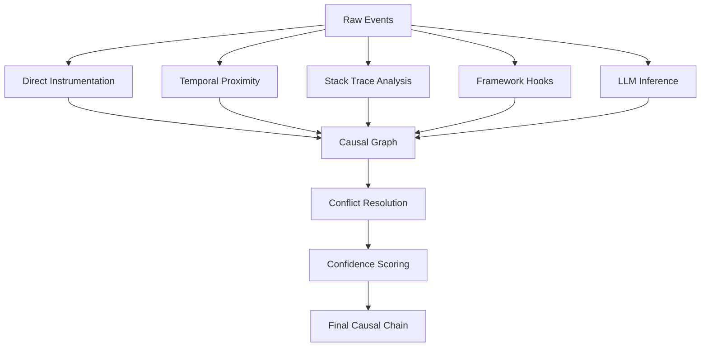
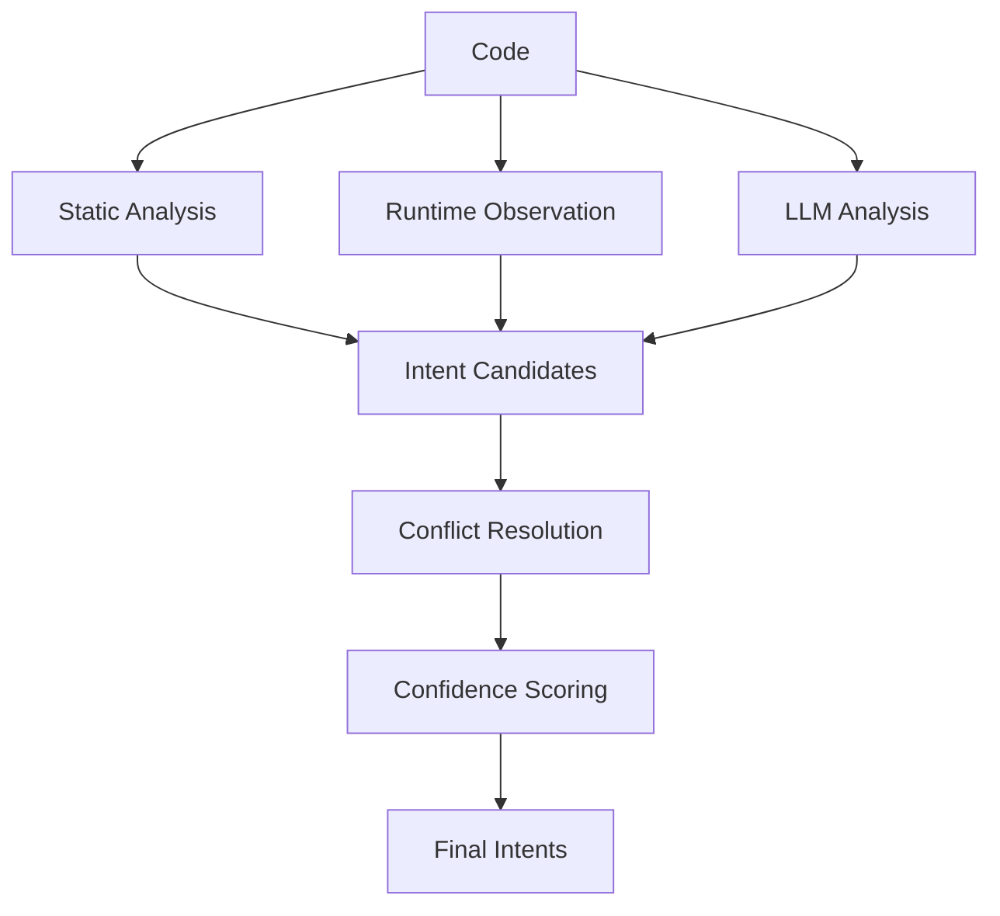

# Causal Chains & Intent Inference

**Deep dive into implementing causal reasoning and intent understanding for AI-first debugging.**

---

# Part 1: Causal Chains

## What Are Causal Chains?

A **causal chain** is a sequence of events where each event causes the next. Unlike simple correlation (A happened, then B happened), causality means A *made* B happen.

**Example:**
```
User types "invalid@email" → Validation runs → Validation fails → Error shown → Button disabled
```

Each arrow represents causation, not just temporal sequence.

---

## Why Causal Chains Matter for AI

| Without Causal Chains | With Causal Chains |
|----------------------|-------------------|
| AI sees: "Button disabled, error shown" | AI sees: "Button disabled BECAUSE validation failed BECAUSE user typed invalid email" |
| AI must guess root cause | AI knows root cause directly |
| AI may suggest wrong fix | AI suggests precise fix |
| Debugging is trial-and-error | Debugging is systematic |

---

## Building Causal Chains: The Technical Model

### Event Model

Every event in the causal chain has:

```typescript
interface CausalEvent {
  id: string;                    // Unique ID (UUID)
  type: EventType;               // user_action, dom_mutation, network_call, etc.
  timestamp: number;             // High-precision timestamp
  causes: string[];             // IDs of events that caused this event
  effects: string[];            // IDs of events this caused
  data: EventData;              // Event-specific data
  confidence?: number;           // Confidence in causal link (0-1)
}
```

### Event Types

| Type | Description | Example |
|------|-------------|---------|
| `user_action` | User input (click, type, scroll) | User typed in email field |
| `dom_mutation` | DOM changed | Error message added to DOM |
| `state_change` | Application state changed | Form error state set to true |
| `network_call` | HTTP/WebSocket request | POST /api/auth/login |
| `network_response` | HTTP/WebSocket response | 400 Bad Request |
| `validation_run` | Validation executed | Email validator ran |
| `validation_result` | Validation passed/failed | Email validation failed |
| `error_thrown` | Error/exception thrown | TypeError: Cannot read property |
| `error_caught` | Error caught by handler | Error caught in try/catch |

---

## Causal Linking Strategies

### Strategy 1: Direct Instrumentation (Most Reliable)

**How it works:** Code explicitly declares causal relationships.

```javascript
// In your validation code
function validateEmail(email) {
  const result = emailValidator.validate(email);
  
  // Explicitly declare causality
  causal.link({
    from: getEventId('user_typed'),  // User typing caused validation
    to: getEventId('validation_run'),
    type: 'triggers'
  });
  
  if (!result.valid) {
    causal.link({
      from: getEventId('validation_run'),
      to: getEventId('validation_failed'),
      type: 'results_in'
    });
    
    causal.link({
      from: getEventId('validation_failed'),
      to: getEventId('error_shown'),
      type: 'causes'
    });
  }
  
  return result;
}
```

**Pros:**
- 100% accurate causal relationships
- No inference needed
- Clear intent

**Cons:**
- Requires code changes
- Developer burden
- May miss unintended causal paths

---

### Strategy 2: Temporal Proximity (Heuristic)

**How it works:** Events that happen close in time are likely causally related.

```javascript
function inferCausality(events: CausalEvent[]): CausalLink[] {
  const links: CausalLink[] = [];
  
  for (let i = 0; i < events.length; i++) {
    for (let j = i + 1; j < events.length; j++) {
      const timeDiff = events[j].timestamp - events[i].timestamp;
      
      // If events happen within 100ms, likely causal
      if (timeDiff < 100) {
        links.push({
          from: events[i].id,
          to: events[j].id,
          type: 'inferred',
          confidence: calculateConfidence(events[i], events[j])
        });
      }
    }
  }
  
  return links;
}
```

**Pros:**
- No code changes needed
- Works with existing applications
- Fast to implement

**Cons:**
- Can produce false positives (coincidence)
- Can miss async causality (events separated by time)
- Confidence is probabilistic

---

### Strategy 3: Stack Trace Analysis (For Errors)

**How it works:** Parse stack traces to link errors to their causes.

```javascript
function linkErrorToCause(error: ErrorEvent): CausalLink[] {
  const links: CausalLink[] = [];
  
  // Parse stack trace
  const stack = parseStackTrace(error.stack);
  
  // Find the function that threw the error
  const throwingFunction = stack[0];
  
  // Find the function that called it
  const callerFunction = stack[1];
  
  // Link caller to error
  links.push({
    from: findEventByFunction(callerFunction),
    to: error.id,
    type: 'called',
    confidence: 0.95
  });
  
  return links;
}
```

**Pros:**
- Highly accurate for errors
- No code changes
- Works with existing applications

**Cons:**
- Only works for errors
- Stack traces can be minified/obfuscated
- Doesn't capture non-error causality

---

### Strategy 4: Framework Hooks (React/Vue/Svelte)

**How it works:** Hook into framework lifecycle to capture causality.

```javascript
// React example
function withCausalTracking(WrappedComponent) {
  return function(props) {
    const prevProps = useRef(props);
    
    useEffect(() => {
      // Detect prop change
      const changedProps = detectChanges(prevProps.current, props);
      
      for (const prop of changedProps) {
        causal.link({
          from: findEventThatChangedProp(prop),
          to: getCurrentRenderEvent(),
          type: 'prop_change_caused_render'
        });
      }
      
      prevProps.current = props;
    });
    
    return <WrappedComponent {...props} />;
  };
}
```

**Pros:**
- Captures framework-specific causality
- Deep integration with component lifecycle
- Understands re-renders, state updates

**Cons:**
- Framework-specific
- Requires instrumentation
- Performance overhead

---

### Strategy 5: LLM-Assisted Inference (Hybrid)

**How it works:** Use LLM to infer causality from event sequences.

```javascript
async function inferCausalityWithLLM(events: CausalEvent[]): Promise<CausalLink[]> {
  const prompt = `
    Analyze these events and determine causal relationships:
    
    ${events.map(e => `- ${e.type}: ${JSON.stringify(e.data)}`).join('\n')}
    
    Output causal links in format: [event_id] -> [event_id] (reason)
  `;
  
  const response = await callLLM(prompt);
  return parseCausalLinks(response);
}
```

**Pros:**
- Can understand semantic causality
- Handles complex scenarios
- No code changes

**Cons:**
- Slower (LLM latency)
- May hallucinate
- Cost (LLM API calls)

---

## Hybrid Approach: Recommended Strategy

Combine multiple strategies for best results:



**Priority:**
1. **Direct instrumentation** (highest confidence)
2. **Framework hooks** (high confidence for framework apps)
3. **Stack trace analysis** (high confidence for errors)
4. **Temporal proximity** (medium confidence, fast)
5. **LLM inference** (low confidence, semantic understanding)

---

## Querying Causal Chains

### Query: "Why is X happening?"

```javascript
query({
  target: "submit_button_disabled",
  mode: "why",
  depth: 5
})

Result: {
  target: "submit_button_disabled",
  causal_chain: [
    {
      event_id: "evt_123",
      type: "user_action",
      description: "User typed 'invalid@email'",
      timestamp: 1643827200000,
      confidence: 1.0
    },
    {
      event_id: "evt_124",
      type: "validation_run",
      description: "Email validator executed",
      caused_by: ["evt_123"],
      confidence: 0.95
    },
    {
      event_id: "evt_125",
      type: "validation_failed",
      description: "Email validation failed: invalid format",
      caused_by: ["evt_124"],
      confidence: 0.98
    },
    {
      event_id: "evt_126",
      type: "state_change",
      description: "Form error state set to true",
      caused_by: ["evt_125"],
      confidence: 0.95
    },
    {
      event_id: "evt_127",
      type: "dom_mutation",
      description: "Submit button disabled attribute set",
      caused_by: ["evt_126"],
      confidence: 1.0
    }
  ],
  root_cause: {
    event_id: "evt_123",
    description: "User typed 'invalid@email'",
    fix_suggestion: "User should type a valid email format (contains @)"
  }
}
```

### Query: "What will happen if I do X?"

```javascript
query({
  action: "click_submit_button",
  mode: "what_if",
  depth: 3
})

Result: {
  action: "click_submit_button",
  predicted_effects: [
    {
      effect: "form_submission",
      description: "Form will attempt to submit",
      confidence: 0.9
    },
    {
      effect: "validation_error",
      description: "Validation will fail due to invalid email",
      confidence: 0.95
    },
    {
      effect: "error_display",
      description: "Error message will be shown",
      confidence: 0.9
    }
  ],
  will_succeed: false,
  reason: "Form has validation errors"
}
```

---

## Challenges & Solutions

| Challenge | Solution |
|-----------|----------|
| **Async causality** — Events separated by time | Track async IDs (Promise IDs, request IDs) and link across time |
| **Multiple causes** — One event has many causes | Support multi-parent causality (DAG, not just chain) |
| **Circular causality** — A causes B, B causes A | Detect cycles and break them (use timestamps) |
| **Confidence uncertainty** — Not all links are certain | Confidence scoring, expose to AI for reasoning |
| **Performance** — Too many events to process | Sampling, batching, incremental processing |

---

# Part 2: Intent Inference

## What Is Intent Inference?

**Intent inference** is understanding *what code is trying to do*, not just *what it does*.

| Code Does | Code Intent |
|-----------|-------------|
| `if (!email.includes('@')) throw new Error()` | Validate email format |
| `fetch('/api/users')` | Retrieve user list |
| `localStorage.setItem('token', token)` | Persist authentication |
| `router.push('/dashboard')` | Navigate to dashboard |

---

## Why Intent Inference Matters

| Without Intent | With Intent |
|----------------|-------------|
| AI sees: "Function checks if email has @" | AI sees: "This function validates email format" |
| AI doesn't know business rules | AI knows: "Email must contain @" |
| AI can't suggest business-level fixes | AI suggests: "Update email format rule" |
| Debugging is code-focused | Debugging is business-focused |

---

## Intent Inference Techniques

### Technique 1: Static Analysis (Code Patterns)

**How it works:** Analyze code structure to infer intent.

```javascript
function inferIntentFromCode(code: string): Intent[] {
  const intents: Intent[] = [];
  
  // Pattern: validation
  if (code.match(/if\s*\(!.*\.includes\(/)) {
    intents.push({
      type: 'validation',
      rule: 'format_check',
      description: 'Validates format of input'
    });
  }
  
  // Pattern: API call
  if (code.match(/fetch\s*\(\s*['"]/)) {
    intents.push({
      type: 'api_call',
      endpoint: extractEndpoint(code),
      description: 'Makes API request'
    });
  }
  
  // Pattern: state update
  if (code.match(/setState|useState|useReducer/)) {
    intents.push({
      type: 'state_update',
      description: 'Updates application state'
    });
  }
  
  return intents;
}
```

**Pros:**
- Fast (no runtime needed)
- Works on codebase analysis
- Deterministic

**Cons:**
- Limited to known patterns
- Misses custom logic
- Doesn't capture runtime behavior

---

### Technique 2: Runtime Observation (Behavior)

**How it works:** Observe what code does at runtime to infer intent.

```javascript
function inferIntentFromBehavior(events: Event[]): Intent[] {
  const intents: Intent[] = [];
  
  // Observe: function called with email, throws error
  const emailValidationEvents = events.filter(e => 
    e.type === 'function_call' && 
    e.data.args?.[0]?.includes('@')
  );
  
  if (emailValidationEvents.some(e => e.data.threwError)) {
    intents.push({
      type: 'validation',
      target: 'email',
      rule: 'must_contain_@',
      description: 'Validates email format'
    });
  }
  
  // Observe: API call to /auth/login
  const loginCalls = events.filter(e => 
    e.type === 'network_call' && 
    e.data.url === '/auth/login'
  );
  
  if (loginCalls.length > 0) {
    intents.push({
      type: 'authentication',
      method: 'login',
      description: 'Authenticates user'
    });
  }
  
  return intents;
}
```

**Pros:**
- Captures actual behavior
- Works with any code
- No pattern matching needed

**Cons:**
- Requires runtime execution
- May miss edge cases
- Slower than static analysis

---

### Technique 3: LLM-Assisted (Semantic Understanding)

**How it works:** Use LLM to understand code intent.

```javascript
async function inferIntentWithLLM(code: string): Promise<Intent[]> {
  const prompt = `
    Analyze this code and describe its intent:
    
    \`\`\`javascript
    ${code}
    \`\`\`
    
    Output as JSON:
    {
      "intents": [
        {
          "type": "validation|api_call|state_update|authentication|navigation",
          "description": "Human-readable description",
          "business_rule": "If applicable"
        }
      ]
    }
  `;
  
  const response = await callLLM(prompt);
  return JSON.parse(response).intents;
}
```

**Pros:**
- Understands semantic meaning
- Handles complex logic
- No pattern matching

**Cons:**
- Slower (LLM latency)
- May hallucinate
- Cost (LLM API calls)

---

### Technique 4: Hybrid (Recommended)

Combine all techniques:



**Priority:**
1. **Static analysis** (fast, deterministic)
2. **Runtime observation** (validates static analysis)
3. **LLM analysis** (handles complex cases, fills gaps)

---

## Intent Taxonomy

### Common Intent Types

| Intent Type | Description | Example |
|-------------|-------------|---------|
| `validation` | Validates input against rules | Email format, password strength |
| `authentication` | Authenticates user | Login, logout, token refresh |
| `authorization` | Checks permissions | Role-based access control |
| `data_fetch` | Retrieves data | API calls, database queries |
| `data_mutation` | Modifies data | POST, PUT, DELETE requests |
| `state_update` | Updates application state | React setState, Redux dispatch |
| `navigation` | Changes route/page | Router.push, window.location |
| `error_handling` | Handles errors | try/catch, error boundaries |
| `logging` | Logs events | console.log, analytics |
| `persistence` | Saves data | localStorage, sessionStorage |

### Business-Level Intents

| Intent Type | Description | Example |
|-------------|-------------|---------|
| `user_signup` | Registers new user | Email validation, account creation |
| `user_login` | Authenticates existing user | Credentials check, token issuance |
| `checkout` | Processes purchase | Payment, inventory update |
| `search` | Searches for items | Query execution, result filtering |
| `notification` | Sends notification | Email, push, in-app |

---

## Querying Intent

### Query: "What does this function do?"

```javascript
query({
  target: "validateEmail",
  mode: "intent"
})

Result: {
  target: "validateEmail",
  intents: [
    {
      type: "validation",
      description: "Validates email format",
      business_rules: [
        "Email must contain @ symbol",
        "Email must have domain after @"
      ],
      confidence: 0.95
    }
  ],
  code_summary: "Checks if email string contains @ symbol",
  related_intents: [
    { type: "error_handling", description: "Throws error if invalid" }
  ]
}
```

### Query: "What are the business rules for login?"

```javascript
query({
  feature: "login",
  mode: "business_rules"
})

Result: {
  feature: "login",
  business_rules: [
    {
      rule: "Email must be valid format",
      enforced_by: "EmailValidator.validate",
      confidence: 0.98
    },
    {
      rule: "Password must be at least 8 characters",
      enforced_by: "PasswordValidator.validate",
      confidence: 0.95
    },
    {
      rule: "Rate limit: 5 attempts per minute",
      enforced_by: "RateLimiter.check",
      confidence: 0.9
    }
  ]
}
```

---

## Implementation Considerations

### Performance

| Technique | Latency | When to Use |
|-----------|----------|--------------|
| Static analysis | <10ms | Always (fast, free) |
| Runtime observation | <50ms | During debugging sessions |
| LLM inference | 500-2000ms | Complex cases, on-demand |

### Privacy

- Don't send sensitive code to LLM
- Redact passwords, tokens, PII
- Allow opt-out for code analysis

### Extensibility

- Allow custom intent patterns
- Plugin system for domain-specific intents
- User-defined business rules

---

## Related Documents

- [ai-engineering.md](ai-engineering.md) — AI-first vision overview
- [semantic-graph.md](semantic-graph.md) — Semantic State Graph deep dive
- [architecture.md](../../.claude/refs/architecture.md) — System architecture

---

**Last Updated:** 2026-02-02
**Status:** Proposed — Deep dive for discussion and refinement
