# Semantic State Graph

**Deep dive into semantic application state modeling for AI-first debugging and observability.**

---

## What Is a Semantic State Graph?

A Semantic State Graph is a structured representation of application state where:

1. **Entities** (nodes) represent meaningful application concepts (users, forms, products, sessions)
2. **Relationships** (edges) represent how entities connect and interact
3. **Semantics** (metadata) describe what each entity and relationship means
4. **Temporal dimension** tracks how the graph changes over time

**Key insight:** Instead of exposing raw data (DOM nodes, console logs, network requests), we expose a *model* of what the application *means*.

---

## Why Current Approaches Fall Short

| Current Approach | Problem | AI Impact |
|------------------|---------|------------|
| **Raw DOM dump** | `<button class="btn-primary">Submit</button>` | AI doesn't know this is a login submit button |
| **Console logs** | `Error: Invalid email format` | AI doesn't know which field, which validator, what rule |
| **Network trace** | `POST /api/auth/login 400` | AI doesn't know why, what was sent, what validation failed |
| **React DevTools** | Shows component tree + state | AI sees structure, not intent |

**Result:** AI must infer meaning from raw data. This is error-prone, token-inefficient, and misses crucial context.

---

## The Semantic State Graph Model

### Core Entities

| Entity Type | Example | Semantic Properties |
|-------------|---------|---------------------|
| **User** | Current logged-in user | `id`, `role`, `permissions`, `session_state` |
| **Form** | Login form, signup form | `name`, `purpose`, `fields`, `validation_rules` |
| **Field** | Email input, password input | `name`, `type`, `value`, `validation_status`, `error_message` |
| **Action** | Click, submit, type | `type`, `target`, `triggered_by`, `result` |
| **Component** | Button, modal, dropdown | `role`, `purpose`, `state`, `visible` |
| **API Call** | Fetch request, mutation | `endpoint`, `method`, `payload`, `response`, `status` |
| **Error** | Validation error, network error | `type`, `severity`, `source`, `context` |
| **Navigation** | Route change, page load | `from`, `to`, `trigger`, `params` |

### Core Relationships

| Relationship | From | To | Meaning |
|--------------|------|-----|---------|
| `has_field` | Form | Field | Form contains this field |
| `validates` | Field | Validator | Field is validated by this rule |
| `triggers` | Action | API Call | Action triggers this API call |
| `updates` | API Call | Component | API call updates this component |
| `displays_error` | Component | Error | Component shows this error |
| `belongs_to` | Error | Field | Error belongs to this field |
| `authenticates` | API Call | User | API call authenticates this user |

### Example Graph: Login Flow


---

## Querying the Semantic State Graph

Instead of querying raw data, AI queries the semantic model:

### Query 1: "Why is the submit button disabled?"

**Current approach (DOM):**
```javascript
document.querySelector('.submit-button').disabled  // true
// But why? Need to trace through code manually
```

**Semantic State Graph query:**
```javascript
query({
  entity: "submit_button",
  property: "disabled",
  reason: true  // Return causal chain
})

Result: {
  disabled: true,
  reason: [
    {
      entity: "login_form",
      property: "has_error",
      value: true,
      caused_by: {
        entity: "email_field",
        property: "validation_status",
        value: "invalid",
        validator: "email_format",
        rule: "Must contain @ symbol",
        input: "user-at-example.com"  // Missing @
      }
    }
  ]
}
```

### Query 2: "What happens when I click submit?"

**Current approach:** Read event handler code, trace manually

**Semantic State Graph query:**
```javascript
query({
  entity: "submit_button",
  action: "click",
  effects: true
})

Result: {
  action: "click",
  effects: [
    {
      type: "api_call",
      endpoint: "POST /auth/login",
      payload: { email: "...", password: "..." },
      expected_response: { token: "..." },
      side_effects: [
        { type: "navigation", to: "/dashboard" },
        { type: "storage", key: "auth_token" }
      ]
    }
  ]
}
```

### Query 3: "Find all errors currently displayed"

**Current approach:** Scan DOM for error elements

**Semantic State Graph query:**
```javascript
query({
  entity_type: "error",
  visible: true,
  include_context: true
})

Result: {
  errors: [
    {
      type: "validation_error",
      message: "Invalid email format",
      field: "email",
      component: "login_form",
      severity: "warning",
      timestamp: "2026-02-02T23:15:23Z"
    }
  ]
}
```

---

## Building the Semantic State Graph

### Data Sources

| Source | What It Provides | How It Maps to Graph |
|--------|------------------|----------------------|
| **DOM** | Structure, visible state | Components, fields, current values |
| **React/Vue/Svelte** | Component state, props | Form state, validation status, error messages |
| **Console** | Errors, warnings, logs | Errors, validation failures, debug info |
| **Network** | API calls, responses | API entities, authentication status, data flow |
| **User Actions** | Clicks, typing, navigation | Action entities, causal chains |
| **Code Analysis** | Function signatures, intent | Validators, business logic, component purpose |

### Construction Pipeline

```mermaid
graph LR
    A[Raw Data] --> B[Extraction Layer]
    B --> C[Semantic Mapping]
    C --> D[Graph Construction]
    D --> E[State Graph]
    
    B -->|DOM| C1[Component Extractor]
    B -->|React| C2[State Extractor]
    B -->|Network| C3[API Extractor]
    B -->|Console| C4[Error Extractor]
    
    C1 --> D
    C2 --> D
    C3 --> D
    C4 --> D
```



### Key Challenges

1. **Framework Detection & Integration**
   - Detect React/Vue/Svelte vs. vanilla JS
   - Hook into framework internals (React DevTools, Vue DevTools)
   - Extract component state without performance impact

2. **Intent Inference**
   - What does this component *do*? (Not just what it *is*)
   - Requires static analysis + runtime observation
   - May need LLM assistance for complex cases

3. **Causal Tracking**
   - Link events to their causes
   - Requires timestamp precision
   - Need to handle async operations

4. **Performance**
   - Graph construction must be fast (<10ms)
   - Cannot block main thread
   - Must handle large applications (1000+ components)

5. **Privacy**
   - Don't expose sensitive data in graph
   - Redact passwords, tokens, PII
   - Allow selective exposure

---

## Implementation Strategy

### Phase 1: Foundation (v6.0-v6.1)

**Goal:** Build basic graph structure from existing data

- Extract components from DOM with semantic labels
- Map network calls to API entities
- Link console errors to components
- Basic query interface

**Example output:**
```javascript
{
  components: [
    { id: "login_form", type: "form", purpose: "authentication" },
    { id: "email_field", type: "input", label: "Email" }
  ],
  api_calls: [
    { id: "login_api", endpoint: "POST /auth/login", status: "pending" }
  ],
  relationships: [
    { from: "login_form", to: "email_field", type: "has_field" }
  ]
}
```

### Phase 2: Framework Integration (v6.2-v6.3)

**Goal:** Deep integration with React/Vue/Svelte

- Hook into React DevTools protocol
- Extract component state and props
- Understand validation rules
- Map business logic to graph entities

**Example output:**
```javascript
{
  components: [
    { 
      id: "login_form", 
      type: "form", 
      purpose: "authentication",
      state: { has_error: true, is_submitting: false },
      props: { onSubmit: "handleLogin" }
    }
  ],
  validators: [
    { id: "email_validator", field: "email", rules: ["format", "required"] }
  ]
}
```

### Phase 3: Causal Intelligence (v6.4-v6.5)

**Goal:** Track causal chains and enable reasoning

- Link actions to effects
- Track error propagation
- Build causal graphs over time
- Enable "why" queries

**Example output:**
```javascript
{
  query: "why is submit disabled?",
  result: {
    disabled: true,
    causal_chain: [
      { event: "user_typed", field: "email", value: "invalid" },
      { event: "validation_failed", validator: "email_format" },
      { event: "form_error_set", form: "login_form", error: true },
      { event: "button_disabled", button: "submit" }
    ]
  }
}
```

### Phase 4: Intent Inference (v6.6+)

**Goal:** Understand what code *means*, not just what it *does*

- Static analysis of component code
- LLM-assisted intent labeling
- Business rule extraction
- Semantic search across graph

**Example output:**
```javascript
{
  component: "login_form",
  intent: "Authenticate user with email and password",
  business_rules: [
    "Email must be valid format",
    "Password must be at least 8 characters",
    "Rate limit: 5 attempts per minute"
  ],
  success_criteria: [
    "User is redirected to dashboard",
    "Auth token is stored",
    "Welcome message is displayed"
  ]
}
```

---

## Benefits of Semantic State Graph

| Benefit | Description | Impact |
|---------|-------------|--------|
| **Token Efficiency** | Semantic queries return relevant context only | 10× less context than raw dumps |
| **Faster Debugging** | AI can query "why" directly | No manual code tracing |
| **Better Understanding** | AI sees intent, not just structure | More accurate fixes |
| **Causal Reasoning** | Links events to causes | Root cause analysis |
| **Framework Agnostic** | Works across React, Vue, Svelte, vanilla | Universal tool |
| **Privacy-Aware** | Expose semantics, hide sensitive data | Production-safe |

---

## Open Questions

1. **Scope:** Should the graph be page-level or application-level?

2. **Persistence:** How much graph history should we keep?

3. **LLM Integration:** How much should we rely on LLMs vs. deterministic rules?

4. **Performance:** What are acceptable query latencies?

5. **Extensibility:** How do users/customers add their own semantics?

---

## Related Documents

- [ai-engineering.md](ai-engineering.md) — AI-first vision overview
- [architecture.md](../../.claude/refs/architecture.md) — System architecture
- [roadmap.md](../roadmap.md) — Current roadmap

---

**Last Updated:** 2026-02-02
**Status:** Proposed — Deep dive for discussion and refinement
