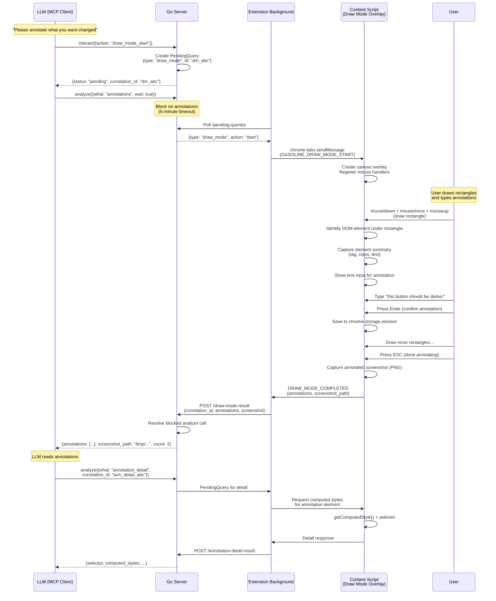
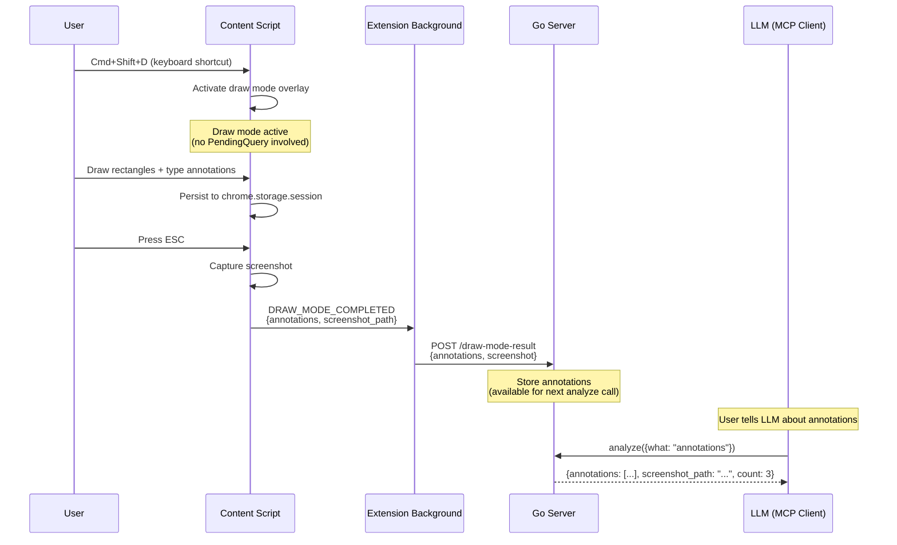
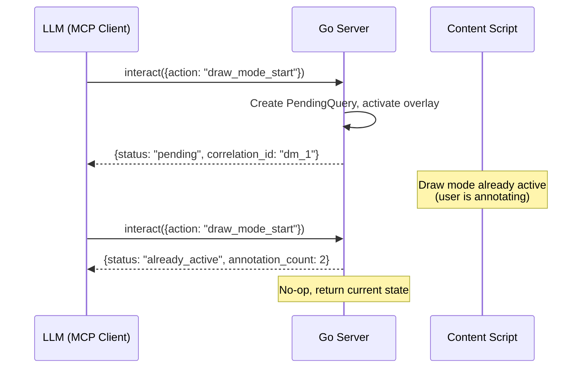

# Draw Mode -- Technical Specification

## Overview

Draw Mode enables users to visually annotate web pages with rectangles and text feedback. Annotations are captured with DOM element context and exposed to LLMs via the `interact` and `analyze` MCP tools. The system supports three activation paths (keyboard shortcut, popup toggle, MCP tool call) and produces structured annotation data plus annotated PNG screenshots.

---

## Architecture

```
AI (MCP Client)
    |
    v
+---------------------+
|   Go Server         |  <- Receives draw_mode_start via interact
|  (cmd/dev-console)  |     Serves annotations via analyze
+---------+-----------+
          | WebSocket + HTTP (localhost only)
          v
+---------------------+
| Chrome Extension    |  <- Activates overlay, captures DOM, persists annotations
|  (content + bg)     |
+---------+-----------+
          |
          v
+---------------------+
| Draw Mode Overlay   |  <- Canvas overlay, rectangle drawing, text input
|  (content script)   |
+---------------------+
```

---

## Sequence Diagrams

### Full LLM Workflow (Cold Start)



### User-Initiated Draw Mode (Warm Start)



### Concurrent Activation (draw_mode_start Called Twice)



---

## Data Model

### Annotation (Lightweight -- Default Response)

Returned by `analyze({what: "annotations"})`.

```js
{
  id: "ann_1707580800000_abc",           // unique ID
  rect: { x: 120, y: 340, width: 200, height: 45 },  // viewport-relative px
  text: "this button should be darker",  // user-typed feedback
  timestamp: 1707580800000,              // when annotation was created
  page_url: "https://example.com/checkout",
  element_summary: "button.btn-primary 'Submit'",  // tag.class 'textContent'
  correlation_id: "ann_detail_abc"       // use to fetch full detail
}
```

### Annotation Detail (Full -- Fetched on Demand)

Returned by `analyze({what: "annotation_detail", correlation_id: "ann_detail_abc"})`.

```js
{
  correlation_id: "ann_detail_abc",
  selector: "button.btn-primary",
  tag: "button",
  text_content: "Submit",
  classes: ["btn-primary", "rounded-lg"],
  id: "submit-btn",
  computed_styles: {
    "background-color": "rgb(59, 130, 246)",
    "color": "rgb(255, 255, 255)",
    "font-size": "14px",
    "padding": "8px 16px",
    "border-radius": "8px",
    "font-weight": "600"
  },
  parent_selector: "form.checkout-form > div.actions",
  bounding_rect: { x: 120, y: 340, width: 200, height: 45 }
}
```

### Annotations Result (Aggregate Response)

Returned when draw mode completes or `analyze({what: "annotations"})` is called.

```js
{
  status: "success",
  count: 2,
  annotations: [ /* array of Annotation objects */ ],
  screenshot_path: "/tmp/gasoline-draw-mode-1707580860000.png",
  page_url: "https://example.com/checkout",
  duration_ms: 45000  // time draw mode was active
}
```

### Internal Storage Format (chrome.storage.session)

```js
// Key: "gasoline_draw_annotations"
{
  active: false,
  tab_id: 123,
  page_url: "https://example.com/checkout",
  started_at: 1707580800000,
  annotations: [ /* array of Annotation objects */ ],
  correlation_id: "dm_abc"  // null if user-initiated
}
```

---

## Edge Cases

### 1. Navigation During Draw Mode

**Scenario:** User navigates to a different page while draw mode is active.

**Resolution:** Annotations are saved to `chrome.storage.session` on every change (add, text confirm). On `beforeunload`, the content script sends current annotations to the background script. If a PendingQuery exists (LLM-initiated), the background script posts results to the Go server with a `warning: "page_navigated"` flag. The blocked `analyze` call resolves with partial data.

### 2. draw_mode_start Called Twice

**Scenario:** LLM calls `interact({action: "draw_mode_start"})` while draw mode is already active.

**Resolution:** No-op. Returns `{status: "already_active", annotation_count: N}` with the current annotation count. Does not create a second overlay or reset existing annotations.

### 3. User Exits With Zero Annotations

**Scenario:** User activates draw mode, draws nothing, and presses ESC.

**Resolution:** Still captures a screenshot (clean page). Sends results with `count: 0` and empty annotations array. The LLM receives this and can ask the user to try again or proceed differently.

### 4. Window Resize During Draw Mode

**Scenario:** User resizes the browser window while draw mode is active.

**Resolution:** A `ResizeObserver` on the document body re-sizes the canvas overlay to match the new viewport dimensions. Existing annotation rectangles are re-rendered at their original viewport-relative coordinates. Annotations near the edge may appear partially off-screen; this is acceptable since the underlying element positions also shift.

### 5. Rectangle Smaller Than 5px

**Scenario:** User clicks without dragging, or drags less than 5px in either dimension.

**Resolution:** The rectangle is ignored (treated as an accidental click). No annotation is created, no text input appears. This prevents accidental single-click annotations.

### 6. Text Input Blur Without Confirming

**Scenario:** User draws a rectangle, the text input appears, but the user clicks elsewhere (blur) instead of pressing Enter.

**Resolution:** On blur, the text input auto-confirms. If the text is empty, the annotation is removed (rectangle disappears). If text is non-empty, the annotation is saved normally.

### 7. CSP-Restricted Pages

**Scenario:** Page has strict Content Security Policy that blocks inline scripts or styles.

**Resolution:** The draw mode overlay runs as a content script in the ISOLATED world. Canvas rendering and DOM queries use standard APIs that are unaffected by page CSP. No inline styles or scripts are injected into the page's main world.

### 8. DOM Capture on Dynamic Content

**Scenario:** The element under a rectangle changes after the annotation is created (e.g., React re-render, dynamic content swap).

**Resolution:** DOM elements are captured at rectangle creation time. The `element_summary` reflects the state when the user drew the rectangle. If the element has changed by the time `annotation_detail` is requested, the detail reflects the current state (re-queried via selector). If the selector no longer matches, the detail response includes `warning: "element_changed"` with the original summary preserved.

### 9. analyze({what: "annotations"}) With No Session

**Scenario:** LLM calls analyze for annotations but no draw mode session has occurred.

**Resolution:** Returns `{status: "success", count: 0, annotations: [], hint: "No annotations found. Use interact({action: 'draw_mode_start'}) to activate draw mode and ask the user to annotate the page."}`.

### 10. Detail correlation_id Expired

**Scenario:** LLM requests annotation detail but the correlation_id has expired (annotation data cleaned up after TTL).

**Resolution:** Returns structured error: `{status: "error", error: {code: "correlation_expired", message: "Annotation detail for this correlation_id has expired. Re-run draw mode to capture fresh annotations."}}`. Detail data has a 10-minute TTL.

### 11. Multiple Draw Sessions on Same Tab

**Scenario:** User activates draw mode, exits, then activates again on the same tab.

**Resolution:** The latest session overwrites the previous annotations in `chrome.storage.session`. Previous annotation detail data remains available via correlation_id until its TTL expires (10 minutes). The `analyze({what: "annotations"})` call returns only the latest session's annotations.

---

## State Machine

### Draw Mode States

```
                  activate (keyboard/popup/MCP)
    +-----------+ --------------------------------> +-----------+
    |           |                                   |           |
    | INACTIVE  |                                   |  DRAWING  |
    |           | <------+                          |           |
    +-----------+        |                          +-----+-----+
         ^               |                                |
         |               |  ESC (with 0 annotations)      | mousedown + drag
         |               |                                v
         |          +----+------+                   +-----+-----+
         |          |           |                   |           |
         +--------- | FINISHING | <---------------- |TEXT_INPUT |
           ESC      |           |    Enter/blur     |           |
      (with N > 0)  +-----------+    (text saved)   +-----------+
                          |
                          | Screenshot captured,
                          | results sent to server
                          v
                    +-----------+
                    |           |
                    | INACTIVE  |
                    |           |
                    +-----------+
```

### State Transitions

| From | Trigger | To | Side Effects |
|------|---------|----|-------------|
| INACTIVE | Cmd+Shift+D / popup toggle / MCP draw_mode_start | DRAWING | Create overlay, register mouse handlers |
| DRAWING | mousedown + drag (>= 5px) | TEXT_INPUT | Render rectangle, identify DOM element, show text input |
| DRAWING | ESC | FINISHING | Capture screenshot, send results (count may be 0) |
| TEXT_INPUT | Enter key | DRAWING | Save annotation text, persist to storage |
| TEXT_INPUT | Blur (non-empty text) | DRAWING | Auto-save annotation text, persist to storage |
| TEXT_INPUT | Blur (empty text) | DRAWING | Remove annotation (rectangle deleted) |
| FINISHING | Screenshot captured + results sent | INACTIVE | Remove overlay, clean up handlers |

### Invalid Transitions

- INACTIVE -> TEXT_INPUT (must go through DRAWING first)
- TEXT_INPUT -> INACTIVE (must go through FINISHING)
- FINISHING -> DRAWING (must fully deactivate first)

---

## Network Communication

### Extension <-> Go Server

**Protocol:** WebSocket sync + HTTP POST for results.

#### Message Types:

| Message | Direction | Transport | Payload |
|---------|-----------|-----------|---------|
| `GASOLINE_DRAW_MODE_START` | Server -> Extension | PendingQuery (polled via WebSocket/HTTP) | `{action: "draw_mode_start", correlation_id: "dm_abc"}` |
| `DRAW_MODE_COMPLETED` | Extension -> Server | HTTP POST `/draw-mode-result` | `{correlation_id, annotations[], screenshot_base64, page_url}` |
| `ANNOTATION_DETAIL_REQUEST` | Server -> Extension | PendingQuery | `{action: "annotation_detail", correlation_id: "ann_detail_abc", selector: "..."}` |
| `ANNOTATION_DETAIL_RESULT` | Extension -> Server | HTTP POST `/annotation-detail-result` | `{correlation_id, selector, computed_styles, ...}` |

#### PendingQuery System:

Draw mode uses the existing PendingQuery infrastructure:
1. LLM calls `interact({action: "draw_mode_start"})` -> Go server creates a PendingQuery with type `draw_mode`
2. Extension polls `/pending-queries` -> picks up the draw_mode query
3. Extension activates draw mode overlay
4. On completion, extension POSTs results to `/draw-mode-result`
5. Go server resolves the blocked `analyze({what: "annotations", wait: true})` call

#### Blocking Analyze Call:

When `analyze({what: "annotations", wait: true})` is called:
- Server checks if draw mode is active (PendingQuery exists)
- If active, blocks with a 5-minute timeout
- When `/draw-mode-result` is posted, the blocked call resolves
- If timeout expires, returns `{status: "timeout", message: "Draw mode timed out after 5 minutes. User may have forgotten to press ESC."}`

#### Screenshot Transfer:

- Content script captures screenshot via `chrome.tabs.captureVisibleTab()`
- Screenshot sent as base64-encoded PNG in the `/draw-mode-result` POST body
- Go server decodes and saves to temp directory
- File path returned in the analyze response

---

## File Plan

### New Files

| File | Purpose | LOC |
|------|---------|-----|
| `extension/content/draw-mode.js` | Canvas overlay, rectangle drawing, text input, DOM capture, annotation CRUD, persistence | ~500 |
| `extension/content/draw-mode-export.js` | Screenshot capture with annotations, base64 encoding, result packaging | ~150 |
| `extension/background/draw-mode-handler.js` | Message routing between content script and server, PendingQuery polling, result POST | ~100 |
| `cmd/dev-console/tools_interact_draw.go` | `draw_mode_start` action handler in interact tool, PendingQuery creation | ~100 |
| `cmd/dev-console/tools_analyze_annotations.go` | `annotations` and `annotation_detail` handlers in analyze tool, blocking wait logic | ~80 |
| `cmd/dev-console/annotation_store.go` | In-memory annotation storage with TTL, correlation_id lookup, cleanup | ~100 |

### Modified Files

| File | Changes | LOC Added |
|------|---------|-----------|
| `cmd/dev-console/tools_interact.go` | Add `draw_mode_start` case to action switch | ~10 |
| `cmd/dev-console/tools_analyze.go` | Add `annotations` and `annotation_detail` cases to what switch | ~15 |
| `cmd/dev-console/tools_schema.go` | Register draw mode parameters in interact and analyze schemas | ~20 |
| `cmd/dev-console/queries.go` | Add `/draw-mode-result` and `/annotation-detail-result` HTTP handlers | ~30 |
| `extension/background/index.js` | Initialize draw-mode-handler, register message listeners | ~10 |
| `extension/manifest.json` | No new permissions needed (uses existing activeTab + scripting) | ~5 |
| `extension/popup/popup.js` | Add Draw Mode toggle button and state sync | ~20 |
| `extension/popup/popup.html` | Add Draw Mode toggle UI element | ~6 |
| `cmd/dev-console/testdata/mcp-tools-list.golden.json` | Update golden test data with new parameters | ~10 |

### Total

- **New code:** ~1,030 LOC (6 files)
- **Modified code:** ~126 LOC (9 files)
- **Total:** ~1,156 LOC

---

## Error Codes

| Code | Meaning |
|------|---------|
| `draw_mode_already_active` | Draw mode is already active on this tab |
| `draw_mode_timeout` | User did not exit draw mode within 5 minutes |
| `draw_mode_page_navigated` | Page navigated while draw mode was active |
| `correlation_expired` | Annotation detail correlation_id has expired (10-min TTL) |
| `no_annotations` | No annotation session found (hint provided) |
| `element_not_found` | Selector no longer matches any element (for detail requests) |
| `screenshot_failed` | Screenshot capture failed (tab may have been closed) |

---

## Performance Targets

| Operation | Target | Notes |
|-----------|--------|-------|
| Overlay activation | < 50ms | Canvas creation + event handler registration |
| Rectangle render | < 16ms | Must not drop frames (60fps) |
| DOM element capture | < 100ms | Per rectangle, includes selector generation |
| Computed style fetch | < 200ms | Full getComputedStyle for annotation detail |
| Screenshot capture | < 500ms | captureVisibleTab + base64 encoding |
| Storage persistence | < 50ms | chrome.storage.session write per annotation |

---

## Security and Privacy

- All annotation data stays on localhost
- Screenshots saved to OS temp directory (same as existing screenshot behavior)
- No annotation content transmitted to external services
- Computed styles are read-only queries against the page DOM
- Draw mode overlay does not modify the page DOM (canvas element only)
- Password field values are never captured in element summaries (only tag and selector)

---

## Dependencies

### Required

- Existing Gasoline infrastructure (Go server, extension, MCP, PendingQuery system)
- `chrome.tabs.captureVisibleTab` permission (already granted via `activeTab`)
- `chrome.storage.session` API (already used by extension)

### No New Dependencies

- Canvas API is native to all browsers
- No external libraries needed for drawing or DOM capture
- getComputedStyle is a standard DOM API

---

## Risks and Mitigations

| Risk | Impact | Mitigation |
|------|--------|------------|
| Canvas overlay blocks page interaction | User cannot interact with page while annotating | By design -- draw mode is a modal state. ESC exits cleanly. |
| Large screenshots (>5MB base64) | Slow HTTP POST, memory pressure | Compress PNG, cap at 2MB. If exceeds, reduce quality. |
| Element selector fragility | Selector generated at draw time may not match later | Re-query on detail request; include warning if element changed. |
| User forgets to press ESC | Blocking analyze call hangs | 5-minute timeout with clear message. |
| Dynamic page content shifts annotations | Rectangles may not align with elements after DOM changes | Annotations capture state at creation time; document this limitation. |

---

## Future Improvements

1. **Arrow annotations** -- Draw arrows pointing to specific elements
2. **Annotation editing** -- Move, resize, delete individual annotations
3. **Annotation persistence across sessions** -- Save/load annotation sets
4. **Multi-tab support** -- Annotate across multiple tabs in one session
5. **Color coding** -- Different rectangle colors for different annotation types (bug, suggestion, question)
