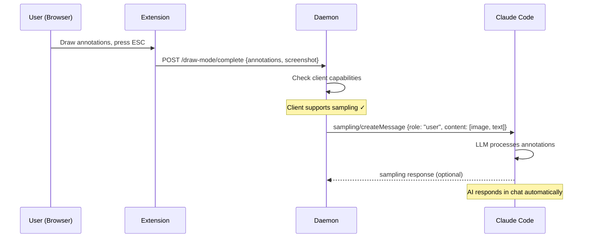
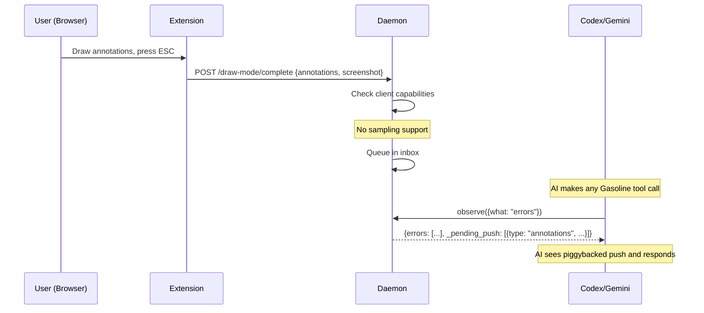
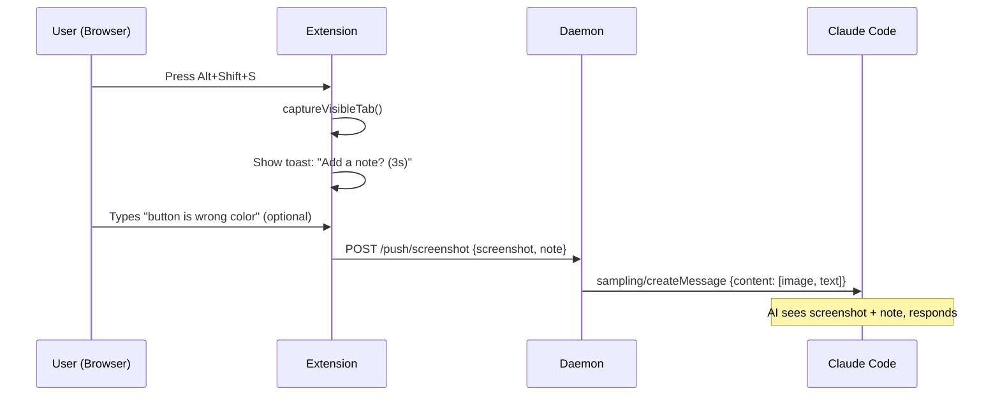

# Browser Push — Tech Spec

## Overview

Add a push delivery pipeline to the Gasoline daemon. When the browser extension sends content (annotations, screenshots), the daemon delivers it to the connected MCP client using the best available mechanism: MCP sampling, notifications, or inbox queuing.

Additionally, change `wait: true` on annotations from immediate-return-then-poll to blocking-then-poll: hold the MCP tool response for up to 15s waiting for annotations to arrive. If they arrive within the window, return them directly (zero polling). If the timeout expires, then return a correlation_id for polling as before.

## Architecture

```
┌──────────────────────────────────────────────────────────────┐
│                     Chrome Extension                         │
│                                                              │
│  User draws annotations → ESC                               │
│  User presses Alt+Shift+S → screenshot capture              │
│                    │                                         │
│                    ▼                                         │
│  POST /draw-mode/complete   or   POST /push/screenshot      │
└──────────────────────┬───────────────────────────────────────┘
                       │ HTTP (localhost)
                       ▼
┌──────────────────────────────────────────────────────────────┐
│                     Go Daemon                                │
│                                                              │
│  ┌─────────────┐    ┌──────────────────┐                     │
│  │ Push Router  │───▶│ Client Capability │                    │
│  │             │    │ Store             │                     │
│  └──────┬──────┘    └──────────────────┘                     │
│         │                                                    │
│         ├─── supports sampling? ──▶ sampling/createMessage   │
│         ├─── supports notifs?   ──▶ notifications/message    │
│         └─── fallback           ──▶ Inbox Queue              │
│                                       │                      │
│                                       ▼                      │
│                              observe({what:"inbox"})         │
│                              or _pending_push piggyback      │
└──────────────────────────────────────────────────────────────┘
                       │ MCP (stdio/HTTP)
                       ▼
┌──────────────────────────────────────────────────────────────┐
│                     MCP Client                               │
│  (Claude Code / Codex / Gemini CLI / Cursor)                 │
│                                                              │
│  Sampling → new AI turn with image + text                    │
│  Notification → log message displayed                        │
│  Inbox → AI polls on next tool call                          │
└──────────────────────────────────────────────────────────────┘
```

## Sequence Diagrams

### Sampling Path (Claude Code)



### Inbox Fallback Path (Codex / Gemini)



### Screenshot Push Path



## Data Model

### PushEvent (Go)

```go
// PushEvent represents a browser-originated content push.
type PushEvent struct {
    ID        string    `json:"id"`         // Unique event ID (push_xxx)
    Type      string    `json:"type"`       // "annotations" | "screenshot"
    Timestamp time.Time `json:"timestamp"`
    PageURL   string    `json:"page_url"`
    TabID     int       `json:"tab_id"`

    // Annotation-specific
    Annotations []any  `json:"annotations,omitempty"`
    AnnotSession string `json:"annot_session,omitempty"`

    // Screenshot-specific
    ScreenshotB64 string `json:"screenshot_b64,omitempty"` // base64 PNG
    Note          string `json:"note,omitempty"`            // User's text note
}
```

### Inbox Queue (Go)

```go
// PushInbox is a bounded FIFO queue of push events awaiting AI retrieval.
type PushInbox struct {
    mu     sync.Mutex
    events []PushEvent
    maxLen int // 50
}

func (q *PushInbox) Enqueue(ev PushEvent)          // Append, evict oldest if full
func (q *PushInbox) DrainAll() []PushEvent          // Return all events, clear queue
func (q *PushInbox) Peek() []PushEvent              // Return without clearing
func (q *PushInbox) Len() int
```

### Client Capabilities (Go)

```go
// ClientCapabilities stores MCP client capability flags detected during init.
type ClientCapabilities struct {
    SupportsSampling      bool
    SupportsNotifications bool
    ClientName            string // "claude-code", "codex", "gemini-cli", etc.
}
```

### MCP Sampling Request (JSON-RPC)

```json
{
    "jsonrpc": "2.0",
    "id": "push_ann_001",
    "method": "sampling/createMessage",
    "params": {
        "messages": [
            {
                "role": "user",
                "content": {
                    "type": "text",
                    "text": "The user drew annotations on https://example.com/dashboard and pushed them to you:\n\n1. [Red rectangle at 120,340 450x200] \"This chart is showing stale data\"\n2. [Red rectangle at 600,100 300x50] \"Wrong heading text\"\n\nPlease analyze these issues."
                }
            }
        ],
        "systemPrompt": "The user is pushing browser annotations to you via Gasoline. Analyze the annotated areas and respond with actionable feedback.",
        "includeContext": "thisServer",
        "maxTokens": 1024
    }
}
```

When a screenshot is available, use multi-part content:

```json
{
    "messages": [
        {
            "role": "user",
            "content": [
                {
                    "type": "image",
                    "data": "<base64 PNG>",
                    "mimeType": "image/png"
                },
                {
                    "type": "text",
                    "text": "The user pushed this screenshot from https://example.com/dashboard with the note: \"button is wrong color\""
                }
            ]
        }
    ]
}
```

## Blocking Wait (wait: true)

### Current behavior (wasteful)

```
AI ──analyze({what:"annotations", wait:true})──▶ Daemon
Daemon ◀── immediately returns {correlation_id: "ann_xyz"} ──▶ AI
AI ──observe({what:"command_result", correlation_id:"ann_xyz"})──▶ Daemon  (poll 1, ~300 tokens)
AI ──observe({what:"command_result", correlation_id:"ann_xyz"})──▶ Daemon  (poll 2, ~300 tokens)
AI ──observe({what:"command_result", correlation_id:"ann_xyz"})──▶ Daemon  (poll 3, ~300 tokens)
...user finishes drawing...
AI ──observe({what:"command_result", correlation_id:"ann_xyz"})──▶ Daemon  (poll N, gets result)
```

**Cost: N × ~300 tokens wasted on empty polls.**

### New behavior (block first, then poll)

```
AI ──analyze({what:"annotations", wait:true})──▶ Daemon
Daemon holds response (goroutine blocks on channel, up to 15s)
...user finishes drawing within 15s...
Daemon ◀── returns {annotations: [...], screenshot: "..."} ──▶ AI
```

**Cost: zero extra tokens. One round-trip.**

If the user takes longer than 15s:

```
AI ──analyze({what:"annotations", wait:true})──▶ Daemon
Daemon holds response for 15s... timeout
Daemon ◀── returns {status: "waiting", correlation_id: "ann_xyz"} ──▶ AI
AI ──observe({what:"command_result", correlation_id:"ann_xyz"})──▶ Daemon  (poll, as before)
```

**Cost: only polls after the 15s window. Much less waste.**

### Implementation

```go
func (h *ToolHandler) getAnonymousAnnotations(req JSONRPCRequest, wait bool) JSONRPCResponse {
    // Check if annotations are already available
    if session := h.annotationStore.GetLatestSessionSinceDraw(); session != nil {
        return h.formatAnnotationSession(req, session)
    }

    if !wait {
        return h.noAnnotationsResponse(req)
    }

    // Block for up to 15s waiting for annotations
    ch := h.annotationStore.WaitForSession(15 * time.Second)

    select {
    case session := <-ch:
        // Annotations arrived within window
        return h.formatAnnotationSession(req, session)
    case <-time.After(15 * time.Second):
        // Timeout — fall back to correlation_id polling
        corrID := newCorrelationID("ann")
        h.capture.RegisterCommand(corrID, "", annotationWaitCommandTTL)
        h.annotationStore.RegisterWaiter(corrID, "")
        return h.waitingForAnnotationsResponse(req, corrID)
    }
}
```

The `WaitForSession` method returns a channel that receives the session when `/draw-mode/complete` fires. The goroutine is cheap (Go routines cost ~4KB stack). The channel is cleaned up on timeout or delivery.

### Why 15s is the right timeout

- MCP sync tool calls already block for up to 15s — this uses the existing window, not a new one
- Most annotation sessions where the user is already in draw mode complete in under 15s
- If the user hasn't started drawing yet, 15s gives them time to start and finish a quick annotation
- After 15s, the correlation_id fallback kicks in with the same behavior as today

## HTTP Endpoints

### POST /push/screenshot (new)

Receives a screenshot push from the extension.

```json
{
    "screenshot_data_url": "data:image/png;base64,...",
    "note": "button is wrong color",
    "page_url": "https://example.com/dashboard",
    "tab_id": 42
}
```

Response: `200 OK` with `{"status": "delivered"}` or `{"status": "queued"}`.

### POST /draw-mode/complete (existing, modified)

Already receives annotations. Modification: after storing annotations, also route through push pipeline.

## Push Router Logic

```go
// DeliverPush routes a push event to the best available delivery mechanism.
func (h *PushHandler) DeliverPush(ev PushEvent) error {
    caps := h.getClientCapabilities()

    // 1. Try sampling (creates new AI turn)
    if caps.SupportsSampling {
        err := h.deliverViaSampling(ev)
        if err == nil {
            return nil
        }
        // Sampling failed — fall through to next mechanism
        log.Printf("sampling delivery failed: %v, falling back", err)
    }

    // 2. Try notifications (log-level signal)
    if caps.SupportsNotifications {
        h.deliverViaNotification(ev)
        // Still queue in inbox — notification is just a signal
    }

    // 3. Always queue in inbox as universal fallback
    h.inbox.Enqueue(ev)
    return nil
}
```

## Client Capability Detection

During MCP `initialize` handshake, the client sends its capabilities:

```json
{
    "method": "initialize",
    "params": {
        "capabilities": {
            "sampling": {},
            "roots": {"listChanged": true}
        },
        "clientInfo": {
            "name": "claude-code",
            "version": "2.1.0"
        }
    }
}
```

The daemon inspects:
- `params.capabilities.sampling` — if present, client supports sampling
- `params.clientInfo.name` — for client-specific behavior
- Notifications are assumed available for all stdio clients (part of base MCP spec)

**Current state**: The daemon already handles `initialize` in `tools_mcp.go`. Add capability extraction there.

## observe({what: "inbox"}) — New Mode

Returns and clears queued push events.

```json
// Request
{"what": "inbox"}

// Response
{
    "events": [
        {
            "id": "push_ann_001",
            "type": "annotations",
            "timestamp": "2026-03-01T10:30:00Z",
            "page_url": "https://example.com/dashboard",
            "annotations": [...],
            "screenshot_b64": "..."
        }
    ],
    "count": 1,
    "message": "1 push event retrieved and cleared from inbox."
}
```

Empty inbox returns `{"events": [], "count": 0}`.

## _pending_push Piggyback

When the inbox is non-empty, any Gasoline tool response includes a `_pending_push` field:

```json
{
    "content": [
        {"type": "text", "text": "3 errors found..."},
        {"type": "text", "text": "\n\n---\n⚡ BROWSER PUSH: The user pushed 1 annotation from the browser. Call observe({what: 'inbox'}) to view."}
    ]
}
```

The piggyback is a text hint only (no images) to keep normal tool responses fast. The AI calls `observe({what: "inbox"})` to get full content including screenshots.

## Extension Changes

### New: Screenshot Push Command

**manifest.json** — add command:
```json
{
    "commands": {
        "toggle_draw_mode": { ... },
        "push_screenshot": {
            "suggested_key": {
                "default": "Alt+Shift+S",
                "mac": "Alt+Shift+S"
            },
            "description": "Push Screenshot to AI"
        }
    }
}
```

**push-handler.js** (new, ~120 LOC) — background script:
```javascript
export function installPushCommandListener() {
    chrome.commands.onCommand.addListener(async (command) => {
        if (command !== 'push_screenshot') return

        const tabs = await chrome.tabs.query({ active: true, currentWindow: true })
        const tab = tabs[0]
        if (!tab?.id) return

        // Capture screenshot
        const dataUrl = await chrome.tabs.captureVisibleTab(tab.windowId, { format: 'png' })

        // Show toast asking for optional note
        await chrome.tabs.sendMessage(tab.id, {
            type: 'GASOLINE_PUSH_NOTE_PROMPT',
            screenshot_data_url: dataUrl
        })
        // Content script shows input, waits 3s, then POSTs to /push/screenshot
    })
}
```

### Modified: Draw Mode Completion

**draw-mode-handler.js** — no changes needed. The existing `POST /draw-mode/complete` handler in the daemon is modified to also route through the push pipeline. The extension side stays the same.

## Edge Cases

| # | Scenario | Resolution |
|---|----------|------------|
| 1 | No MCP client connected when user pushes | Queue in inbox. Log warning. Content available when client connects. |
| 2 | Multiple MCP clients connected | Push to first connected client only (MVP). Log which client received. |
| 3 | Sampling request rejected by client | Fall through to notification, then inbox. |
| 4 | Screenshot too large for sampling (>10MB base64) | Compress to JPEG quality 70. If still >5MB, crop to viewport only. |
| 5 | User pushes rapidly (5+ in 10s) | Debounce: max 1 sampling request per 2 seconds. Queue excess in inbox. |
| 6 | Client disconnects mid-sampling | Sampling request fails, event queued in inbox. |
| 7 | Inbox overflow (>50 events) | FIFO eviction — oldest events dropped. Log eviction count. |
| 8 | Draw mode started by AI with wait:true, user finishes within 15s | Blocking wait returns annotations directly. Push also fires (sampling/inbox). AI may see content twice — acceptable, idempotent. |
| 11 | Draw mode started by AI with wait:true, user finishes after 15s | Blocking wait times out, returns correlation_id. Annotations delivered via poll AND push. |
| 12 | Multiple wait:true calls for same session | Only first caller gets the blocking channel. Second returns correlation_id immediately. |
| 9 | Extension not connected | `/push/screenshot` endpoint returns 503. Toast shows error in browser. |
| 10 | User pushes from incognito tab | Same behavior. No special handling for incognito. |

## File Plan

### New Files

| File | LOC | Purpose |
|------|-----|---------|
| `internal/push/inbox.go` | ~80 | PushInbox queue (bounded FIFO) |
| `internal/push/inbox_test.go` | ~100 | Queue tests (enqueue, drain, overflow, concurrency) |
| `internal/push/router.go` | ~120 | Push router (sampling → notification → inbox) |
| `internal/push/router_test.go` | ~150 | Router tests (capability detection, fallback chain) |
| `internal/push/sampling.go` | ~100 | MCP sampling request builder and sender |
| `internal/push/sampling_test.go` | ~80 | Sampling message format tests |
| `cmd/dev-console/tools_observe_inbox.go` | ~60 | observe({what: "inbox"}) handler |
| `extension/background/push-handler.js` | ~120 | Screenshot push hotkey handler |
| `extension/content/push-note.js` | ~80 | Toast input UI for screenshot notes |

**Total new: ~890 LOC**

### Modified Files

| File | Changes | LOC Delta |
|------|---------|-----------|
| `cmd/dev-console/tools_mcp.go` | Extract client capabilities from initialize handshake | +20 |
| `cmd/dev-console/tools_observe.go` | Route `what: "inbox"` to handler | +5 |
| `cmd/dev-console/tool_handler.go` | Add PushInbox + PushRouter to ToolHandler struct | +10 |
| `cmd/dev-console/tools_analyze_annotations.go` | After annotation store, also call push router | +15 |
| `cmd/dev-console/http_routes.go` | Add `/push/screenshot` endpoint | +20 |
| `cmd/dev-console/response_builder.go` | Add `_pending_push` piggyback to all tool responses | +25 |
| `extension/manifest.json` | Add `push_screenshot` command | +6 |
| `extension/background/init.js` | Call `installPushCommandListener()` | +2 |

**Total modified: ~103 LOC delta**

**Grand total: ~993 LOC**

## Performance Targets

| Operation | Target | Notes |
|-----------|--------|-------|
| Push event queuing | < 1ms | Mutex lock + slice append |
| Sampling request construction | < 5ms | JSON marshal + base64 encode |
| Sampling delivery (localhost) | < 50ms | JSON-RPC over stdio |
| Inbox drain | < 1ms | Slice copy + clear |
| Piggyback check | < 0.1ms | `inbox.Len() > 0` check on every response |
| Screenshot capture (extension) | < 200ms | `captureVisibleTab()` — Chrome API |
| Blocking wait (goroutine hold) | ≤ 15s | Channel receive, ~4KB stack cost per waiter |
| Blocking wait delivery | < 5ms | Channel send after `/draw-mode/complete` POST |

## Security and Privacy

- All push data stays on localhost. No external transmission.
- Screenshots are base64 in-memory only — never written to disk (unless inbox overflow triggers temp file, which is out of scope for MVP).
- Sampling requests go over the existing MCP transport (stdio pipe or localhost HTTP). No new network surface.
- Screenshot content may include sensitive page data — same risk profile as existing `observe({what: "screenshot"})`. User has already opted in by installing the extension.
- Push events are ephemeral — cleared on inbox drain, no persistence.

## Risks and Mitigations

| # | Risk | Impact | Mitigation |
|---|------|--------|------------|
| 1 | Sampling not supported by target client | Push doesn't create AI turn | Inbox fallback ensures no data loss. Piggyback hints prompt AI to check. |
| 2 | Base64 screenshots bloat MCP messages | Slow sampling, high memory | JPEG compression, 5MB cap, viewport-only crop |
| 3 | AI sees duplicate annotations (wait + push) | Confusing double response | Document in edge cases. Idempotent — AI handles gracefully. |
| 4 | Hotkey conflicts with browser shortcuts | Push doesn't fire | Use `Alt+Shift+S` (uncommon). User can remap in `chrome://extensions/shortcuts`. |
| 5 | Inbox piggyback makes all responses larger | Extra tokens on every call | Piggyback is text-only hint (~50 tokens). Full content requires explicit `observe({what: "inbox"})`. |
