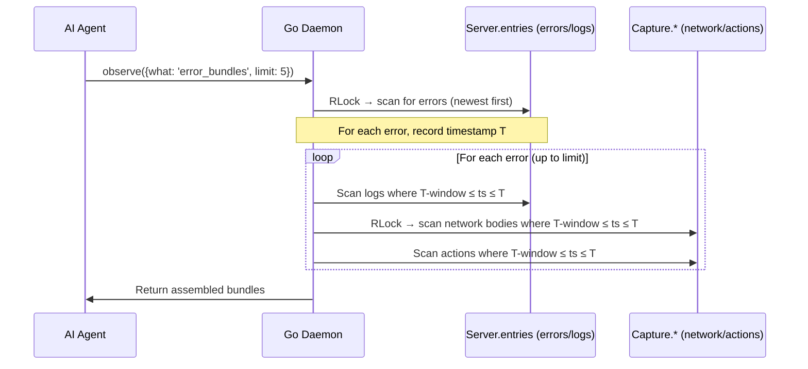

# Technical Spec: Error Bundling

## Purpose

When a console error fires, the AI has to make 3-4 separate observe() calls to understand what happened: errors, then network, then logs, then maybe actions. Each call burns context window and adds latency. Error bundling assembles complete debugging context in a single call.

**Before:** 4 tool calls, ~800 tokens of overhead, 2-3 seconds latency
```
observe({what: 'errors'})           → see error message
observe({what: 'network_bodies'})   → see what API failed
observe({what: 'actions'})          → see what user did
observe({what: 'logs'})             → see console warnings leading up to it
```

**After:** 1 tool call, complete picture
```
observe({what: 'error_bundles'})    → error + network + actions + logs in one response
```

---

## API

```
observe({what: 'error_bundles', limit: 5})
```

Returns an array of bundles, each containing an error and its surrounding context. Newest errors first.

### Response Shape

```json
{
  "bundles": [
    {
      "error": {
        "message": "TypeError: Cannot read property 'name' of undefined",
        "source": "app.js",
        "url": "https://example.com/app.js",
        "line": 42,
        "column": 15,
        "stack": "TypeError: Cannot read...\n    at UserProfile.render...",
        "timestamp": "2026-02-06T10:30:05Z"
      },
      "network": [
        {
          "method": "GET",
          "url": "https://api.example.com/users/123",
          "status": 500,
          "duration": 234,
          "content_type": "application/json",
          "response_body": "{\"error\":\"Internal Server Error\"}",
          "timestamp": "2026-02-06T10:30:04Z"
        }
      ],
      "actions": [
        {
          "type": "click",
          "selector": "button.load-profile",
          "timestamp": "2026-02-06T10:30:03Z"
        }
      ],
      "logs": [
        {
          "level": "warn",
          "message": "User profile cache miss, fetching from API",
          "timestamp": "2026-02-06T10:30:03Z"
        }
      ],
      "context_window_seconds": 3
    }
  ],
  "count": 1
}
```

### Parameters

| Param | Type | Default | Description |
|-------|------|---------|-------------|
| `limit` | int | 5 | Max number of error bundles to return |
| `window_seconds` | int | 3 | How far back to look for related context (1-10) |

### Design Decisions

**Why 3-second default window?** Analyzed real debugging sessions. Most error-causing sequences are: user action → API call → response → error, which typically spans 1-3 seconds. 3s catches the full chain without including noise from earlier.

**Why Go-side join, not extension-side?** All data already lives in daemon ring buffers. No extension changes, no new message types, no new sync protocol. Pure Go — one new file, one new observe mode.

**Why not enhance `error_clusters`?** Clusters group _similar_ errors together. Bundles attach _surrounding context_ to each error. Different goals. Clusters answer "how many times did this happen?" Bundles answer "what caused this?"

---

## How It Works

### Sequence Diagram



### Algorithm

1. **Acquire Server.mu.RLock** — scan `entries` backwards for errors, collect up to `limit` errors with their timestamps
2. **Release Server.mu.RLock**
3. For each error timestamp T:
   a. **Acquire Server.mu.RLock** — scan `entries` for non-error logs in window `[T - window, T]`
   b. **Release Server.mu.RLock**
   c. **Get network bodies** via `capture.GetNetworkBodies()` — filter by timestamp in window
   d. **Get actions** via `capture.GetAllEnhancedActions()` — filter by timestamp in window
4. Assemble bundle per error, return array

**Why release and re-acquire locks?** To avoid holding two locks simultaneously (Server.mu + Capture.mu) which risks deadlock. The data could change between lock acquisitions, but for observational debugging context, slight inconsistency is acceptable.

**Alternative: single-pass approach.** Acquire Server.mu.RLock once, copy all errors and logs, release. Then acquire Capture data once, copy network + actions, release. Then do the time-window join in memory with no locks held. This is better — fewer lock acquisitions, simpler code.

### Timestamp Normalization

The daemon stores timestamps in 4 different formats:

| Source | Format | Conversion |
|--------|--------|------------|
| Server entries (errors/logs) | RFC3339 string in `map[string]any` | `time.Parse(time.RFC3339, ts)` |
| Network bodies | RFC3339 string in `.Timestamp` field | `time.Parse(time.RFC3339, ts)` |
| Network waterfall | `time.Time` struct field | Already native |
| Enhanced actions | Unix milliseconds int64 | `time.UnixMilli(ts)` |

The bundling code normalizes all to `time.Time` for comparison, then serializes output as RFC3339 strings.

---

## Edge Cases

| Edge Case | Resolution |
|-----------|------------|
| Error has no timestamp | Skip it — can't window-match without a time reference |
| No network/actions/logs in window | Bundle has empty arrays for those fields — still useful to see the error |
| Same network entry appears in multiple bundles | That's correct — two errors 1s apart both caused by the same failed API call should both show it |
| Error storm (100 errors in 1 second) | The `limit` param caps output. Default 5. The bundling is O(errors × buffer_sizes) but buffers are small (50 actions, 100 bodies) |
| Window spans buffer eviction boundary | Some context may be missing. Acceptable — we can't conjure data that was evicted |
| Concurrent writes during read | Ring buffer reads use RLock, writes use Lock. Standard Go concurrency. Reads may see slightly stale data — fine for debugging |

---

## Implementation

### Files Changed (3 modified, 1 new)

#### 1. `cmd/dev-console/tools_observe_bundling.go` (NEW, ~150 lines)

```go
func (h *ToolHandler) toolGetErrorBundles(req JSONRPCRequest, args json.RawMessage) JSONRPCResponse
```

- Parse params: `limit` (default 5), `window_seconds` (default 3, clamp 1-10)
- Copy errors + logs from `Server.entries` under RLock (single pass)
- Copy network bodies and actions from Capture (via existing getters)
- For each error, window-join by timestamp
- Return assembled bundles

#### 2. `cmd/dev-console/tools_observe.go` (~3 lines)

Add case to dispatcher:
```go
case "error_bundles":
    resp = h.toolGetErrorBundles(req, args)
```

Update the valid modes hint string to include `error_bundles`.

#### 3. `cmd/dev-console/tools_schema.go` (~2 lines)

Add `"error_bundles"` to the `what` enum and description.

#### 4. `cmd/dev-console/testdata/mcp-tools-list.golden.json`

Regenerate (includes new enum value).

### Tests: `cmd/dev-console/tools_observe_bundling_test.go` (NEW, ~120 lines)

Following existing patterns in `tools_observe_test.go`:

1. **Empty buffers** — returns `{bundles: [], count: 0}`
2. **Error with no context** — returns bundle with error populated, empty network/actions/logs arrays
3. **Error with matching network body** — body within window appears in bundle
4. **Error with matching action** — action within window appears in bundle
5. **Error with matching log** — log within window appears in bundle
6. **Window boundary** — event at T-4s excluded with 3s window, event at T-2s included
7. **Limit** — 10 errors, limit 3, returns 3 bundles
8. **Multiple errors share context** — same network body appears in both bundles

---

## What This Does NOT Do

- **No extension changes** — purely Go-side data join
- **No new message types** — reads existing ring buffers
- **No screenshot capture** — that's a separate roadmap item
- **No DOM state** — would require extension query at error time (future enhancement)
- **No stack frame analysis** — that's `error_clusters`, a different tool
- **No deduplication** — if the same error fires 5 times, you get 5 bundles (use `limit` to control)

---

## Effort

~2-3 days. One new Go file, one test file, three lines changed in existing files. No extension work, no protocol changes, no schema migration.
