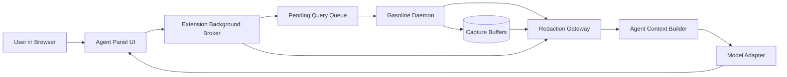

# Technical Spec: In-Browser Agent Panel (Redaction-First)

- Detailed runtime design: [Runtime Spec (Go Orchestrator)](runtime-spec-go-orchestrator.md)

## Overview

This feature adds a browser-side chat/control panel that operates as a first-party client of Gasoline MCP. It does not replace the existing daemon or MCP tool contracts. Instead, it composes them with:

1. Context orchestration (event-triggered bundle assembly).
2. Safety controls (approval gating for mutating actions).
3. Mandatory redaction at every egress point.

## Architecture



### Key Principle

Gasoline remains the deterministic source of truth. The panel is an orchestrator and presentation layer over existing contracts.

## Components

## 1) Agent Panel UI (extension sidepanel)

- Shows active conversation, current tab context, and tool calls.
- Supports two modes:
  - Manual mode: user explicitly asks for actions/context.
  - Watch mode: selected events auto-attach summarized context.
- Displays redaction diagnostics for transparency:
  - policy version
  - redacted field count
  - blocked payload count

## 2) Background Broker

- Translates panel intents into existing MCP tool calls.
- Enforces command gating:
  - read-only commands: may auto-run
  - mutating commands: require approval token
- Handles dedup/rate limit for auto-piped events.

## 3) Redaction Gateway (mandatory)

Applied in three places:

1. `source_redact`: extension capture normalization stage.
2. `server_redact`: before persistence + before MCP responses.
3. `egress_redact`: before model-bound payload assembly.

If any stage fails, payload is dropped (`fail_closed`) and surfaced as structured diagnostic.

## 4) Agent Context Builder

- Builds compact packets from:
  - `error_bundles`
  - recent actions
  - network errors
  - relevant command results
- Attaches metadata:
  - `tab_id`, `url`, `timestamp`
  - `correlation_id`
  - `redaction_policy_version`
  - `redacted_count`

## 5) Model Adapter

- Provider-agnostic interface.
- Supports:
  - local-only mode (no external model)
  - configured external provider mode
- Never receives unredacted payloads.

## Data Contracts

## A) Agent Watch Configuration (proposed)

```json
{
  "action": "agent_watch",
  "operation": "enable",
  "events": ["errors", "network_errors", "security"],
  "rate_limit_per_min": 20,
  "dedupe_window_seconds": 15
}
```

## B) Agent Context Packet (proposed internal schema)

```json
{
  "context_id": "ctx_1771200000000_123",
  "tab_id": 7,
  "url": "https://example.com/checkout",
  "trigger": "errors",
  "summary": "TypeError in checkout submit flow after POST /api/payments",
  "bundles": {
    "errors": [],
    "network": [],
    "actions": []
  },
  "redaction": {
    "policy_version": "v2",
    "redacted_count": 6,
    "blocked": false
  },
  "created_at": "2026-02-16T12:00:00Z"
}
```

## C) Approval Token for Mutations (proposed internal)

```json
{
  "approval_id": "appr_1771200000000_456",
  "action": "interact.click",
  "scope": "tab:7",
  "expires_at": "2026-02-16T12:01:00Z"
}
```

## Redaction Policy

## Secret classes

- bearer/auth tokens
- API keys
- cookies + session IDs
- password and credential fields
- payment/account identifiers
- custom user-defined redaction patterns

## Replacement rules

- structured fields: preserve key names, redact values
- free text/log blobs: pattern replacement with stable placeholders
- optional deterministic surrogate for correlation (HMAC-based), never raw secret

## Required guarantees

1. No raw secret appears in:
   - MCP responses
   - extension logs
   - diagnostics files
   - saved session exports
   - model-bound payloads
2. Redaction failure blocks egress, not warnings-only.
3. Redaction counters are observable for auditability.

## Execution Flow

## Manual Request

1. User asks panel question.
2. Broker gathers required MCP results.
3. Redaction Gateway sanitizes merged context.
4. Context Builder composes packet.
5. Model Adapter executes.
6. Panel renders answer + linked evidence.

## Auto-pipe Watch Event

1. Capture event triggers (for example `errors`).
2. Broker checks watch config, rate limit, dedupe.
3. Gather minimal relevant bundles.
4. Redact and package context.
5. Attach as queued assistant hint in panel.
6. User can promote hint to full model query.

## Security Model

- Default deny for mutation actions from auto-pipe.
- Explicit user approval required per mutating action scope.
- Redaction policy version pinned at startup.
- Any policy load/parse error disables model egress path.
- Provider credentials are never exposed to page scripts.

## Reliability and Stability

- Preserve async queue + poll architecture for all extension commands.
- Panel failures must not impact daemon availability.
- On panel crash/reload:
  - command queue remains valid
  - correlation IDs continue to resolve
  - no protocol changes required for existing clients

## Observability

Add metrics:

- `agent_context_packets_total`
- `agent_context_packets_blocked_total`
- `agent_context_redacted_fields_total`
- `agent_watch_events_dropped_total` (rate limit / dedupe)
- `agent_mutation_approvals_total`

## Test Plan (Required)

1. Contract tests
   - `interact/observe` behavior unchanged for non-panel clients.
   - `interact(action:"screenshot")` compatibility remains green.
2. Redaction tests
   - seed synthetic secrets through logs/network/errors/actions.
   - assert no secret appears in panel packet or persisted artifacts.
3. Failure tests
   - redaction policy load failure -> egress blocked.
   - provider adapter failure -> graceful panel error, daemon unaffected.
4. Race tests
   - concurrent watch events do not bypass dedupe/approval gates.
5. Performance tests
   - packet build and redact latency within SLO targets.

## Rollout Plan

## Phase 0: Spec + ADR

- Approve architecture and redaction guarantees.

## Phase 1: Read-only panel

- Manual context + chat view.
- No auto-watch and no mutating commands.

## Phase 2: Watch mode + approvals

- Enable event auto-pipe and mutation approval gates.

## Phase 3: Provider adapters + exports

- Add pluggable model adapters and redacted session export.

## Backward Compatibility

- Existing MCP clients and tool names remain valid.
- Existing daemon startup/bridge behavior remains unchanged.
- New panel APIs are additive; no breaking changes to current interfaces.

## Open Questions

1. Should `agent_context` be surfaced as `observe` mode vs. panel-internal only?
2. Should approval tokens be one-shot or short-lived reusable by action class?
3. Which redaction policy source is canonical when extension and daemon disagree?
