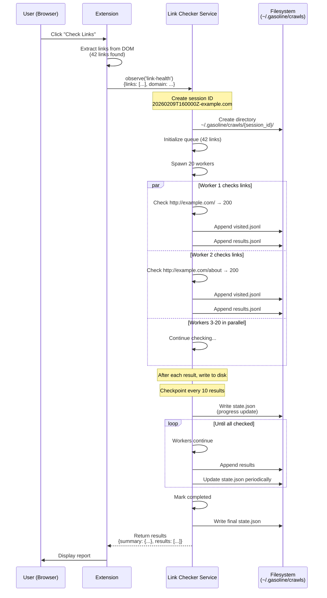
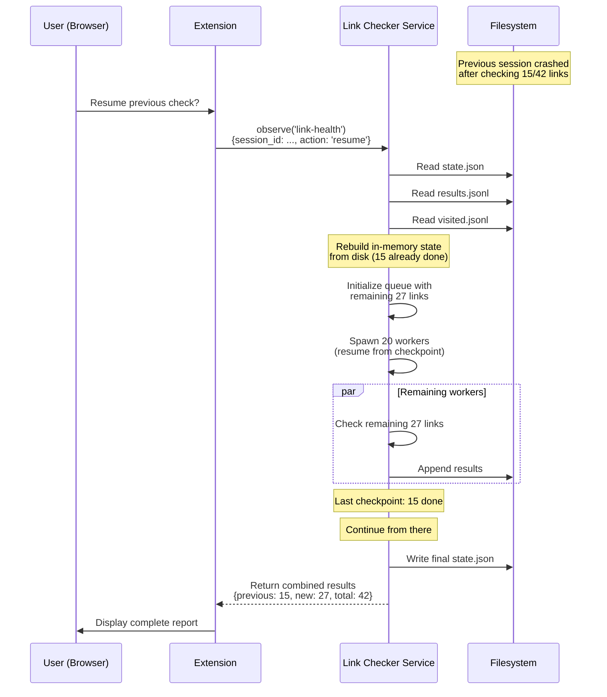
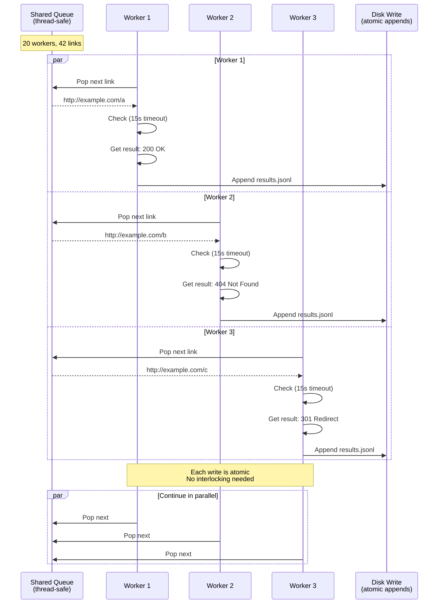

# Link Health Checker Technical Specification

## Overview

The Link Health Checker observes and reports on the health of all links on the current page. It identifies broken links (4xx/5xx errors), redirects (3xx), timeout issues, and distinguishes auth-required links (401/403) from genuinely broken ones.

**Scope (v1):** Current page only (50–200 typical links)

**Scope (v2 - Future):** Recursive domain crawling with embedded database

## Architecture: v1 (Current Page)

### System Design

```
┌─────────────────────────────────────────────────────────┐
│ Browser Extension                                       │
│ ┌─────────────────┐                                   │
│ │ User requests   │                                   │
│ │ link health     │                                   │
│ └────────┬────────┘                                   │
│          │                                             │
│          v                                             │
│ ┌─────────────────────────────────────────────┐       │
│ │ observe('link-health')                      │       │
│ │ - Extract links from DOM                    │       │
│ │ - Create session ID                         │       │
│ │ - Start link checking                       │       │
│ └────────┬────────────────────────────────────┘       │
│          │                                             │
│          v                                             │
│ ┌─────────────────────────────────────────────┐       │
│ │ Link Checker Service                        │       │
│ │ - 20 concurrent workers                     │       │
│ │ - Append-only JSONL logging                 │       │
│ │ - Periodic state checkpoints                │       │
│ └────────┬────────────────────────────────────┘       │
│          │                                             │
│          v                                             │
└─────────────────────────────────────────────────────────┘
         │
         │ Files: ~/.gasoline/crawls/{session_id}/
         │
         v
┌─────────────────────────────────────────────────────────┐
│ Persistent Storage (Zero-Deps)                          │
│                                                         │
│ visited.jsonl       (append-only visited URLs)         │
│ results.jsonl       (append-only results)              │
│ state.json          (queue + metadata)                 │
│ metadata.json       (page info, timestamps)            │
└─────────────────────────────────────────────────────────┘
```

### File Layout

```
~/.gasoline/crawls/
├── {session_id}/
│   ├── visited.jsonl          # Append-only: one URL per line (atomic appends)
│   ├── results.jsonl          # Append-only: LinkCheckResult JSON per line
│   ├── state.json             # Current queue + progress (overwrite OK)
│   └── metadata.json          # Domain, start URL, timestamps
```

### File Formats

#### visited.jsonl
```jsonl
http://example.com/
http://example.com/about
http://example.com/contact
```

#### results.jsonl
```jsonl
{"url":"http://example.com/","status":200,"code":"ok","time_ms":125,"is_external":false}
{"url":"http://example.com/missing","status":404,"code":"broken","time_ms":87,"is_external":false}
{"url":"http://example.com/protected","status":403,"code":"requires_auth","time_ms":156,"is_external":false}
{"url":"http://other.com/","status":301,"code":"redirect","time_ms":92,"is_external":true,"redirect_to":"http://other.com/new"}
{"url":"http://timeout.com/","status":null,"code":"timeout","time_ms":30000,"is_external":true,"error":"deadline exceeded"}
```

#### state.json
```json
{
  "session_id": "20260209T160000Z-example.com",
  "start_url": "http://example.com/",
  "domain": "example.com",
  "status": "in_progress",
  "created_at": "2026-02-09T16:00:00Z",
  "started_at": "2026-02-09T16:00:00Z",
  "completed_at": null,
  "queue": [
    "http://example.com/page1",
    "http://example.com/page2"
  ],
  "visited_count": 5,
  "completed_count": 5,
  "checkpoints": [
    {"at": "2026-02-09T16:02:30Z", "completed": 5, "remaining": 10}
  ]
}
```

#### metadata.json
```json
{
  "domain": "example.com",
  "start_url": "http://example.com/",
  "extracted_at": "2026-02-09T16:00:00Z",
  "total_links": 42,
  "internal_links": 32,
  "external_links": 10,
  "version": "1"
}
```

## Sequence Diagrams

### Cold Start (First Link Check)



### Warm Start (Resume After Crash)



### Concurrent Workers (Parallel Checking)



## State Machine

```
              ┌─────────────┐
              │   CREATED   │
              └──────┬──────┘
                     │
                     v
              ┌─────────────────┐
              │  IN_PROGRESS    │◄─────┐
              └────────┬────────┘      │
                       │              │
         ┌─────────────┼─────────────┐ │
         │             │             │ │
         v             v             v │
    ┌────────┐   ┌─────────┐   ┌────────────┐
    │TIMEOUT │   │PAUSED   │   │CRASHED     │
    └────────┘   └────┬────┘   └────────────┘
                      │              │
                      └──────┬───────┘
                             │
                             v
                    ┌──────────────┐
                    │RESUMING      │───┐
                    └──────┬───────┘   │
                           │          │
                           v          │
                    ┌──────────────┐  │
                    │IN_PROGRESS   │──┘
                    └──────┬───────┘
                           │
                           v
                    ┌──────────────┐
                    │COMPLETED     │
                    └──────────────┘

States:
- CREATED: Session initialized, queue built
- IN_PROGRESS: Workers actively checking
- TIMEOUT: Check timed out (e.g., 15s timeout per link)
- PAUSED: User paused the check
- CRASHED: Server crashed mid-check
- RESUMING: Rebuilding state from disk
- COMPLETED: All links checked

Transitions:
- CREATED → IN_PROGRESS: Start checking
- IN_PROGRESS → TIMEOUT: Link check hit timeout
- IN_PROGRESS → PAUSED: User pauses
- IN_PROGRESS → CRASHED: Server crash (detected on resume)
- IN_PROGRESS → COMPLETED: All links checked
- PAUSED → IN_PROGRESS: Resume
- CRASHED → RESUMING: Resume detected
- RESUMING → IN_PROGRESS: State rebuilt
- TIMEOUT → (remains IN_PROGRESS): Timeout is per-link, session continues
```

## Issue Categories

```
Issue Code     Status    Description                    Example
─────────────────────────────────────────────────────────────────
ok             2xx       Working link                   200 OK
redirect       3xx       Redirects (follow on v2)       301, 302
requires_auth  401/403   Needs authentication          403 Forbidden
broken         4xx/5xx   Genuinely broken              404, 500
timeout        null      Check timed out               (> 15s)
```

**Key Design:** `requires_auth` is NOT counted as "broken" because the link works correctly—it just needs authentication. This prevents false positives for protected resources.

## Network Communication

### observe('link-health') Request

```typescript
interface LinkHealthRequest {
  action: 'start' | 'resume' | 'cancel' | 'pause';
  session_id?: string;           // Required for resume/cancel/pause
  links?: string[];              // Required for start
  domain?: string;               // Required for start
  timeout_ms?: number;           // Default: 15000 (15s per link)
  timeout_total_ms?: number;     // Default: 300000 (5m total)
  max_workers?: number;          // Default: 20
  checkpoint_interval?: number;  // Default: 10 (checkpoint every 10 results)
}
```

### observe('link-health') Response

```typescript
interface LinkHealthResponse {
  session_id: string;
  status: 'in_progress' | 'completed' | 'paused' | 'error';

  summary: {
    total_links: number;
    checked: number;
    remaining: number;
    ok: number;
    redirect: number;
    requires_auth: number;
    broken: number;
    timeout: number;
    progress_percent: number;
  };

  results: LinkCheckResult[];

  metadata: {
    created_at: string;
    started_at: string;
    completed_at: string | null;
    elapsed_ms: number;
  };
}

interface LinkCheckResult {
  url: string;
  status: number | null;        // null if timeout
  code: 'ok' | 'redirect' | 'requires_auth' | 'broken' | 'timeout';
  time_ms: number;
  is_external: boolean;
  redirect_to?: string;         // Only if code='redirect'
  error?: string;               // Only if code='timeout'
}
```

### Failure Modes

| Failure | Cause | Recovery |
|---------|-------|----------|
| **Network Timeout** | URL unreachable for >15s | Logged as `timeout` code, continue with next |
| **DNS Failure** | Domain not resolvable | Logged as `timeout`, treated as broken |
| **Connection Reset** | Server closes mid-request | Retry once, then timeout |
| **Disk Full** | Can't append to results.jsonl | Log to stderr, continue in-memory only |
| **Server Crash** | Process dies during check | Rebuild state from disk on resume |
| **Port 80/443 Blocked** | Corporate firewall | Logged as `timeout` |

### Pagination (for v2 - Current page v1 does not paginate)

v1 handles all links on current page in a single operation. When v2 adds recursive crawling, pagination becomes necessary:

```typescript
interface LinkHealthPaginationRequest {
  session_id: string;
  limit?: number;       // Results per page (default: 50)
  offset?: number;      // Skip N results (default: 0)
  filter?: 'all' | 'broken' | 'redirect' | 'requires_auth' | 'ok' | 'timeout';
}

interface LinkHealthPaginationResponse {
  results: LinkCheckResult[];
  pagination: {
    total: number;
    limit: number;
    offset: number;
    has_more: boolean;
  };
}
```

## Persistence & Crash Recovery

### Design Principles

1. **Append-Only JSONL** - Zero risk of data loss, human-readable, crash-safe
2. **Session-Based** - Each check is independent, identified by session ID
3. **Incremental Writes** - Result written to disk immediately after check
4. **Periodic Checkpoints** - state.json updated every N results for quick resume

### Recovery Algorithm

```
On Resume:
1. Read state.json
   - Get session_id, domain, created_at
   - Get checkpoint info

2. Rebuild visited set from visited.jsonl
   - Scan file, one URL per line
   - Build in-memory set for deduplication

3. Rebuild results from results.jsonl
   - Scan file, parse each JSON line
   - Aggregate counts (ok, broken, etc.)

4. Compute remaining queue
   - Take original queue
   - Subtract visited URLs
   - Re-sort by domain (keep external last)

5. Resume checking
   - Spawn workers with remaining queue
   - Continue appending to results.jsonl
   - Update state.json periodically

6. Merge results
   - Return combined results (previous + new)
   - Mark resumed=true in metadata
```

### File Integrity

- **visited.jsonl**: Write-append atomic. One line per URL. No partial lines.
- **results.jsonl**: Write-append atomic. One line per result JSON. No partial lines.
- **state.json**: Overwrite OK. Atomic write with temp file rename.
- **metadata.json**: Overwrite OK. Static, written once at start.

## Edge Cases & Failure Modes

### 1. Session Directory Already Exists

**Scenario:** User starts check, server crashes, user starts again with same session ID.

**Expected:** Resume from checkpoint, not restart.

**Resolution:** On start, check if `~/.gasoline/crawls/{session_id}/` exists:
- If exists + state.json status = "in_progress": Auto-resume
- If exists + state.json status = "completed": Skip
- If exists but corrupted: Create new session with different timestamp

### 2. Disk Full (Can't Append)

**Scenario:** results.jsonl append fails due to full disk.

**Expected:** Graceful degradation.

#### Resolution:
- Log error to stderr
- Continue checking in-memory
- Return results in response (but not persisted)
- Mark session as "degraded" in state.json

### 3. Large Number of Links (1000+)

**Scenario:** Page has many links (crawlable app with infinite scroll).

**Expected:** Handle efficiently without OOM.

#### Resolution:
- Process in batches via workers
- Never load all results into memory at once
- Stream results from results.jsonl when returning

### 4. Mixed Internal/External Links

**Scenario:** Page has links to internal pages and external sites.

**Expected:** Distinguish and handle differently.

#### Resolution:
- Mark `is_external` in result
- Internal links: 15s timeout
- External links: 30s timeout (network variance)
- Both categories tracked separately

### 5. Redirect Chains (301 → 302 → 200)

**Scenario:** Link redirects multiple times.

**Expected:** Follow redirects on v2, report final status on v1.

**Resolution (v1):** Report first redirect (301) as `code='redirect'`, include `redirect_to` field.

**Resolution (v2):** Follow chain up to 10 hops, report final status.

### 6. Same Link Appears Multiple Times

**Scenario:** Page links to `/about` in multiple places.

**Expected:** Check once, report multiple results.

#### Resolution:
- Add to visited set after first check
- Append to queue only once
- In results, return one entry per URL occurrence in DOM (with deduplicated checks)

### 7. Authentication-Required Link Works After Login

**Scenario:** Link returns 403, but user is logged in on extension.

**Expected:** Properly categorize as `requires_auth` not broken.

**Resolution:** Send HTTP request with extension's cookies/auth headers. If 403 → mark `requires_auth`.

### 8. Server Crashes Between Checkpoint and Completion

**Scenario:** All checks done, server crashes before writing final state.json.

**Expected:** Resume sees all results in results.jsonl.

#### Resolution:
- Rebuild state from disk includes all appended results
- Resume detects "all visited" and marks completed
- No re-checks needed

### 9. Concurrent Sessions (User Starts Two Checks)

**Scenario:** User checks links on page A, then page B without waiting.

**Expected:** Two independent sessions.

#### Resolution:
- Each gets unique session ID (timestamp + domain)
- Sessions share nothing (separate directories)
- Workers are per-session

### 10. User Cancels Mid-Check

**Scenario:** User calls observe('link-health', {action: 'cancel', session_id: ...}).

**Expected:** Stop checking, preserve results so far.

#### Resolution:
- Set state.json status = "cancelled"
- Signal workers to drain queue (no new pops)
- Return final results collected

### 11. Timeout on Timeout (Link Checks Exceed Total Timeout)

**Scenario:** Some links check fast, others are slow, total exceeds 5m limit.

**Expected:** Stop processing, return partial results.

#### Resolution:
- Track elapsed_ms in state
- When elapsed > timeout_total_ms, signal workers to stop
- Mark remaining as not checked (not timeout, just incomplete)
- Return partial results with `status: 'timeout_limit_reached'`

### 12. Redirect to Same Domain (Loop)

**Scenario:** `/page1` redirects to `/page2`, which redirects back to `/page1`.

**Expected:** Detect loop, report correctly.

#### Resolution:
- v1: Report `/page1 → /page2` (first redirect)
- v2: Detect cycle after 3 redirects, return error

### 13. Very Large Response (>100MB)

**Scenario:** Link points to large file download.

**Expected:** Handle without memory bloat.

#### Resolution:
- HEAD request first (no body)
- If Content-Length > 10MB, warn in result
- Return status based on HEAD (only headers)

### 14. IPv6 Links

**Scenario:** Link is `http://[::1]/page`.

**Expected:** Check properly.

#### Resolution:
- Go's net/http handles IPv6 natively
- Extract URL, make request, log result

## Performance Targets

| Metric | Target | Notes |
|--------|--------|-------|
| Queue Build | < 100ms | Extract DOM links |
| Per-Link Check | < 15s | Network timeout |
| Total Session | < 5m | 300s limit for all links |
| Worker Count | 20 concurrent | Parallelism limit |
| Disk Write | < 1ms | Append-only, buffered |
| Checkpoint Write | < 10ms | Atomic state.json |
| Resume Load | < 100ms | Read from disk |

## Future: v2 Recursive Crawling (Note for v1)

**v1 Limitation:** Current page only (single request).

**v2 Plan:** Recursive domain crawling (follow internal links, build sitemap).

**Why Not v1:** Would require complex cross-session state, multi-page deduplication, database queries.

### v2 Upgrade Path:
- Replace JSONL with **bbolt** (pure Go, zero external deps, embedded key-value store)
- Benefits: Indexed queries ("show me all 404s across sessions"), transaction support, atomic multi-updates
- File location: `~/.gasoline/crawls/crawls.db` (single bbolt database)
- Bucket structure:
  ```
  sessions/
    {session_id}/metadata
    {session_id}/visited
    {session_id}/results
  index/
    broken_by_domain
    redirects_by_target
  ```
- When to upgrade: When v2 (recursive) is implemented and cross-session queries needed

**For v1:** JSONL is optimal—simple, durable, zero dependencies, sufficient for single-page checks.

## Configuration

### Environment Variables

```bash
# Session storage location (default: ~/.gasoline/crawls)
GASOLINE_CRAWLS_DIR=/custom/path

# Default timeout per link (ms)
GASOLINE_LINK_TIMEOUT=15000

# Default total timeout (ms)
GASOLINE_LINK_TIMEOUT_TOTAL=300000

# Max concurrent workers
GASOLINE_LINK_WORKERS=20

# Checkpoint interval (every N results)
GASOLINE_LINK_CHECKPOINT=10
```

### API Parameters

See "Network Communication" section above for full request/response schemas.
