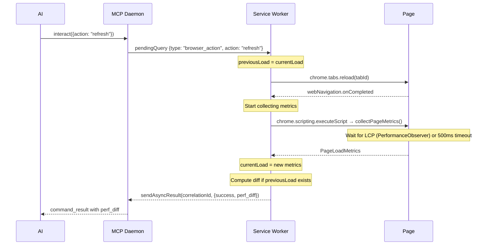
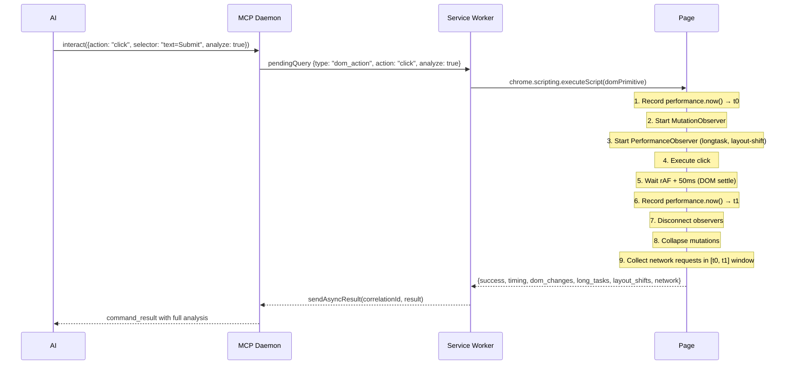

# Tech Spec: Rich Action Results

## Problem

The AI's optimization loop is slow:

```
edit code → refresh → observe(performance) → observe(vitals) → observe(network_waterfall)
→ mentally diff numbers → decide next step → repeat
```

Three observe calls per iteration, manual number-crunching, no cause-and-effect visibility. For DOM actions it's worse — the AI clicks a button and has no idea what happened without follow-up queries.

## Solution

**Action results include everything that happened.** The extension is the measurement instrument, not the AI.

Two modes, zero extra tool calls in either:

| Action type | What comes back automatically |
| --- | --- |
| **Navigation** (refresh, navigate) | Perf diff vs previous page load |
| **DOM mutation** (click, type, select, check, key_press, set_attribute) | Timing + DOM changes summary |
| **DOM mutation with `analyze: true`** | Full breakdown: timing, network, long tasks, layout shifts, detailed DOM changes |
| **Read-only** (get_text, get_value, list_interactive, etc.) | Nothing extra |

### The optimization loop becomes

```
repeat {
  edit code
  interact({action: "refresh"})
  → result includes perf_diff: LCP -57%, transfer_size -33%, ...
  read diff, decide next step
}
```

One call per iteration. No snapshots, no compare, no observe.

## API

### Navigation results (refresh / navigate)

Always included — no opt-in needed:

```json
interact({ action: "refresh" })
// → async result:
{
  "success": true,
  "action": "refresh",
  "perf_diff": {
    "metrics": {
      "lcp":   { "before": 2800, "after": 1200, "delta": -1600, "pct": "-57%", "improved": true },
      "fcp":   { "before": 900,  "after": 800,  "delta": -100,  "pct": "-11%", "improved": true },
      "cls":   { "before": 0.02, "after": 0.01, "delta": -0.01, "pct": "-50%", "improved": true },
      "ttfb":  { "before": 120,  "after": 80,   "delta": -40,   "pct": "-33%", "improved": true },
      "load":  { "before": 1500, "after": 1100, "delta": -400,  "pct": "-27%", "improved": true },
      "transfer_kb": { "before": 768, "after": 512, "delta": -256, "pct": "-33%", "improved": true },
      "requests": { "before": 58, "after": 42, "delta": -16, "pct": "-28%", "improved": true }
    },
    "resources": {
      "added": [],
      "removed": [{ "url": "/old-bundle.js", "type": "script", "kb": 256 }],
      "resized": [{ "url": "/main.js", "before_kb": 512, "after_kb": 256 }]
    },
    "summary": "LCP improved 57% (2.8s → 1.2s). 256KB saved by removing old-bundle.js."
  }
}
```

First page load: no `perf_diff` (no baseline yet). Every subsequent navigation auto-diffs against the previous one.

### DOM action results — default (always-on, compact)

Two fields added to every mutating action result:

```json
interact({ action: "click", selector: "text=Submit" })
// → async result:
{
  "success": true,
  "action": "click",
  "timing_ms": 85,
  "dom_summary": "2 added, 1 attr changed"
}
```

~30 tokens. Negligible cost. Tells the AI "something happened" vs "nothing changed."

### DOM action results — with `analyze: true` (opt-in, detailed)

When the AI is actively debugging or profiling an interaction:

```json
interact({ action: "click", selector: "text=Load More", analyze: true })
// → async result:
{
  "success": true,
  "action": "click",
  "timing": {
    "total_ms": 340,
    "js_blocking_ms": 120,
    "network_ms": 180,
    "render_ms": 40
  },
  "network": [
    { "url": "/api/items?page=2", "method": "GET", "status": 200, "duration_ms": 180, "kb": 12 }
  ],
  "long_tasks": [
    { "duration_ms": 120, "attribution": "script" }
  ],
  "layout_shifts": 0.03,
  "dom_changes": {
    "summary": "25 items added, 1 attr changed",
    "added": [
      { "selector": ".item-card", "count": 25, "text": "Product 11..." }
    ],
    "attributes": [
      { "selector": "#load-more", "attr": "data-page", "from": "1", "to": "2" }
    ]
  },
  "analysis": "340ms total: 180ms network (/api/items), 120ms JS long task, 40ms render. Layout shift 0.03 from 25 items inserted without reserved height."
}
```

### User Timing passthrough

The AI inserts standard `performance.mark()` / `performance.measure()` calls in source code. The extension captures these via `PerformanceObserver` and includes them in `observe({what: 'performance'})`:

```json
observe({ what: "performance" })
// → includes:
{
  "snapshots": [...],
  "user_timing": {
    "marks": [
      { "name": "hero-render-start", "time": 450.2 },
      { "name": "hero-render-end", "time": 512.8 }
    ],
    "measures": [
      { "name": "hero-render", "duration": 62.6, "start": 450.2 }
    ]
  }
}
```

No Gasoline-specific API. Standard browser API. The extension just makes it accessible.

## Extension Architecture

### State the extension holds

```typescript
// In service worker memory — survives across navigations within a tab
interface PerfState {
  previousLoad: PageLoadMetrics | null  // metrics from last completed navigation
  currentLoad: PageLoadMetrics | null   // metrics from current page
}

interface PageLoadMetrics {
  url: string
  timestamp: number
  timing: {
    ttfb: number
    fcp: number | null
    lcp: number | null
    domContentLoaded: number
    load: number
  }
  cls: number
  resources: ResourceEntry[]  // from PerformanceResourceTiming
  transferSize: number
  requestCount: number
  longTaskCount: number
  totalBlockingTime: number
}
```

### Navigation flow



### DOM action flow (with analyze: true)



### DOM action flow (default, no analyze)

Same as above but steps 3, 8, 9 are simplified:

- MutationObserver still runs (needed for `dom_summary`)
- No PerformanceObserver for long tasks / layout shifts
- No network request collection
- Just returns `timing_ms` + `dom_summary`

### LCP readiness strategy

LCP can change until user interaction. For the optimization loop, we need to report fast, not perfectly.

```typescript
async function waitForMetrics(): Promise<PageLoadMetrics> {
  return new Promise(resolve => {
    let lcpValue: number | null = null

    const observer = new PerformanceObserver(entries => {
      for (const entry of entries.getEntries()) {
        if (entry.entryType === 'largest-contentful-paint') {
          lcpValue = entry.startTime
        }
      }
    })
    observer.observe({ type: 'largest-contentful-paint', buffered: true })

    // Resolve when LCP fires or after 500ms, whichever first
    const timeout = setTimeout(() => done(), 500)

    function done() {
      clearTimeout(timeout)
      observer.disconnect()
      resolve(collectAllMetrics(lcpValue))
    }

    // If LCP already buffered, resolve immediately
    if (lcpValue !== null) done()
  })
}
```

500ms timeout keeps iteration fast. On most dev servers, LCP fires well within this window.

### User Timing capture

Add to the existing inject script's PerformanceObserver setup:

```typescript
const userTimingObserver = new PerformanceObserver(entries => {
  for (const entry of entries.getEntries()) {
    capturedUserTiming.push({
      type: entry.entryType,  // 'mark' or 'measure'
      name: entry.name,
      startTime: entry.startTime,
      duration: entry.duration,
    })
  }
})
userTimingObserver.observe({ type: 'mark', buffered: true })
userTimingObserver.observe({ type: 'measure', buffered: true })
```

Surfaced through the existing perf snapshot POST to the daemon. No new endpoints.

## Diff computation

### Navigation perf diff

Computed in the extension (before sending async result) or in the daemon (on the perf snapshot POST). Extension-side is faster for the iteration loop.

```typescript
function computePerfDiff(before: PageLoadMetrics, after: PageLoadMetrics): PerfDiff {
  const metrics: Record<string, MetricDiff> = {}

  const pairs: [string, number | null, number | null, boolean][] = [
    ['lcp', before.timing.lcp, after.timing.lcp, true],     // lower = better
    ['fcp', before.timing.fcp, after.timing.fcp, true],
    ['cls', before.cls, after.cls, true],
    ['ttfb', before.timing.ttfb, after.timing.ttfb, true],
    ['load', before.timing.load, after.timing.load, true],
    ['transfer_kb', before.transferSize / 1024, after.transferSize / 1024, true],
    ['requests', before.requestCount, after.requestCount, true],
  ]

  for (const [name, bVal, aVal, lowerIsBetter] of pairs) {
    if (bVal == null || aVal == null) continue
    const delta = aVal - bVal
    const pct = bVal !== 0 ? Math.round((delta / bVal) * 100) : 0
    metrics[name] = {
      before: round(bVal), after: round(aVal),
      delta: round(delta), pct: `${pct >= 0 ? '+' : ''}${pct}%`,
      improved: lowerIsBetter ? delta < 0 : delta > 0,
    }
  }

  const resources = computeResourceDiff(before.resources, after.resources)
  const summary = generateSummary(metrics, resources)

  return { metrics, resources, summary }
}
```

### Resource diff

Match resources by URL. Report:

- **added**: in current but not baseline (>1KB or render-blocking)
- **removed**: in baseline but not current
- **resized**: same URL, size changed >10% and >1KB

### DOM mutation collapsing

(Unchanged from previous DOM diffing spec — MutationObserver + collapse + cap at 20 per category)

### Analysis string generation

For navigation:
```
"LCP improved 57% (2.8s → 1.2s). 256KB saved by removing old-bundle.js."
```

For interaction analysis:
```
"340ms total: 180ms network (/api/items), 120ms JS long task, 40ms render."
```

Rules:

1. Lead with the most impactful metric change
2. Mention specific resources/URLs when relevant
3. Flag regressions: "Warning: CLS regressed 200% (0.01 → 0.03)"
4. Keep under 200 chars

## Files

### Extension (TypeScript)

#### 1. `src/background/perf-tracking.ts` (NEW, ~150 lines)

- `PerfState` — holds previous/current `PageLoadMetrics`
- `collectPageMetrics()` — injected function that gathers timing, resources, vitals
- `waitForMetrics()` — LCP readiness strategy (500ms timeout)
- `computePerfDiff()` — structured diff between two load snapshots
- `computeResourceDiff()` — added/removed/resized resources
- `generateSummary()` — human-readable analysis string

#### 2. `src/background/dom-primitives.ts` (MODIFIED, ~100 lines added)

Inside the `domPrimitive` mega-function:

- `observeAndExecute(action, element, options, analyze)` wrapper:
  - Always: record `performance.now()`, start MutationObserver, execute, settle, collect
  - With `analyze`: also start PerformanceObserver for longtask + layout-shift, collect network
- `collapseMutations(records)` — deduplicate, skip children of added/removed parents, cap
- `getCompactSelector(el)` — id > data-testid > tag.class > tag
- Return `timing_ms` + `dom_summary` always, full breakdown when `analyze: true`

#### 3. `src/background/pending-queries.ts` (MODIFIED, ~20 lines)

- For `browser_action` refresh/navigate: call `perfState.snapshotBeforeNavigation()`, listen for `webNavigation.onCompleted`, collect metrics, diff, include in result
- For `dom_action`: pass `analyze` flag through to `executeDOMAction`

#### 4. `src/inject/performance-observers.ts` (MODIFIED, ~20 lines)

- Add `mark` and `measure` to PerformanceObserver entry types
- Include captured user timing in perf snapshot POST payload

#### 5. `src/types/queries.ts` (MODIFIED, ~5 lines)

- Add `analyze?: boolean` to dom_action query params

### Go (daemon)

#### 6. `cmd/dev-console/tools_schema.go` (MODIFIED, ~5 lines)

- Add `analyze` boolean param to interact tool:

  ```json
  "analyze": { "type": "boolean", "description": "Include detailed performance analysis (timing breakdown, network, long tasks, DOM changes) in the action result. Use for profiling interactions." }
  ```

#### 7. `cmd/dev-console/tools_interact.go` (MODIFIED, ~3 lines)

- Pass `analyze` param through to pending query

#### 8. `cmd/dev-console/tools_observe_analysis.go` (MODIFIED, ~10 lines)

- Include `user_timing` (marks + measures) in performance snapshot response

### No new Go files needed

The diff computation happens extension-side. The daemon just passes through the enriched results via the existing async command result mechanism.

## What actions get what

| Action | `timing_ms` | `dom_summary` | Full analysis | `perf_diff` |
| --- | --- | --- | --- | --- |
| click, type, select, check, key_press | Always | Always | With `analyze: true` | No |
| set_attribute | Always | Always | With `analyze: true` | No |
| refresh, navigate | No | No | No | Always (after 1st load) |
| get_text, get_value, get_attribute | No | No | No | No |
| focus, scroll_to, wait_for | No | No | No | No |
| list_interactive | No | No | No | No |

## Edge Cases

| Case | Behavior |
| --- | --- |
| First page load (no baseline) | `perf_diff` omitted, just returns success |
| LCP doesn't fire within 500ms | Report without LCP, note `"lcp": null` |
| Extension not connected | Refresh still works, no `perf_diff` in result |
| Page navigates away during metrics collection | Abandon collection, return success without perf data |
| No DOM changes after action | `dom_summary: "no changes"`, `timing_ms` still reported |
| `analyze: true` on read-only action | Ignored (no overhead added) |
| Hundreds of mutations (React re-render) | Collapse: skip children of added parents, cap 20 per category |
| Network request initiated by action takes >2s | Not included in analysis window (50ms settle) |
| SPA navigation (no full page load) | No `perf_diff` — only works for full navigations |

## Performance Budget

| Component | Overhead |
| --- | --- |
| MutationObserver setup/teardown | <0.1ms |
| DOM settle wait | 50ms |
| Mutation collapsing | <5ms |
| `performance.now()` calls | <0.01ms |
| PerformanceObserver (analyze mode) | <0.5ms |
| LCP wait on refresh | ≤500ms |
| Perf diff computation | <1ms |

Normal actions: ~55ms overhead (mostly the settle wait).
Navigation: ≤500ms after load event (LCP wait).

## Effort

~1.5 weeks total:

- Perf tracking + diff (extension): ~3 days
- DOM mutation observation in domPrimitive: ~3 days
- User Timing passthrough: ~0.5 days
- Wire analyze flag through daemon: ~0.5 days
- Testing: included in above
