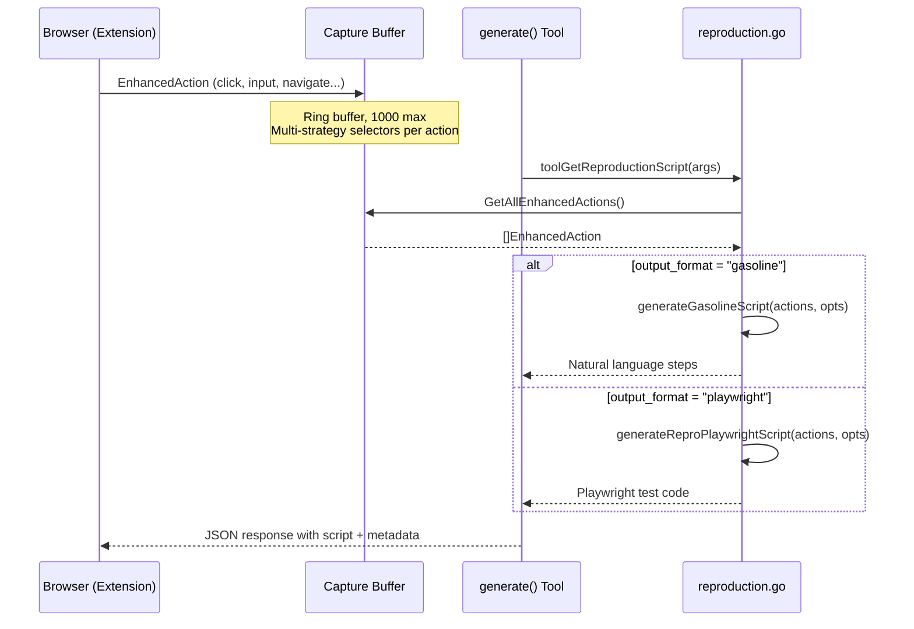

# Tech Spec: Reproduction Scripts

## Overview

Replace the `toolGetReproductionScript()` stub in [tools_generate.go](cmd/dev-console/tools_generate.go) with a complete implementation that generates reproduction scripts from captured `EnhancedAction` data. Two output formats: Playwright (test code) and Gasoline (natural language).

All logic lives in a single new file: `cmd/dev-console/reproduction.go` (~250 LOC).

---

## Architecture

### Data Flow



### Selector Data Available Per Action

Each `EnhancedAction` arrives from the extension with a `Selectors` map containing multi-strategy selectors computed by `computeSelectors()` in `reproduction.ts`:

```
Selectors: {
  "testId":    "coupon-input",              // data-testid attribute
  "ariaLabel": "Enter coupon code",         // aria-label attribute
  "role":      {"role": "textbox", "name": "Enter coupon code"},  // ARIA role + name
  "id":        "coupon",                    // element ID
  "text":      "Apply",                     // visible text (clickables only)
  "cssPath":   "form > div.coupon > input"  // CSS path fallback
}
```

The generation code reads from this map to produce the best possible description for each format.

---

## Implementation

### New File: `cmd/dev-console/reproduction.go`

**Size target:** ~250 LOC

```go
// reproduction.go — Reproduction script generation from captured actions.
// Generates Playwright tests or Gasoline natural language scripts.
package main
```

### Core Functions

#### 1. `toolGetReproductionScript()` — Entry Point

Replaces the stub. Parses parameters, fetches actions, dispatches to format-specific generator.

```go
type ReproductionParams struct {
    Format            string `json:"format"`             // always "reproduction"
    OutputFormat      string `json:"output_format"`      // "gasoline" (default) | "playwright"
    LastN             int    `json:"last_n"`             // optional: filter to last N actions
    BaseURL           string `json:"base_url"`           // optional: rewrite origins
    IncludeScreenshots bool  `json:"include_screenshots"` // optional: screenshot steps (playwright)
    ErrorMessage      string `json:"error_message"`      // optional: error context
}

type ReproductionResult struct {
    Script      string              `json:"script"`
    Format      string              `json:"format"`
    ActionCount int                 `json:"action_count"`
    DurationMs  int64               `json:"duration_ms"`
    StartURL    string              `json:"start_url"`
    Metadata    ReproductionMeta    `json:"metadata"`
}

type ReproductionMeta struct {
    GeneratedAt      string   `json:"generated_at"`
    SelectorsUsed    []string `json:"selectors_used"`
    ActionsAvailable int      `json:"actions_available"`
    ActionsIncluded  int      `json:"actions_included"`
}
```

**Flow:**
1. Parse `ReproductionParams` from args
2. Call `h.capture.GetAllEnhancedActions()`
3. If no actions → return structured error `no_actions_captured`
4. Apply `last_n` filter (slice from end)
5. Dispatch to `generateGasolineScript()` or `generateReproPlaywrightScript()`
6. Compute metadata (duration, selectors used, counts)
7. Return `ReproductionResult`

#### 2. `generateGasolineScript()` — Natural Language

Converts actions to numbered human-readable steps.

```go
func generateGasolineScript(actions []capture.EnhancedAction, opts ReproductionParams) string
```

**Algorithm:**
1. Write header: `# Reproduction: {description}\n# Captured: {time} | {count} actions | {url}\n`
2. For each action:
   a. Check timing gap from previous action → insert `[Ns pause]` if > 2s
   b. Build element description via `describeElement(action)` (see below)
   c. Format step based on action type:
      - `navigate` → `Navigate to: {url}`
      - `click` → `Click: {description}`
      - `input` → `Type "{value}" into: {description}`
      - `select` → `Select "{text}" from: {description}`
      - `keypress` → `Press: {key}`
      - `scroll` → `Scroll to: y={position}`
3. If `error_message` provided → append `\n# Error: {message}`

#### 3. `describeElement()` — Human-Readable Element Description

Converts multi-strategy selectors into the most readable description possible.

```go
func describeElement(action capture.EnhancedAction) string
```

**Priority chain (first match wins):**

| Priority | Condition | Output | Example |
|----------|-----------|--------|---------|
| 1 | `text` + `role.role` | `"{text}" {role}` | `"Submit" button` |
| 2 | `ariaLabel` + `role.role` | `"{ariaLabel}" {role}` | `"Close dialog" button` |
| 3 | `role.name` + `role.role` | `"{name}" {role}` | `"Email" textbox` |
| 4 | `testId` | `[data-testid="{testId}"]` | `[data-testid="coupon-input"]` |
| 5 | `text` alone | `"{text}"` | `"Add to Cart"` |
| 6 | `ariaLabel` alone | `"{ariaLabel}"` | `"Enter coupon code"` |
| 7 | `id` | `#{id}` | `#quantity` |
| 8 | `cssPath` | `{cssPath}` | `form > div > input` |
| 9 | (none) | `(unknown element)` | `(unknown element)` |

**Why this order:**
- Priorities 1-3 produce the most natural descriptions ("Submit" button reads like English)
- Priority 4 (testId) is machine-stable but less readable
- Priorities 5-6 are readable but without role context
- Priorities 7-8 are technical fallbacks

#### 4. `generateReproPlaywrightScript()` — Playwright Test

Converts actions to a Playwright test using the best available Playwright locator.

```go
func generateReproPlaywrightScript(actions []capture.EnhancedAction, opts ReproductionParams) string
```

**Locator priority (matches Playwright best practices):**

| Priority | Selector | Playwright Locator |
|----------|----------|-------------------|
| 1 | `testId` | `page.getByTestId('...')` |
| 2 | `role` + `name` | `page.getByRole('...', { name: '...' })` |
| 3 | `ariaLabel` | `page.getByLabel('...')` |
| 4 | `text` | `page.getByText('...')` |
| 5 | `id` | `page.locator('#...')` |
| 6 | `cssPath` | `page.locator('...')` |

**Action mapping:**

| Action | Playwright Code |
|--------|----------------|
| `click` | `await page.{locator}.click();` |
| `input` | `await page.{locator}.fill('{value}');` |
| `navigate` | `await page.goto('{url}');` |
| `select` | `await page.{locator}.selectOption('{value}');` |
| `keypress` | `await page.keyboard.press('{key}');` |
| `scroll` | `// Scroll to y={position}` |

**Timing:** Pauses > 2s rendered as `// [{N}s pause]` comments.

**URL rewriting:** If `base_url` provided, all URLs rewritten: extract pathname, prepend base_url.

---

## Edge Cases

### E1: No Actions Captured

**Trigger:** `GetAllEnhancedActions()` returns empty slice.
**Resolution:** Return structured error `no_actions_captured` with hint: "Interact with the page first, then retry."

### E2: All Selectors Missing

**Trigger:** Action has nil/empty `Selectors` map.
**Resolution:** `describeElement()` returns `(unknown element)`. Playwright generator emits comment `// action - no selector available`.

### E3: Redacted Input Values

**Trigger:** `action.Value == "[redacted]"` (sensitive field like password).
**Resolution:** Gasoline: `Type "[user-provided]" into: Password field`. Playwright: `await page.{locator}.fill('[user-provided]');`.

### E4: Very Long Scripts (1000 actions)

**Trigger:** Full buffer with 1000 actions.
**Resolution:** Cap output at 200KB. If exceeded, truncate from the beginning (keep most recent actions) and prepend `# Note: Script truncated to last {N} actions (200KB limit)`.

### E5: URL Rewriting with base_url

**Trigger:** `base_url` parameter provided.
**Resolution:** For each URL, extract pathname and prepend base_url. If URL parsing fails, use as-is.

### E6: Special Characters in Values

**Trigger:** User typed text containing quotes, backslashes, newlines.
**Resolution:** Escape for Playwright (`'` → `\'`, `\n` → `\\n`). Gasoline uses double-quoted values which handle most cases naturally; newlines rendered as `\n`.

### E7: Navigate Actions with No URL

**Trigger:** `action.ToURL` is empty.
**Resolution:** Skip the action in output (don't emit an empty navigate step).

### E8: Mixed Human and AI Actions

**Trigger:** Buffer contains both `Source: "human"` and `Source: "ai"` actions.
**Resolution:** Include all actions. AI actions annotated with `(AI)` prefix in Gasoline format: `3. (AI) Click: "Submit" button`. No annotation in Playwright.

---

## Selector Extraction Helpers

The `Selectors` map from the extension uses `map[string]any` in Go. Helper functions extract typed values safely:

```go
func selectorString(selectors map[string]any, key string) string {
    v, ok := selectors[key].(string)
    if !ok { return "" }
    return v
}

func selectorRole(selectors map[string]any) (role, name string) {
    roleData, ok := selectors["role"]
    if !ok { return "", "" }
    roleMap, ok := roleData.(map[string]any)
    if !ok { return "", "" }
    role, _ = roleMap["role"].(string)
    name, _ = roleMap["name"].(string)
    return role, name
}
```

---

## Files Changed

| File | Change | LOC |
|------|--------|-----|
| `cmd/dev-console/reproduction.go` | **NEW** — Core generation logic | ~250 |
| `cmd/dev-console/reproduction_test.go` | **NEW** — Tests | ~300 |
| `cmd/dev-console/tools_generate.go` | Update `toolGetReproductionScript()` to delegate to reproduction.go | ~5 |

**Total new code:** ~555 LOC

---

## Testing Strategy

### Unit Tests (`reproduction_test.go`)

1. **TestReproduction_Gasoline_BasicFlow** — navigate + click + type → verify natural language output
2. **TestReproduction_Gasoline_AllActionTypes** — one of each type → verify format for every action
3. **TestReproduction_Gasoline_ElementDescriptionPriority** — verify selector priority chain (text+role > ariaLabel > testId > etc.)
4. **TestReproduction_Gasoline_TimingPauses** — actions > 2s apart → verify `[Ns pause]` inserted
5. **TestReproduction_Gasoline_RedactedValues** — password input → `[user-provided]`
6. **TestReproduction_Gasoline_AIActions** — Source="ai" → `(AI)` prefix
7. **TestReproduction_Playwright_BasicFlow** — verify valid Playwright test output
8. **TestReproduction_Playwright_LocatorPriority** — testId > role > ariaLabel > text > id > cssPath
9. **TestReproduction_Playwright_URLRewriting** — base_url rewrites origins
10. **TestReproduction_Playwright_SpecialCharacters** — quotes and newlines escaped
11. **TestReproduction_EmptyActions** — returns error
12. **TestReproduction_LastN** — filter to last N actions
13. **TestReproduction_OutputCap** — 1000 actions doesn't exceed 200KB
14. **TestReproduction_DefaultFormat** — empty output_format defaults to "gasoline"

### Integration Test

Run via existing `go test ./cmd/dev-console/...` — the generate tool dispatch in `tools_generate.go` ensures the `reproduction` format reaches the new code.

---

## Performance

| Metric | Target | Rationale |
|--------|--------|-----------|
| Generation time | < 50ms for 1000 actions | Single pass, string builder, no I/O |
| Output size | < 200KB | Capped by truncation |
| Memory | < 2MB transient | Actions already in buffer; script is one string allocation |

---

## Implementation Order

1. Write `reproduction_test.go` with tests for both formats (TDD)
2. Write `reproduction.go` — types, helpers, `generateGasolineScript()`, `generateReproPlaywrightScript()`
3. Update `toolGetReproductionScript()` in `tools_generate.go` to call new code
4. Run tests: `go test ./cmd/dev-console/... -run TestReproduction`
5. Run full suite: `go test ./... -timeout 120s`
