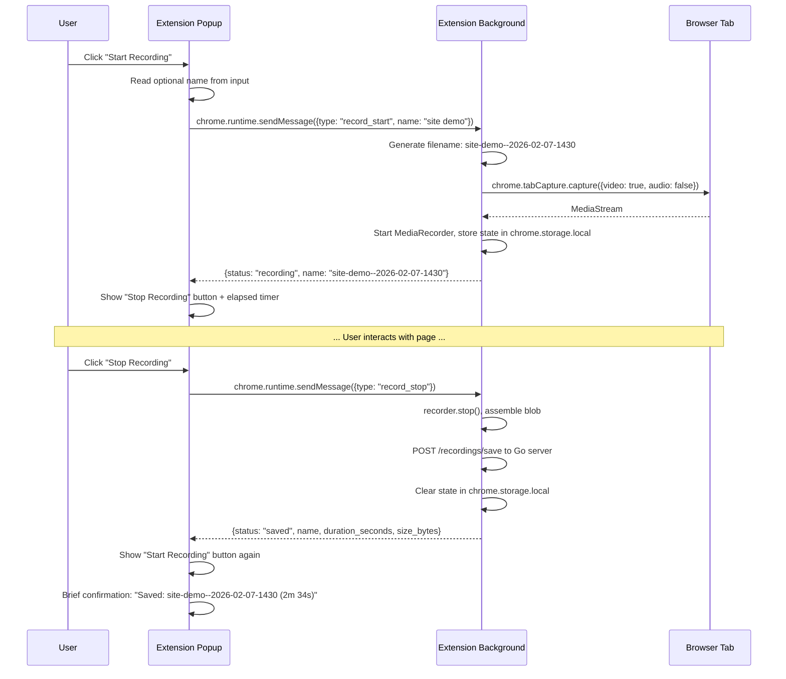
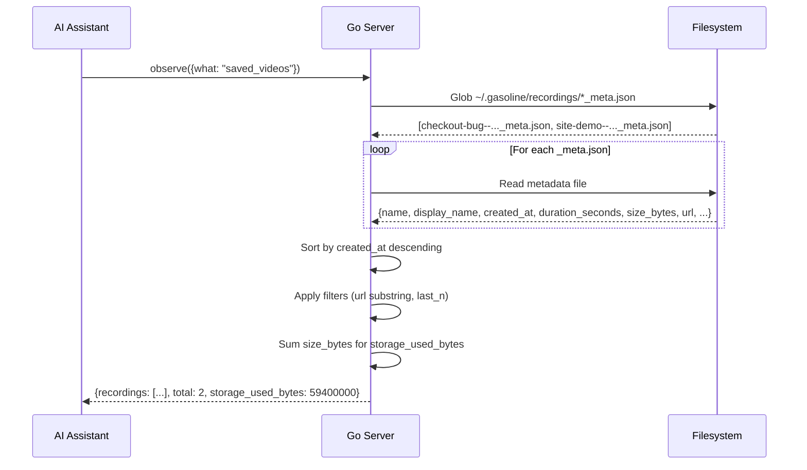
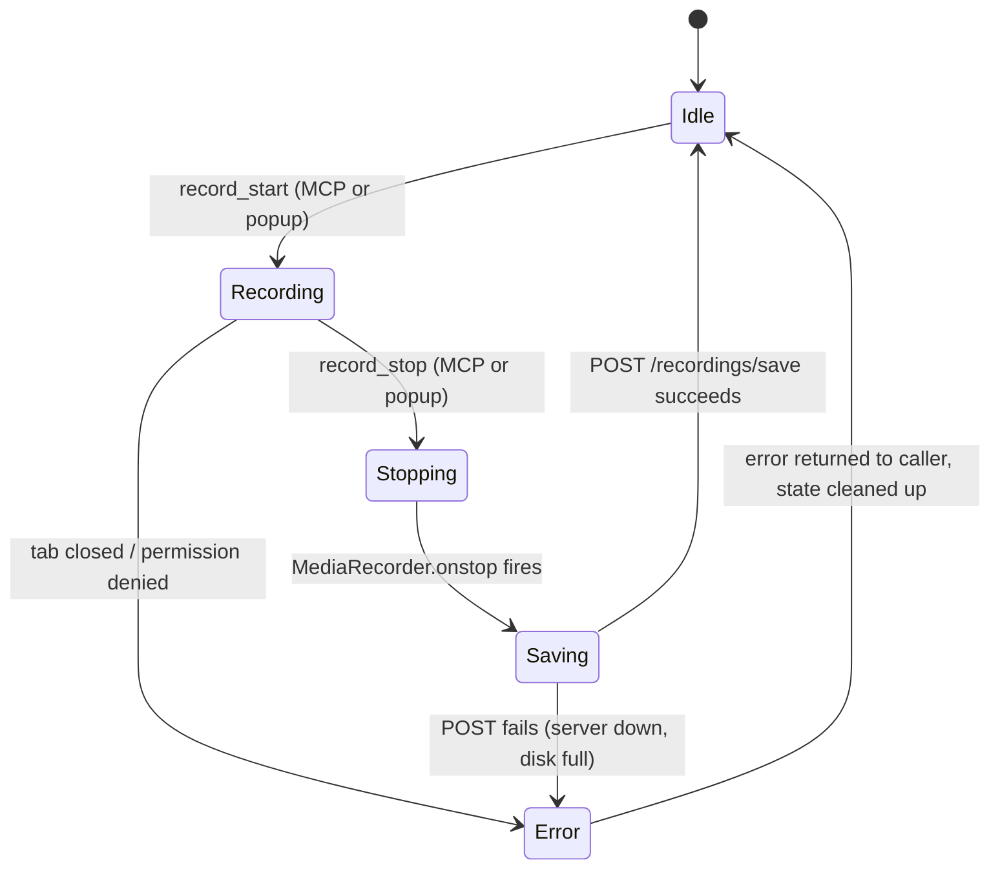
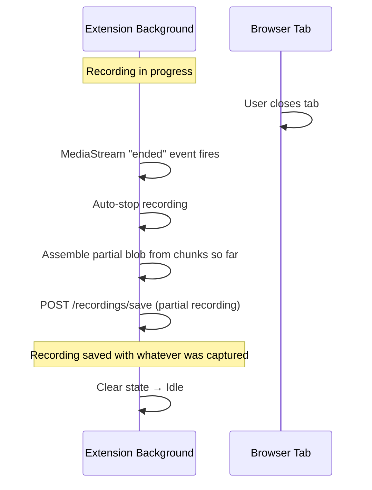
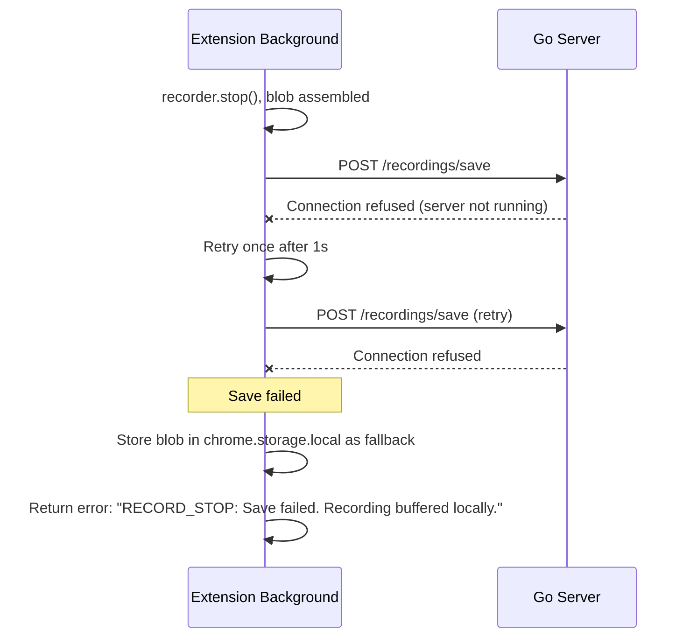
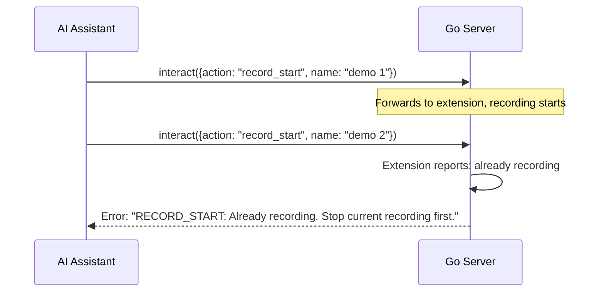
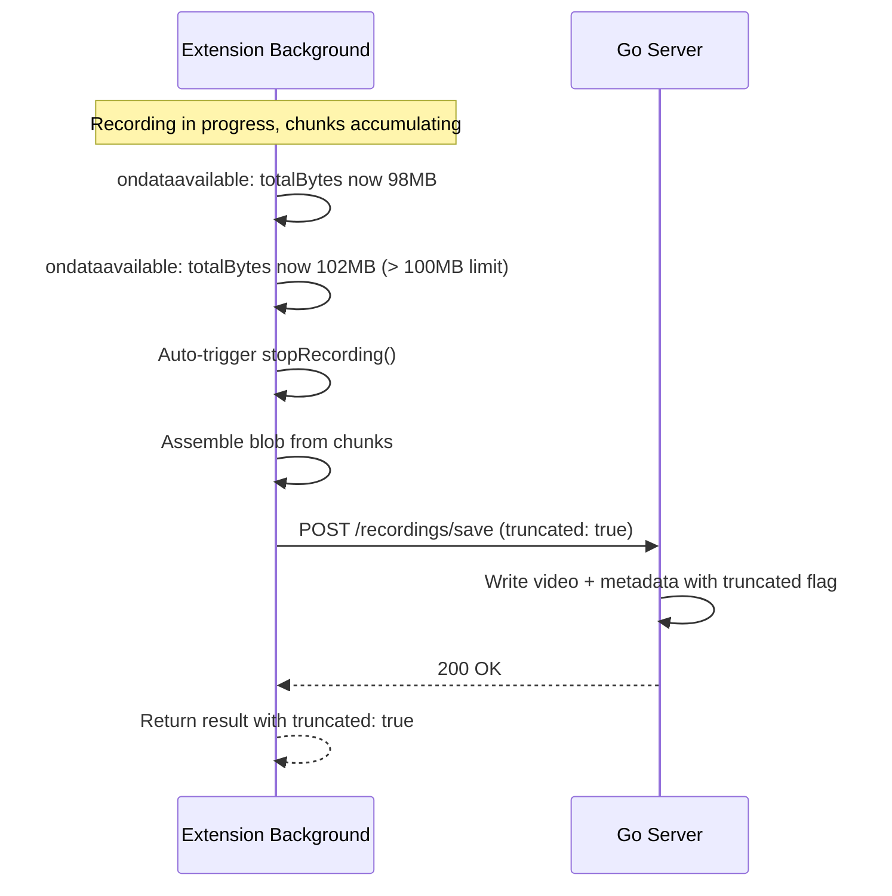
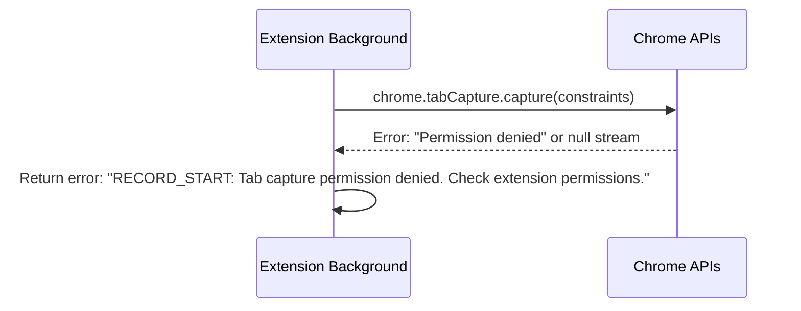
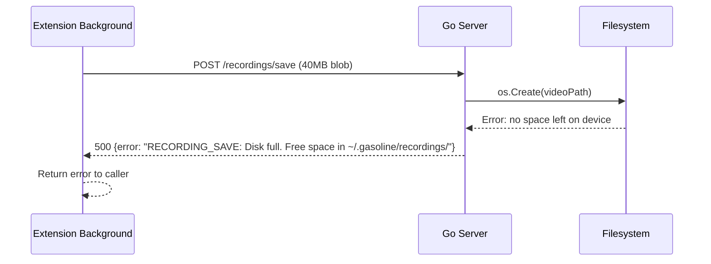

# Tab Recording — Technical Architecture

## Overview

Tab recording captures the active browser tab as a WebM video using `chrome.tabCapture.capture()`. The extension holds the video in memory during recording, then POSTs the final blob to the Go server on stop. The server writes the video file and metadata sidecar to `~/.gasoline/recordings/`.

**Key design decisions:**

- **Single POST on stop** — no chunk streaming in v6. Extension holds `MediaRecorder` output in memory. Simpler, fewer failure modes.
- **Server assigns filename on start** — extension receives the final path upfront so both sides agree on naming.
- **Sidecar metadata** — `{name}_meta.json` next to `{name}.webm`. No database, no index file. `observe({what: "saved_videos"})` globs the directory.
- **~10 min recommended limit** — at ~4MB/min, a 10-minute recording is ~40MB in memory. Acceptable for v6.

## Sequence Diagrams

### MCP-Triggered Recording

```mermaid
sequenceDiagram
    participant AI as AI Assistant
    participant Server as Go Server
    participant Ext as Extension (background)
    participant Tab as Browser Tab

    AI->>Server: interact({action: "record_start", name: "checkout bug"})
    Server->>Server: Generate filename: checkout-bug--2026-02-07-1423
    Server->>Server: Create dir ~/.gasoline/recordings/ (if needed)
    Server->>Ext: PendingQuery {action: "record_start", name: "checkout-bug--2026-02-07-1423"}

    Ext->>Tab: chrome.tabCapture.capture({video: true, audio: false})
    Tab-->>Ext: MediaStream
    Ext->>Ext: new MediaRecorder(stream, {mimeType: "video/webm;codecs=vp8"})
    Ext->>Ext: recorder.start(1000) — collect chunks every 1s
    Ext->>Ext: Store state: {recording: true, name, startTime, chunks: []}
    Ext->>Ext: recorder.ondataavailable → push chunk to array

    Ext-->>Server: CommandResult {status: "recording", name, path}
    Server-->>AI: {status: "recording", name: "checkout-bug--2026-02-07-1423", path: "~/.gasoline/recordings/checkout-bug--2026-02-07-1423.webm"}

    Note over AI,Tab: ... AI interacts with page, subtitles render in tab ...

    AI->>Server: interact({action: "record_stop"})
    Server->>Ext: PendingQuery {action: "record_stop"}

    Ext->>Ext: recorder.stop()
    Ext->>Ext: Assemble Blob from chunks
    Ext->>Ext: stream.getTracks().forEach(t => t.stop())
    Ext->>Server: POST /recordings/save {name, blob, url, duration, resolution}
    Server->>Server: Write .webm file to disk
    Server->>Server: Write _meta.json sidecar
    Server-->>Ext: 200 OK

    Ext->>Ext: Clear recording state
    Ext-->>Server: CommandResult {status: "saved", name, path, duration_seconds, size_bytes}
    Server-->>AI: {status: "saved", name: "checkout-bug--2026-02-07-1423", path: "...", duration_seconds: 154, size_bytes: 18400000}
```

### Manual Recording from Popup



### Observe Saved Videos



## Key Implementation Details

### 1. Extension: Recording Pipeline (`src/background/recording.ts`)

New module handling all recording logic:

```typescript
interface RecordingState {
  active: boolean;
  name: string;
  startTime: number;
  recorder: MediaRecorder | null;
  stream: MediaStream | null;
  chunks: Blob[];
  totalBytes: number;
  tabId: number;
  url: string;
}

let recordingState: RecordingState = { active: false, ... };

async function startRecording(name: string, fps: number = 15): Promise<RecordingResult> {
  if (recordingState.active) {
    throw new Error("RECORD_START: Already recording. Stop current recording first.");
  }

  // Clamp fps to valid range
  fps = Math.max(5, Math.min(60, fps));

  // Scale bitrate proportionally: 500kbps at 15fps baseline
  const bitrate = Math.round((fps / 15) * 500_000);

  const tab = await getActiveTab();
  const stream = await chrome.tabCapture.capture({
    video: true,
    videoConstraints: {
      mandatory: {
        minWidth: 1280,
        minHeight: 720,
        maxWidth: 1920,
        maxHeight: 1080,
        maxFrameRate: fps,
      },
    },
    audio: false,
  });

  const recorder = new MediaRecorder(stream, {
    mimeType: "video/webm;codecs=vp8",
    videoBitsPerSecond: bitrate,
  });

  const MAX_RECORDING_BYTES = 100 * 1024 * 1024; // 100MB memory guard
  const chunks: Blob[] = [];
  let totalBytes = 0;

  recorder.ondataavailable = (e) => {
    if (e.data.size > 0) {
      chunks.push(e.data);
      totalBytes += e.data.size;

      // Memory guard: auto-stop and save if approaching limit
      if (totalBytes >= MAX_RECORDING_BYTES) {
        stopRecording(); // saves what we have, adds truncated flag
      }
    }
  };

  recorder.start(1000); // Collect chunks every 1s

  recordingState = {
    active: true, name, startTime: Date.now(),
    recorder, stream, chunks, tabId: tab.id, url: tab.url,
    totalBytes: 0,
  };

  // Persist state flag for popup sync
  await chrome.storage.local.set({
    gasoline_recording: { active: true, name, startTime: Date.now() },
  });

  return { status: "recording", name, path: `~/.gasoline/recordings/${name}.webm` };
}

async function stopRecording(): Promise<RecordingResult> {
  if (!recordingState.active) {
    throw new Error("RECORD_STOP: No active recording.");
  }

  return new Promise((resolve) => {
    recordingState.recorder!.onstop = async () => {
      const blob = new Blob(recordingState.chunks, { type: "video/webm" });
      const duration = Math.round((Date.now() - recordingState.startTime) / 1000);

      // Stop media stream tracks
      recordingState.stream!.getTracks().forEach((t) => t.stop());

      // POST to Go server
      const formData = new FormData();
      formData.append("video", blob, `${recordingState.name}.webm`);
      formData.append("metadata", JSON.stringify({
        name: recordingState.name,
        display_name: recordingState.name.replace(/--\d{4}-\d{2}-\d{2}-\d{4}$/, "").replace(/-/g, " "),
        created_at: new Date(recordingState.startTime).toISOString(),
        duration_seconds: duration,
        size_bytes: blob.size,
        url: recordingState.url,
        tab_id: recordingState.tabId,
        resolution: "1920x1080",
        format: "video/webm;codecs=vp8",
      }));

      await fetch(`${serverUrl}/recordings/save`, {
        method: "POST",
        body: formData,
      });

      // Clear state
      await chrome.storage.local.remove("gasoline_recording");
      const result = {
        status: "saved", name: recordingState.name,
        path: `~/.gasoline/recordings/${recordingState.name}.webm`,
        duration_seconds: duration, size_bytes: blob.size,
      };

      recordingState = { active: false, name: "", startTime: 0, recorder: null, stream: null, chunks: [], tabId: 0, url: "" };
      resolve(result);
    };

    recordingState.recorder!.stop();
  });
}
```

**Key choices:**

- `fps` parameter — clamped to 5–60, default 15. Bitrate scales proportionally (500kbps at 15fps baseline)
- `recorder.start(1000)` — 1s chunk interval, keeps memory pressure predictable
- `MAX_RECORDING_BYTES = 100MB` — memory guard auto-stops and saves before OOM. At 15fps (~4MB/min) that's ~25 min. At 60fps (~15MB/min) that's ~7 min. Recording is saved, not lost.
- `chrome.storage.local` for popup sync — popup can read recording state on open

### 2. Extension: Manifest Changes

```json
{
  "permissions": ["storage", "alarms", "tabs", "scripting", "tabCapture"]
}
```

Only change: add `tabCapture` to permissions array. No new host permissions needed.

### 3. Extension: Popup UI Changes (`extension/popup.html`)

New section below existing toggles:

```html
<div class="section" id="recording-section">
  <div class="section-header">
    <span class="section-icon">&#9679;</span> <!-- red circle when recording -->
    <span class="section-title">Recording</span>
    <span id="recording-timer" class="recording-timer" style="display:none">0:00</span>
  </div>
  <div class="section-body">
    <input type="text" id="recording-name" placeholder="Recording name (optional)" />
    <button id="btn-record-start" class="btn-record">Start Recording</button>
    <button id="btn-record-stop" class="btn-record btn-stop" style="display:none">Stop Recording</button>
    <div id="recording-status"></div>
  </div>
</div>
```

**Popup logic:**

- On open: read `chrome.storage.local.get("gasoline_recording")` → show correct state
- Start: send `{type: "record_start", name}` to background
- Stop: send `{type: "record_stop"}` to background
- Timer: `setInterval` updates display every second while recording

### 4. Go Server: Recording Endpoint (`cmd/dev-console/tools_recording.go`)

New file, ~200 LOC:

```go
// tools_recording.go — Handles recording save and listing.

func (h *Handler) handleRecordingSave(w http.ResponseWriter, r *http.Request) {
    // Parse multipart form: video blob + metadata JSON
    r.ParseMultipartForm(200 << 20) // 200MB max

    videoFile, _, _ := r.FormFile("video")
    defer videoFile.Close()

    metadataStr := r.FormValue("metadata")
    var meta RecordingMetadata
    json.Unmarshal([]byte(metadataStr), &meta)

    // Ensure directory exists
    dir := filepath.Join(os.Getenv("HOME"), ".gasoline", "recordings")
    os.MkdirAll(dir, 0755)

    // Write video file
    videoPath := filepath.Join(dir, meta.Name+".webm")
    outFile, _ := os.Create(videoPath)
    io.Copy(outFile, videoFile)
    outFile.Close()

    // Update size_bytes from actual file
    fi, _ := os.Stat(videoPath)
    meta.SizeBytes = fi.Size()

    // Write metadata sidecar
    metaPath := filepath.Join(dir, meta.Name+"_meta.json")
    metaJSON, _ := json.MarshalIndent(meta, "", "  ")
    os.WriteFile(metaPath, metaJSON, 0644)

    w.WriteHeader(200)
}
```

### 5. Go Server: Observe Handler (`cmd/dev-console/tools_observe.go`)

New case in observe dispatch:

```go
case "saved_videos":
    return h.handleObserveSavedVideos(req, args)
```

```go
func (h *Handler) handleObserveSavedVideos(req mcp.Request, args ObserveArgs) mcp.Response {
    dir := filepath.Join(os.Getenv("HOME"), ".gasoline", "recordings")

    matches, err := filepath.Glob(filepath.Join(dir, "*_meta.json"))
    if err != nil || len(matches) == 0 {
        return successResponse(req, map[string]any{
            "recordings": []any{}, "total": 0, "storage_used_bytes": 0,
        })
    }

    var recordings []RecordingMetadata
    var totalSize int64

    for _, metaPath := range matches {
        data, _ := os.ReadFile(metaPath)
        var meta RecordingMetadata
        json.Unmarshal(data, &meta)

        // Apply url filter if provided
        if args.URL != "" && !strings.Contains(meta.Name, args.URL) &&
            !strings.Contains(meta.URL, args.URL) {
            continue
        }

        recordings = append(recordings, meta)
        totalSize += meta.SizeBytes
    }

    // Sort by created_at descending
    sort.Slice(recordings, func(i, j int) bool {
        return recordings[i].CreatedAt > recordings[j].CreatedAt
    })

    // Apply last_n
    if args.LastN > 0 && len(recordings) > args.LastN {
        recordings = recordings[:args.LastN]
    }

    return successResponse(req, map[string]any{
        "recordings": recordings, "total": len(recordings),
        "storage_used_bytes": totalSize,
    })
}
```

### 6. Go Server: Name Generation on record_start

When `record_start` arrives, the server generates the filename before forwarding to the extension:

```go
func (h *Handler) handleRecordStart(req mcp.Request, args InteractArgs) mcp.Response {
    name := args.Name
    if name == "" {
        name = "recording"
    }

    // Sanitize: lowercase, replace spaces/special with hyphens
    slug := sanitizeSlug(name)

    // Append timestamp
    ts := time.Now().Format("2006-01-02-1504")
    fullName := fmt.Sprintf("%s--%s", slug, ts)

    // Clamp fps to valid range (default 15)
    fps := args.FPS
    if fps == 0 {
        fps = 15
    }
    if fps < 5 {
        fps = 5
    }
    if fps > 60 {
        fps = 60
    }

    // Forward to extension with resolved name and fps
    args.Name = fullName
    args.FPS = fps
    return h.forwardToExtension(req, args)
}

func sanitizeSlug(s string) string {
    s = strings.ToLower(s)
    s = regexp.MustCompile(`[^a-z0-9-]+`).ReplaceAllString(s, "-")
    s = regexp.MustCompile(`-{2,}`).ReplaceAllString(s, "-")
    s = strings.Trim(s, "-")
    if s == "" {
        s = "recording"
    }
    return s
}
```

### 7. Data Types

```go
// RecordingMetadata is the sidecar JSON written next to each .webm file.
type RecordingMetadata struct {
    Name            string `json:"name"`
    DisplayName     string `json:"display_name"`
    CreatedAt       string `json:"created_at"`
    DurationSeconds int    `json:"duration_seconds"`
    SizeBytes       int64  `json:"size_bytes"`
    URL             string `json:"url"`
    TabID           int    `json:"tab_id"`
    Resolution      string `json:"resolution"`
    Format          string `json:"format"`
}
```

## State Machine



**States:**

| State | Description | Extension Memory | Popup Shows |
|-------|-------------|-----------------|-------------|
| **Idle** | No active recording | No stream/recorder/chunks | "Start Recording" button |
| **Recording** | MediaRecorder active, chunks accumulating | Stream + recorder + chunks[] | "Stop Recording" + timer |
| **Stopping** | recorder.stop() called, waiting for final chunk | Chunks being assembled | "Saving..." |
| **Saving** | Blob assembled, POSTing to server | Full blob in memory | "Saving..." |
| **Error** | Something failed, cleaning up | Releasing all resources | Error message, back to Start |

**Invariants:**

- Only one recording at a time (enforced by `recordingState.active` check)
- State always returns to Idle after error (no stuck states)
- `chrome.storage.local` always reflects current state for popup sync

## Edge Cases & Failure Modes

### 1. Tab Closes During Recording



**Resolution:** Listen for `stream.getVideoTracks()[0].onended`. Auto-stop and save partial recording. Better to save something than lose everything.

### 2. Extension Disconnects from Server During Save



**Resolution:** One retry. If still fails, buffer in `chrome.storage.local` (size limited but better than data loss). On next successful server connection, flush buffered recording.

### 3. Concurrent record_start Calls



**Resolution:** Reject second start with clear error. One recording at a time.

### 4. Large Recording (Memory Pressure)

**Scenario:** User records for 20+ minutes. At ~4MB/min (15fps), that's 80MB+ in extension memory.



**Resolution (v6):** Memory guard at 100MB. When accumulated chunks exceed the limit, the extension auto-stops and saves what it has. The response includes `truncated: true` so the caller knows. At 15fps (~4MB/min) that's ~25 min of recording. At 60fps (~15MB/min) it's ~7 min. No data loss — the recording is saved, just capped.

**Resolution (v6.1+):** Chunked streaming — POST chunks to server every 30s during recording. Extension only holds the latest chunk window in memory. Effectively unlimited duration.

### 5. tabCapture Permission Not Granted



**Resolution:** Return clear error. User may need to re-enable the extension or grant permissions.

### 6. Server Disk Full



**Resolution:** Server returns 500 with actionable error. Extension passes error through. User deletes old recordings or frees disk space.

### 7. No Name Provided

**Scenario:** `interact({action: "record_start"})` with no `name` parameter.

**Resolution:** Server uses default slug `recording`, appends timestamp: `recording--2026-02-07-1423`. Same file saved, same metadata.

### 8. Name Collision

**Scenario:** Two recordings started in the same minute with the same name.

**Resolution:** Timestamp includes hour + minute (`HHmm`). If exact collision (same name, same minute), append `-2`: `demo--2026-02-07-1423-2.webm`. Server checks for existing file before writing.

### 9. Popup Opened Mid-Recording

**Scenario:** MCP started a recording, user opens popup.

**Resolution:** Popup reads `chrome.storage.local.get("gasoline_recording")` on open. If `active: true`, show "Stop Recording" button + elapsed time calculated from `startTime`.

### 10. Browser Crash During Recording

**Scenario:** Chrome crashes or extension is force-reloaded.

**Resolution:** Data loss — chunks in memory are gone. This is accepted for v6. Chunked streaming (v6.1+) would mitigate by having partial video on disk. On extension startup, clear any stale `gasoline_recording` state from `chrome.storage.local`.

## Network Communication

### Extension → Server

**POST `/recordings/save`**

- **Content-Type:** `multipart/form-data`
- **Fields:**
  - `video` — WebM blob (binary)
  - `metadata` — JSON string with `RecordingMetadata` fields
- **Response:** `200 OK` on success, `500` with error JSON on failure
- **Max size:** `200MB` (server-side `ParseMultipartForm` limit)

**Why multipart:** Single request with both binary video and structured metadata. No chunked protocol, no streaming complexity.

### Server → Filesystem

**Write path:** `~/.gasoline/recordings/{name}.webm` + `{name}_meta.json`

**Directory creation:** `os.MkdirAll` on first save if directory doesn't exist.

**File permissions:** `0644` (user read/write, group/others read).

### PendingQuery Flow (record_start / record_stop)

Uses existing async command pattern:

1. Server receives `interact({action: "record_start"})` from MCP
2. Server creates `PendingQuery` with correlation ID
3. Extension picks up query on next `/sync` poll
4. Extension executes recording action
5. Extension returns `CommandResult` to server
6. Server resolves the MCP response

No new protocol — reuses existing `PendingQuery` / `CommandResult` infrastructure.

## File Layout (New/Modified Files)

```text
Extension:
  src/background/recording.ts      (NEW — ~200 LOC, recording pipeline)
  src/background/pending-queries.ts (MODIFY — add record_start/record_stop dispatch)
  extension/manifest.json           (MODIFY — add tabCapture permission)
  extension/popup.html              (MODIFY — add recording section)
  extension/popup.js                (MODIFY — add recording UI logic)

Go Server:
  cmd/dev-console/tools_recording.go (NEW — ~150 LOC, save endpoint + types)
  cmd/dev-console/tools_observe.go   (MODIFY — add saved_videos case)
  cmd/dev-console/tools_interact.go  (MODIFY — add record_start/record_stop dispatch)
  cmd/dev-console/server.go          (MODIFY — register /recordings/save route)
```

## Performance

| Metric | Target | Notes |
|--------|--------|-------|
| CPU during recording | < 10% (15fps) | Scales with fps; 60fps may reach ~20% |
| Memory during recording | ~4MB/min (15fps) | Scales with fps; auto-stops at 100MB |
| Memory guard | 100MB | Auto-stop saves recording, prevents OOM |
| Start latency | < 500ms | `tabCapture.capture()` is fast |
| Stop + save latency | < 2s (5 min recording) | Blob assembly + localhost POST |
| File size | ~4MB/min (15fps) | Scales: ~2MB/min at 5fps, ~15MB/min at 60fps |
| Observe listing | < 50ms | Glob + JSON reads, small directory |

## Security

- Videos saved to `~/.gasoline/recordings/` — user's home directory, standard permissions
- No network transmission — localhost only (extension → `127.0.0.1`)
- Metadata contains URL of recorded page — no credentials, no cookies
- Video may contain sensitive screen content — same risk as any screen recording tool
- No automatic sharing or upload — user manually shares files

## Future: Chunked Streaming (v6.1+)

For recordings longer than ~10 minutes, stream chunks to server during recording:

1. `record_start` → server creates file, returns handle
2. Every 30s: extension POSTs accumulated chunks → server appends to file
3. `record_stop` → extension POSTs final chunk → server finalizes metadata

**Benefits:** Constant memory (~30s of video), partial recovery on crash, unlimited duration.

**Complexity:** Server needs append-mode file handle, extension needs chunk management, partial files need cleanup on error.

**Decision:** Deferred to v6.1+. v6 memory-based approach handles the 95% case (demos and bug repros under 10 minutes).
