# MCP Persistent Server Architecture

## Overview

The MCP server uses a persistent HTTP server architecture where:

- HTTP server runs as a background daemon (persists across MCP connections)
- MCP clients connect via stdio and bridge to the HTTP server
- First client spawns the server; subsequent clients connect to existing server
- Server stays running after all clients disconnect

## Sequence Diagrams

### Cold Start (No Server Running)

```mermaid
sequenceDiagram
    participant User as AI Tool (VSCode/Cursor)
    participant Wrapper as gasoline-mcp<br/>(Node.js wrapper)
    participant Binary as gasoline<br/>(Go binary)
    participant Server as HTTP Server<br/>(Daemon)

    User->>Wrapper: Spawn gasoline-mcp --port 7890
    Note over Wrapper: No longer kills existing server
    Wrapper->>Binary: exec(gasoline, [--port, 7890])
    Note over Binary: stdin is piped (MCP mode)

    Binary->>Binary: handleMCPConnection()
    Binary->>Server: Check if running (GET /health)
    Server-->>Binary: ❌ Connection refused

    Note over Binary: Server not running, try to spawn
    Binary->>Binary: net.Listen(":7890")
    Note over Binary: ✅ Port available, we spawn

    Binary->>Server: spawn(gasoline --daemon --port 7890)
    Note over Server: Server starts as detached process
    Server->>Server: Bind port 7890
    Server->>Server: Start HTTP handlers

    Binary->>Server: Wait for ready (poll /health)
    Server-->>Binary: 200 OK

    Note over Binary: Server ready, bridge stdio
    Binary->>Server: Forward MCP calls via HTTP
    User->>Binary: tools/list (via stdin)
    Binary->>Server: POST /mcp (tools/list)
    Server-->>Binary: {tools: [...]}
    Binary-->>User: {tools: [...]} (via stdout)

    Note over User,Binary: Client exits, server stays running
    Binary->>Binary: Exit
    Note over Server: ✅ Server persists in background
```



### Warm Start (Server Already Running)


### Multiple Concurrent Clients (Race Condition)

```mermaid
sequenceDiagram
    participant Client1 as Client 1
    participant Client2 as Client 2
    participant Server as HTTP Server

    Note over Client1,Client2: Both check at same time, server not running

    Client1->>Client1: Check server (not running)
    Client2->>Client2: Check server (not running)

    Client1->>Client1: Try to bind port
    Client2->>Client2: Try to bind port

    Note over Client1: ✅ Binds successfully
    Note over Client2: ❌ Port already bound

    Client1->>Server: spawn(--daemon)
    Note over Server: Server starts

    Note over Client2: Falls through to connection logic
    Client2->>Client2: Wait for server ready
    Client2->>Server: Poll /health
    Server-->>Client2: 200 OK

    Note over Client1,Client2: Both clients now connected
    Client1->>Server: MCP requests
    Client2->>Server: MCP requests
```



## Key Implementation Details

### 1. Wrapper Changes (bin/gasoline-mcp)

**Before:**

```javascript
// Kill any existing server before starting
killExistingServers(port);
execFileSync(binary, args);
```

**After:**

```javascript
// Let Go binary handle connection logic
execFileSync(binary, args);
```

**Why:** Killing the server forced respawn on every connection. Now the server persists.

### 2. Go Binary Connection Logic (cmd/dev-console/main.go)

```go
func handleMCPConnection(server *Server, port int, apiKey string) {
    // Step 1: Check if server is running
    serverRunning := isServerRunning(port)

    // Step 2: If not running, try to spawn (race-safe)
    if !serverRunning {
        ln, err := net.Listen("tcp", fmt.Sprintf("127.0.0.1:%d", port))
        if err == nil {
            // We won the race, spawn server
            ln.Close()
            cmd := exec.Command(exe, "--daemon", "--port", port)
            util.SetDetachedProcess(cmd)
            cmd.Start()
            waitForServer(port, 10*time.Second)
        }
        // If bind failed, another client is spawning - fall through
    }

    // Step 3: Connect to server (either existing or just spawned)
    bridgeStdioToHTTP(mcpEndpoint)
}
```

**Race Safety:** Multiple clients can race to spawn. First one to bind the port wins. Others fall through to connection logic and wait for server to be ready.

### 3. Daemon Mode (--daemon flag)

```go
if *daemonMode {
    // Run server directly without spawn logic (prevents recursion)
    runMCPMode(server, *port, *apiKey)
    return
}
```

**Purpose:** When spawned with `--daemon`, the binary runs the HTTP server directly without checking for existing servers (avoids infinite spawn recursion).

## Process Lifecycle

### Server Startup

1. First MCP client spawns server with `--daemon` flag
2. Server process detached from parent (survives client exit)
3. Server writes PID to `~/.gasoline-7890.pid`
4. Server binds HTTP port 7890
5. Server runs until explicitly stopped

### Server Persistence

- Server does NOT exit when clients disconnect
- Server runs until:
  - User runs `gasoline --stop --port 7890`
  - User kills process manually
  - System reboot
  - Server crashes (rare)

### Graceful Shutdown

```bash
# Stop server
gasoline --stop --port 7890

# Or manually
kill $(cat ~/.gasoline-7890.pid)
```

## Performance Benefits

| Scenario | Before (Kill + Spawn) | After (Persistent) |
|----------|----------------------|-------------------|
| First connection | ~3s (spawn + bind + ready) | ~3s (same) |
| Subsequent connections | ~3s (killed, respawn) | **< 100ms** (instant) |
| Multi-client | N × 3s (serial kills) | **< 100ms** (parallel) |

## Edge Cases & Failure Modes

### 1. Port Already in Use (Non-Gasoline Process)

**Scenario:** Another process (nginx, another app) is using port 7890.

```mermaid
sequenceDiagram
    participant Client as MCP Client
    participant Binary as gasoline binary
    participant Port as Port 7890 (nginx)

    Client->>Binary: Connect
    Binary->>Port: GET /health
    Port-->>Binary: 404 Not Found (wrong app)
    Binary->>Binary: Not gasoline, try to spawn
    Binary->>Port: net.Listen(":7890")
    Port-->>Binary: ❌ Address already in use
    Binary->>Binary: Log error, exit(1)
```



**Resolution:** Client fails fast with error message telling user to free the port.

### 2. Server Crashes Mid-Connection

**Scenario:** Server crashes (OOM, panic) while client is connected.

```mermaid
sequenceDiagram
    participant Client as MCP Client
    participant Binary as gasoline binary
    participant Server as HTTP Server

    Client->>Binary: tools/list
    Binary->>Server: POST /mcp
    Note over Server: 💥 Crash (OOM, panic)
    Server--XBinary: Connection reset
    Binary->>Binary: Retry once
    Binary->>Server: GET /health
    Server--XBinary: Connection refused
    Binary->>Binary: Server down, respawn
    Binary->>Server: spawn(--daemon)
    Note over Server: New server starts
    Binary->>Server: POST /mcp (retry)
    Server-->>Binary: Success
```



**Resolution:** Auto-recovery - client detects failure, spawns new server, retries request.

### 3. Stale PID File

**Scenario:** PID file exists but process is dead (killed with SIGKILL, system reboot).


**Resolution:** Client validates PID before trusting it. Spawns new server if dead.

### 4. Multiple Clients Race to Spawn

**Scenario:** Two clients start simultaneously, both see server not running.

```mermaid
sequenceDiagram
    participant C1 as Client 1
    participant C2 as Client 2
    participant Port as Port 7890

    par Client 1 checks
        C1->>Port: GET /health
        Port--XC1: Connection refused
    and Client 2 checks
        C2->>Port: GET /health
        Port--XC2: Connection refused
    end

    Note over C1,C2: Both decide to spawn

    C1->>Port: net.Listen(":7890")
    Port-->>C1: ✅ Success (C1 won race)

    C2->>Port: net.Listen(":7890")
    Port-->>C2: ❌ Address in use (C2 lost race)

    C1->>Port: spawn(--daemon)
    Note over Port: Server starting...

    Note over C2: Lost race, wait for C1's spawn
    C2->>Port: Poll /health (10s timeout)
    Port-->>C2: 200 OK

    Note over C1,C2: Both clients now connected
```



**Resolution:** Built-in race protection via `net.Listen()`. Loser waits for winner's spawn.

### 5. Server Startup Timeout

**Scenario:** Server spawned but doesn't become ready within 10 seconds.


**Resolution:** Client writes debug info to `/tmp/gasoline-debug-*.log` and exits. User can check logs.

### 6. Permission Denied on Port Bind

**Scenario:** Ports < 1024 require root on Unix.

```mermaid
sequenceDiagram
    participant Client as MCP Client
    participant OS as Operating System

    Client->>OS: net.Listen(":80")
    OS-->>Client: ❌ Permission denied
    Client->>Client: Log error
    Note over Client: Cannot bind port 80 without root
    Client->>Client: Exit(1)
```



**Resolution:** Fail fast with clear error. User must use port >= 1024 or run with sudo.

### 7. Extension Version Mismatch

**Scenario:** Extension version `5.7.0`, server version `5.8.0` (minor version bump).


**Resolution:** Warning shown in extension popup. Server continues to work (best effort).

### 8. Wrapper Binary Not Found

**Scenario:** npm package installed but platform binary missing.


**Resolution:** Clear error with platform info and fix instructions.

### 9. Disk Full (Log File Write Fails)

**Scenario:** `~/gasoline-logs.jsonl` write fails due to disk full.


**Resolution:** Non-fatal. Server continues without logging. No user-visible error.

### 10. Graceful Shutdown During Active Connection

**Scenario:** User runs `gasoline --stop` while client is connected.


**Resolution:** Server completes in-flight requests before exiting. Client respawns on next request.

### 11. PID File Race Condition

**Scenario:** Two servers write PID file simultaneously.


**Resolution:** This can't happen in practice (race protection via port binding). If it does, running `--stop` twice or `lsof -ti :7890 | xargs kill` cleans up.

### 12. SIGKILL (Unkillable Signal)

**Scenario:** User force-kills server with `kill -9`.

```mermaid
sequenceDiagram
    participant Server as HTTP Server
    participant Logs as gasoline-logs.jsonl

    Server->>Logs: {"event":"startup", "pid":12345}
    Note over Server: Server running...
    Note over Server: 💥 SIGKILL (cannot be caught)
    Note over Server: Process terminated immediately
    Note over Logs: No shutdown entry logged

    Note over Logs: Detection: startup→startup<br/>with no shutdown in between
```



**Resolution:** SIGKILL cannot be caught. Detection heuristic: consecutive startup entries without shutdown indicate forced kill.

### 13. Extension Connects Before Server Ready

**Scenario:** Extension polls `/sync` before server has initialized handlers.


**Resolution:** Extension has exponential backoff retry logic. Eventually succeeds when server ready.

### 14. Network Interface Down

**Scenario:** `127.0.0.1` loopback interface is down (rare, but possible).

```mermaid
sequenceDiagram
    participant Client as MCP Client
    participant Network as Loopback (lo0)

    Client->>Network: net.Listen("127.0.0.1:7890")
    Network-->>Client: ❌ Network unreachable
    Client->>Client: Log error
    Note over Client: Cannot bind to 127.0.0.1
    Client->>Client: Exit(1)
```



**Resolution:** Fail fast. User must fix network configuration (loopback should always be up).

## Monitoring

Check server status:

```bash
# Health endpoint
curl http://localhost:7890/health

# Check if process alive
ps aux | grep gasoline

# Check PID file
cat ~/.gasoline-7890.pid
```

Logs stored at `~/gasoline-logs.jsonl`:

```json
{"type":"lifecycle","event":"startup","version":"5.7.0","pid":12345}
{"type":"lifecycle","event":"mcp_server_spawned","client_pid":12346,"server_pid":12345}
{"type":"lifecycle","event":"shutdown","signal":"SIGTERM","uptime_seconds":3600}
```

## Security

- Server binds to `127.0.0.1` (localhost only, not accessible from network)
- Optional `--api-key` flag for HTTP authentication
- PID file mode `0600` (owner read/write only)
- Crash logs mode `0644` (world-readable for debugging)

## Future Improvements

1. **Auto-restart on crash** - Supervise server process
2. **Multi-user support** - User-scoped sockets instead of ports
3. **Version checking** - Auto-restart if binary version changes
4. **Resource limits** - Memory/CPU caps for server process
