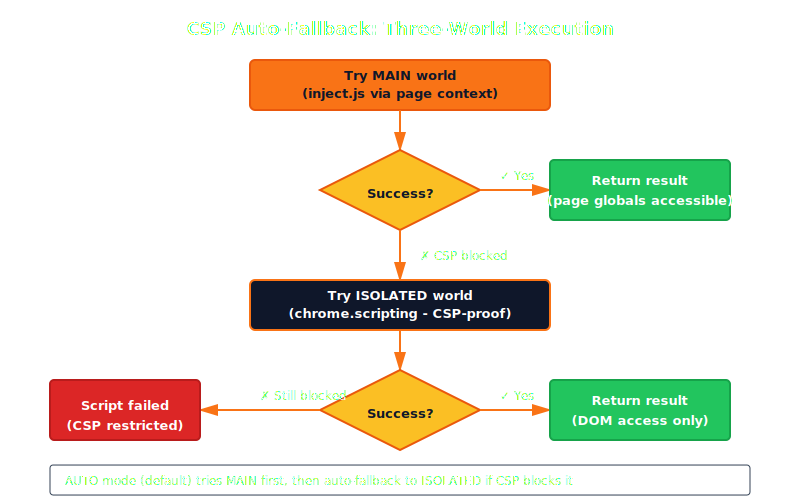

## The Problem: Pages Fight Back

Running JavaScript on a web page sounds simple. It's not.

Modern web applications use **Content Security Policy (CSP)** to restrict what scripts can run. Sites like Gmail, Google Docs, and banking apps use **Trusted Types** — a CSP directive that blocks `eval()`, `new Function()`, and any dynamic code execution.

This means a naive approach (inject a script tag, run some code) fails silently on millions of production websites.

Kaboom solves this with a **three-world execution model** that automatically detects CSP restrictions and falls back to the right approach.

## The Three Worlds

When you call `interact({action: "execute_js", script: "document.title"})`, Kaboom chooses one of three execution worlds:

### World 1: Main (Page Context)

```js
interact({action: "execute_js", script: "document.title", world: "main"})
```

The script runs in the **same JavaScript context as the web page**. It can:

- Access page globals (React state, Vue stores, Angular services)
- Call functions defined by the page
- Read and modify the DOM
- Access `window`, `document`, and any page-defined objects

**How it works:**

```
MCP call → Go server → Extension background →
Content script → window.postMessage → inject.js →
new Function(script)() → Result back through the chain
```

The inject.js layer runs in Chrome's MAIN world, sharing the page's execution context. It wraps your script in `new Function()` for safe execution with a timeout.

**When it fails:** Sites with CSP `script-src` restrictions or Trusted Types block `new Function()`. The script silently fails.

### World 2: Isolated (Extension Context)

```js
interact({action: "execute_js", script: "document.title", world: "isolated"})
```

The script runs in Chrome's **isolated world** — a separate JavaScript context with full DOM access but no access to page globals.

**How it works:**

```
MCP call → Go server → Extension background →
chrome.scripting.executeScript({world: 'MAIN', func: ...})
```

Chrome itself injects the function. Because Chrome is the execution agent (not the page), CSP doesn't apply. The script bypasses Trusted Types, `script-src` restrictions, and any other CSP directive.

**What it can do:**
- Full DOM access (read, modify, query elements)
- Run any JavaScript Chrome's V8 engine supports

**What it can't do:**
- Access page-defined globals (React state, Vue stores, etc.)
- Call functions the page defined
- Access `window.__myApp` or similar page-level objects

### World 3: Auto (Smart Fallback)

```js
interact({action: "execute_js", script: "document.title", world: "auto"})
```

This is the **default** and the one you should almost always use.

**How it works:**

1. Try MAIN world via inject.js (fast, full page access)
2. If CSP blocks it, detect the error
3. Automatically retry via `chrome.scripting.executeScript` (CSP-proof)
4. Return the result — the caller never knows which path was used



The auto mode means you don't need to know whether a site uses CSP. Kaboom figures it out and picks the right path.

## The Gmail Problem (and How It's Solved)

Gmail is one of the most CSP-restrictive sites on the internet. It uses:

- `script-src` with strict nonce requirements
- **Trusted Types** that block all dynamic code creation
- CSP headers that prevent inline scripts

A typical browser automation tool fails on Gmail entirely. Kaboom's auto fallback handles it transparently:

1. **First attempt:** inject.js tries `new Function(script)` — Gmail's CSP blocks it
2. **Detection:** The error is caught and identified as a CSP violation
3. **Fallback:** `chrome.scripting.executeScript` injects the code natively — Chrome bypasses its own CSP for extension APIs
4. **Result:** The script executes, the result returns, the caller never knew there was a problem

This is why Kaboom can automate Gmail (compose emails, read inboxes, click buttons) while tools that depend on `--remote-debugging-port` and CDP's `Runtime.evaluate` struggle with CSP-heavy sites.

## Timeouts and Error Handling

Every script execution has a configurable timeout:

```js
interact({action: "execute_js", script: "longRunningOperation()", timeout_ms: 10000})
```

Default: 5 seconds. Maximum: configurable per call.

If the script hangs (infinite loop, blocking network call), Kaboom:

1. Kills the execution after the timeout
2. Returns a clear error: "Script execution timed out after 10000ms"
3. Does not leave the page in a broken state

## What You Can Do with execute_js

### Read page state

```js
interact({action: "execute_js", script: "document.title"})
interact({action: "execute_js", script: "window.location.href"})
interact({action: "execute_js", script: "document.querySelectorAll('li').length"})
```

### Access framework state (main world only)

```js
interact({action: "execute_js",
          script: "document.querySelector('#app').__vue__.$store.state.user",
          world: "main"})
```

### Modify the page

```js
interact({action: "execute_js",
          script: "document.body.style.backgroundColor = 'red'"})
```

### Run complex logic

```js
interact({action: "execute_js",
          script: "Array.from(document.querySelectorAll('table tr')).map(r => Array.from(r.cells).map(c => c.textContent))"})
```

### Check for specific conditions

```js
interact({action: "execute_js",
          script: "!!document.querySelector('.error-banner')"})
```

## Quick Reference

| World | Page globals | DOM access | CSP-proof | Speed |
|---|---|---|---|---|
| `main` | Yes | Yes | No | Fastest |
| `isolated` | No | Yes | Yes | Fast |
| `auto` | Tries both | Yes | Yes (fallback) | Fast with fallback |

**Rule of thumb:** Use `auto` (the default) for everything. Only specify `main` when you explicitly need page globals, or `isolated` when you know CSP will block and want to skip the fallback attempt.
